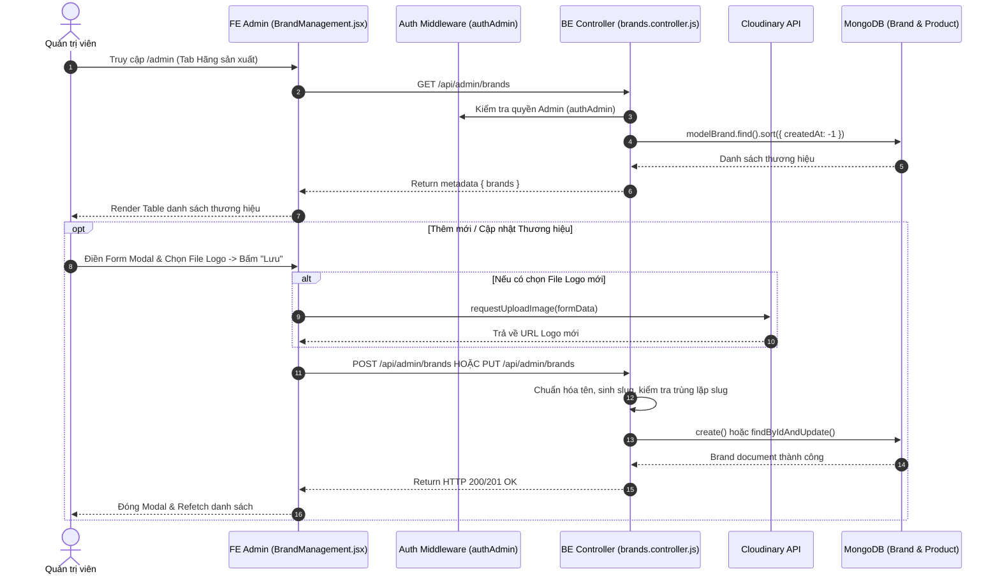

# TÀI LIỆU CONTEXT VÀ BỐI CẢNH NGHIỆP VỤ: QUẢN LÝ THƯƠNG HIỆU / HÃNG SẢN XUẤT (BRAND MANAGEMENT)

Document này mô tả chi tiết bối cảnh, luồng dữ liệu, luồng nghiệp vụ, các hàm lõi backend/frontend, state và các trường hợp đặc biệt (edge cases) của tính năng Quản lý Thương hiệu (Brand Management) thuộc trang Admin.

---

## 1. TỔNG QUAN CHỨC NĂNG

### 1.1 Chức năng chính
Trang Quản lý Thương hiệu (`BrandManagement.jsx`) cho phép Quản trị viên (Admin):
1. **Xem danh sách & Tìm kiếm Thương hiệu**: Hiển thị bảng danh sách các Hãng sản xuất (`Apple`, `Dell`, `Asus`, `Lenovo`...) kèm Logo, Mô tả, Ngày tạo và Trạng thái hoạt động (`isActive`).
2. **Thêm thương hiệu mới (`createBrand`)**: Tạo tên thương hiệu, mô tả, tải logo hãng lên Cloudinary và bật/tắt kích hoạt.
3. **Cập nhật thông tin thương hiệu (`updateBrand`)**: Chỉnh sửa tên, mô tả, thay đổi logo, toggle công tắc bật/tắt hiển thị `isActive`.
4. **Xóa thương hiệu (`deleteBrand`)**: Kiểm tra và xóa thương hiệu khỏi hệ thống nếu không có ràng buộc sản phẩm.

### 1.2 Các thành phần chính
- **Frontend Component**: `BrandManagement.jsx` (Table, Form Modal, Antd Upload).
- **Frontend API**: `requestGetAdminBrands`, `requestCreateBrand`, `requestUpdateBrand`, `requestDeleteBrand`, `requestUploadImage`.
- **Backend Routes & Controller**: `brands.routes.js`, `brands.controller.js` (`getAdminBrands`, `createBrand`, `updateBrand`, `deleteBrand`).
- **Backend Model**: `brands.model.js`.

---

## 2. SƠ ĐỒ LUỒNG DỮ LIỆU TỔNG QUÁT

---

## 3. GIẢI THÍCH TỪNG LUỒNG NGHIỆP VỤ CHÍNH

### 3.1 Luồng Hiển thị & Tìm kiếm Thương hiệu (`getAdminBrands`)
- **Trigger**: Khi Admin mở tab Quản lý Hãng hoặc gõ từ khóa tìm kiếm.
- **API**: `GET /api/admin/brands` (`requestGetAdminBrands`).
- **Logic FE**: Lọc client-side không phân biệt hoa thường theo `name` của thương hiệu.

---

### 3.2 Luồng Thêm mới Thương hiệu (`createBrand`)
- **Trigger**: Admin bấm "Thêm hãng sản xuất", nhập Tên, Mô tả, Upload Logo và bấm "Lưu".
- **API**: `POST /api/admin/brands` (`requestCreateBrand`).
- **Logic BE**:
  1. Chuẩn hóa tên thương hiệu `normalizeName(name)`.
  2. Tạo `slug` tự động qua `toSlug(name)`.
  3. Kiểm tra trùng lặp slug trong DB (`modelBrand.findOne({ slug })`). Nếu đã tồn tại -> Ném lỗi `ConflictRequestError("Hãng sản xuất đã tồn tại")`.
  4. Tạo document `modelBrand` mới trong DB.

---

### 3.3 Luồng Cập nhật Thương hiệu & Đồng bộ Cascade (`updateBrand`)
- **Trigger**: Admin bấm nút Edit trên 1 dòng thương hiệu, sửa thông tin trong Modal và bấm "Lưu".
- **API**: `PUT /api/admin/brands` (`requestUpdateBrand`).
- **Logic BE**:
  1. Kiểm tra tồn tại thương hiệu theo ID (`modelBrand.findById(id)`).
  2. Tạo slug mới từ tên. Thẩm định trùng lặp slug loại trừ chính ID đó (`_id: { $ne: id }`).
  3. Cập nhật các trường `name`, `slug`, `description`, `logo`, `isActive`.
  4. **Cơ chế Cập nhật Cascade (`Cascade Update`)**: Nếu tên thương hiệu bị đổi (`currentBrand.name !== normalizedName`), BE tự động chạy `modelProduct.updateMany({ brand: currentBrand.name }, { $set: { brand: normalizedName } })` để đồng bộ lại toàn bộ sản phẩm thuộc hãng này.

---

### 3.4 Luồng Xóa Thương hiệu & Bảo vệ Ràng buộc (`deleteBrand`)
- **Trigger**: Admin bấm nút Thùng rác -> Xác nhận Popconfirm "Có".
- **API**: `DELETE /api/admin/brands?id=...` (`requestDeleteBrand`).
- **Logic BE Guard Rule**:
  1. Lấy thông tin thương hiệu theo ID (`modelBrand.findById(id)`).
  2. **Kiểm tra ràng buộc sản phẩm**: BE query `modelProduct.exists({ brand: brand.name })`.
  3. Nếu tồn tại ít nhất 1 sản phẩm thuộc hãng này -> BE chặn xóa và ném lỗi `BadRequestError("Không thể xóa hãng đang có sản phẩm")`.
  4. Nếu không có sản phẩm liên kết -> Thực hiện `modelBrand.findByIdAndDelete(id)` an toàn.

---

### 3.5 Luồng Upload Logo Hãng sản xuất (`handleUploadLogo`)
- **Trigger**: Admin chọn file ảnh logo trong Upload component trên Modal.
- **Logic Validation FE**:
  1. Validate định dạng: Chỉ chấp nhận các file `image/jpeg`, `image/jpg`, `image/png`, `image/webp`.
  2. Validate dung lượng: Kích thước file tối đa 2MB (`file.size / 1024 / 1024 > 2`).
- **Upload Cloudinary**: Gửi FormData tới `requestUploadImage` với parameter `folder: 'mac-shop/brands'`. Trả về `secure_url` để gán vào `logoUrl`.

---

## 4. GIẢI THÍCH HÀM LÕI VÀ STATE

### 4.1 State Quan trọng
- `brands`: Mảng chứa tất cả thương hiệu.
- `editingBrand`: Object thương hiệu đang được chọn để chỉnh sửa (null nếu Thêm mới).
- `logoFileList` & `logoUrl`: Quản lý danh sách file upload và URL ảnh logo sau khi đẩy lên Cloudinary.
- `isModalOpen`: Trạng thái ẩn/hiện Modal Form.

---

## 5. GHI CHÚ / RỦI RO PHÁT HIỆN ĐƯỢC

> [!NOTE]
> 1. **Upload Logo Cloudinary**: Logo thương hiệu được upload vào folder `mac-shop/brands` nhận URL dạng string chuẩn HTTPs, đảm bảo tốc độ tải trang mượt mà.
> 2. **Check trùng tên hãng**: Kiểm tra trùng tên/slug không phân biệt hoa thường giúp ngăn ngừa việc tạo các hãng trùng nhau như `"Apple"` và `"apple"`.
> 3. **Cascade Update & Delete Guard**: Đảm bảo tính toàn vẹn dữ liệu toàn hệ thống giữa bảng `Brand` và `Product`.
