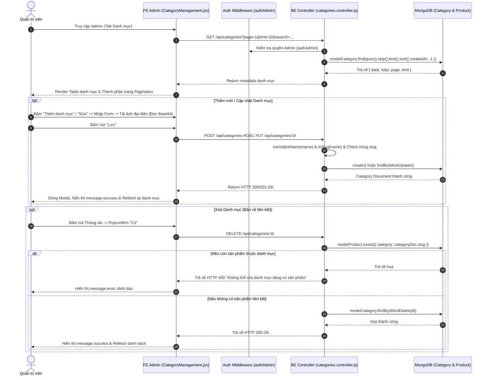

# TÀI LIỆU CONTEXT VÀ BỐI CẢNH NGHIỆP VỤ: QUẢN LÝ DANH MỤC SẢN PHẨM ADMIN (CATEGORY MANAGEMENT)

Document này mô tả chi tiết bối cảnh, luồng dữ liệu, luồng nghiệp vụ, các hàm lõi backend/frontend, state và các trường hợp đặc biệt (edge cases) của tính năng Quản lý Danh mục phía Admin (`CategoryManagement.jsx`).

---

## 1. TỔNG QUAN CHỨC NĂNG

### 1.1 Chức năng chính
Trang Quản lý Danh mục Admin (`CategoryManagement/CategoryManagement.jsx`) cho phép Quản trị viên (Admin):
1. **Xem danh sách Phân trang & Tìm kiếm Danh mục (`requestGetAdminCategories`)**: Bảng danh sách danh mục sản phẩm (MacBook, iMac, Mac mini, iPad...) hỗ trợ phân trang Server-side (`page`, `limit`) và tìm kiếm Debounce 300ms theo tên/mô tả.
2. **Thêm mới Danh mục (`requestCreateCategory`)**: Tạo tên danh mục, mô tả, chuyển đổi ảnh đại diện xem trước dạng Base64 qua FileReader, thiết lập trạng thái hiển thị `isActive`.
3. **Cập nhật thông tin Danh mục (`requestUpdateCategory`)**: Chỉnh sửa tên danh mục, hình ảnh, mô tả và công tắc gạt Switch Bật/Tắt hiển thị `isActive`.
4. **Xóa Danh mục & Bảo vệ liên kết (`requestDeleteCategory`)**: Xóa danh mục khỏi hệ thống với cơ chế bảo vệ ngăn xóa nếu còn sản phẩm tồn tại thuộc danh mục đó.

### 1.2 Các thành phần chính và mối liên hệ
- **Frontend Component (`CategoryManagement.jsx`)**: Tích hợp Antd (Table, Modal, Form, Switch, Upload, Pagination) và hook `useDebounce`.
- **Frontend API Layer (`request.jsx`)**: `requestGetAdminCategories(params)`, `requestCreateCategory(payload)`, `requestUpdateCategory(id, payload)`, `requestDeleteCategory(id)`.
- **Backend Routes (`categories.routes.js`)**: Endpoint `/api/categories`.
- **Backend Controller (`categories.controller.js`)**: Controller xử lý CRUD danh mục, tự động tạo slug (`toSlug`), chuẩn hóa tên (`normalizeName`), kiểm tra trùng lặp slug và bảo vệ ngăn xóa danh mục khi có sản phẩm liên kết (`modelProduct.exists({ category: ... })`).
- **Backend Models**: `category.model.js` và `products.model.js`.

---

## 2. SƠ ĐỒ LUỒNG DỮ LIỆU TỔNG QUÁT

---

## 3. GIẢI THÍCH TỪNG LUỒNG NGHIỆP VỤ CHÍNH

### 3.1 Luồng Hiển thị Danh sách, Tìm kiếm Debounce & Phân trang
- **Trigger**: Khi Admin mở tab Quản lý danh mục, gõ từ khóa vào ô tìm kiếm hoặc chuyển trang trên `Pagination`.
- **API**: `GET /api/categories?page=...&limit=...&search=...`.
- **Logic FE**:
  - Ô tìm kiếm sử dụng `useDebounce(searchText, 300)` để trì hoãn 300ms trước khi gửi request, tránh quá tải API.
  - Nhận về `metadata` chứa mảng `data` danh mục, tổng số bản ghi `total`, trang hiện tại `page` và số bản ghi trên mỗi trang `limit`.

---

### 3.2 Luồng Tải ảnh & Đọc file dạng Base64 (`getBase64`)
- **Trigger**: Admin bấm chọn file ảnh đại diện trong Modal Form.
- **Hàm FE xử lý**: `handleBeforeUpload(file)` & `getBase64(file)`.
- **Logic FE**:
  1. Validate kiểu file: Chỉ chấp nhận các file định dạng hình ảnh (`file.type.startsWith('image/')`).
  2. Validate dung lượng file: Kích thước file phải nhỏ hơn 5MB (`file.size / 1024 / 1024 < 5`).
  3. Đọc dữ liệu file thành chuỗi Data URL Base64 (`FileReader.readAsDataURL(file)`).
  4. Trả về `Upload.LIST_IGNORE` để chặn Antd tự động upload file lên server mặc định, giữ lại chuỗi Base64 gán vào field `image` của Form.

---

### 3.3 Luồng Thêm mới Danh mục (`createCategory`)
- **Trigger**: Admin nhập Tên, Mô tả, chọn Ảnh và bấm "Lưu".
- **API**: `POST /api/categories` (`requestCreateCategory`).
- **Logic BE**:
  1. Chuẩn hóa tên danh mục `normalizeName(name)`.
  2. Tự động sinh `slug` không dấu bằng `toSlug(name)`.
  3. Kiểm tra trùng lặp slug trong DB (`modelCategory.findOne({ slug })`). Nếu đã tồn tại -> Ném lỗi `BadRequestError("Danh mục đã tồn tại")`.
  4. Tạo document `modelCategory` mới trong MongoDB.

---

### 3.4 Luồng Cập nhật Danh mục (`updateCategory`)
- **Trigger**: Admin bấm Edit trên 1 dòng danh mục, sửa thông tin và bấm "Lưu".
- **API**: `PUT /api/categories/:id` (`requestUpdateCategory`).
- **Logic BE**:
  1. Kiểm tra tồn tại theo ID.
  2. Sinh slug mới từ tên. Kiểm tra trùng lặp slug với các danh mục khác (`_id: { $ne: id }`).
  3. Cập nhật các trường `name`, `slug`, `description`, `image`, `isActive`.

---

### 3.5 Luồng Xóa Danh mục & Cơ chế Cảnh báo Ngăn Xóa (`deleteCategory`)
- **Trigger**: Admin bấm biểu tượng Thùng rác -> Xác nhận Popconfirm.
- **API**: `DELETE /api/categories/:id` (`requestDeleteCategory`).
- **Logic BE Guard Rule**:
  1. Tìm danh mục theo ID (`modelCategory.findById(id)`).
  2. **Kiểm tra liên kết ràng buộc**: BE query kiểm tra bảng sản phẩm `modelProduct.exists({ category: categoryDoc.slug })`.
  3. Nếu tồn tại ít nhất 1 sản phẩm thuộc danh mục này -> BE ném lỗi `BadRequestError("Không thể xóa danh mục đang có sản phẩm liên kết")`.
  4. Nếu không có sản phẩm liên kết -> BE tiến hành `findByIdAndDelete(id)` an toàn.

---

## 4. GIẢI THÍCH HÀM LÕI VÀ STATE

### 4.1 State Quan trọng
- `categories`: Mảng danh sách các danh mục sản phẩm của trang hiện tại.
- `page`, `limit`, `total`: Các chỉ số phân trang server-side.
- `searchText` & `debouncedSearch`: State quản lý từ khóa tìm kiếm trước và sau khi debounce 300ms.
- `editing`: Document danh mục đang được chọn để chỉnh sửa (null nếu Thêm mới).
- `uploadFileList`: Mảng lưu vết file ảnh hiển thị trên Antd Upload component.

### 4.2 Helper Core Functions
- `getBase64(file)`: Chuyển đổi một đối tượng File local thành chuỗi Data URL Base64 bất đồng bộ qua `FileReader`.
- `toSlug(str)`: (Backend helper) Chuyển đổi tên tiếng Việt có dấu thành chuỗi URL slug không dấu (Ví dụ: `"Máy Tính Bảng"` -> `"may-tinh-bang"`).

---

## 5. GHI CHÚ / RỦI RO PHÁT HIỆN ĐƯỢC

> [!NOTE]
> 1. **Dữ liệu Hình ảnh Base64**: Việc lưu ảnh dưới dạng chuỗi Base64 trực tiếp vào database MongoDB giúp đơn giản hóa hệ thống không cần máy chủ lưu file riêng, tuy nhiên có thể khiến dung lượng tài liệu MongoDB lớn hơn nếu nạp các file ảnh kích thước lớn (đã được giới hạn < 5MB ở FE).
> 2. **Bảo vệ toàn vẹn dữ liệu (Cascade Protection)**: Việc kiểm tra `modelProduct.exists` trước khi xóa danh mục giúp ngăn ngừa tình trạng các sản phẩm trên website bị mất danh mục gốc (lỗi mồ côi category).
