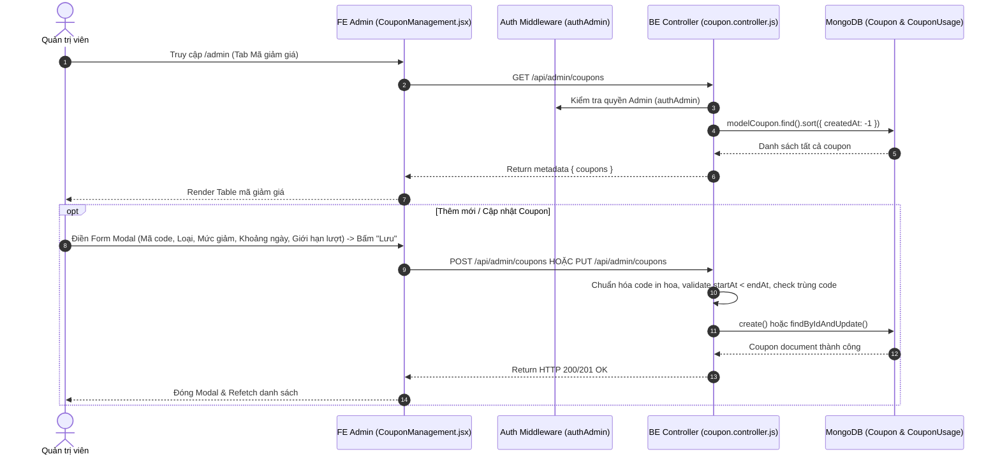

# TÀI LIỆU CONTEXT VÀ BỐI CẢNH NGHIỆP VỤ: QUẢN LÝ MÃ GIẢM GIÁ (COUPON MANAGEMENT)

Document này mô tả chi tiết bối cảnh, luồng dữ liệu, luồng nghiệp vụ, các hàm lõi backend/frontend, state và các trường hợp đặc biệt (edge cases) của tính năng Quản lý Mã giảm giá (Coupon Management) thuộc trang Admin.

---

## 1. TỔNG QUAN CHỨC NĂNG

### 1.1 Chức năng chính
Trang Quản lý Mã giảm giá (`CouponManagement.jsx`) cho phép Quản trị viên (Admin):
1. **Xem danh sách & Lọc mã giảm giá**: Bảng danh sách coupon với thông tin chi tiết: Mã Voucher (`code`), Loại giảm giá (`PERCENT` - % hoặc `FIXED` - Số tiền cố định), Mức giảm (`value`), Giá trị đơn hàng tối thiểu (`minOrderValue`), Mức giảm tối đa (`maxDiscount`), Giới hạn lượt dùng tổng (`totalUsageLimit`), Giới hạn lượt dùng/user (`perUserUsageLimit`), Số lượt đã dùng (`usedCount`), Thời gian hiệu lực (`startAt` - `endAt`), Trạng thái (`ACTIVE` vs `INACTIVE`).
2. **Thêm mã giảm giá mới (`createCoupon`)**: Tạo Voucher với mã in hoa tự động, đặt điều kiện giới hạn sử dụng và khoảng ngày hiệu lực (`RangePicker`).
3. **Cập nhật mã giảm giá (`updateCoupon`)**: Chỉnh sửa thông tin, gia hạn thời gian hoặc thay đổi số lượng giới hạn.
4. **Bật/tắt trạng thái Voucher (`updateCouponStatus`)**: Đổi trạng thái giữa `ACTIVE` và `INACTIVE`.
5. **Xóa mã giảm giá (`deleteCoupon`)**: Xóa Voucher khỏi hệ thống.

### 1.2 Các thành phần chính
- **Frontend Component**: `CouponManagement.jsx` (Table Antd, Form Modal, RangePicker).
- **Frontend API**: `requestGetCoupons`, `requestCreateCoupon`, `requestUpdateCoupon`, `requestDeleteCoupon`, `requestUpdateCouponStatus`.
- **Backend Routes & Controller**: `coupon.routes.js`, `coupon.controller.js`.
- **Backend Service**: `couponService.js` (`validateCouponForCart`, `computeDiscount`, `recalculateCartTotals`, `recordCouponUsage`).
- **Backend Models**: `coupon.model.js` và `couponUsage.model.js`.

---

## 2. SƠ ĐỒ LUỒNG DỮ LIỆU TỔNG QUÁT

---

## 3. GIẢI THÍCH TỪNG LUỒNG NGHIỆP VỤ CHÍNH

### 3.1 Luồng Hiển thị & Tự động kiểm tra Hết hạn Coupon
- **Trigger**: Khi Admin mở tab Mã giảm giá.
- **API**: `GET /api/admin/coupons` (`requestGetCoupons`).
- **Logic FE**:
  - Tự động kiểm tra nếu `endAt` nhỏ hơn thời gian hiện tại (`dayjs().isAfter(dayjs(item.endAt))`) -> Tự chuyển trạng thái hiển thị trên bảng sang Tag Đỏ `INACTIVE` (Hết hạn).

---

### 3.2 Luồng Thêm mới Mã giảm giá (`createCoupon`)
- **Trigger**: Admin bấm "Thêm mã giảm giá", điền Form và bấm "Lưu".
- **API**: `POST /api/admin/coupons` (`requestCreateCoupon`).
- **Logic BE**:
  1. Chuẩn hóa mã code thành chữ in hoa `normalizeCode(code)`.
  2. Validate `startAt < endAt`.
  3. Kiểm tra mã code trùng lặp trong DB (`modelCoupon.findOne({ code })`). Nếu trùng -> Ném lỗi `ConflictRequestError("Mã giảm giá đã tồn tại")`.
  4. Nếu `type === 'PERCENT'`, validate `value` nằm trong khoảng 1% - 100%.
  5. Tạo document `modelCoupon` mới.

---

### 3.3 Luồng Cập nhật & Bật/Tắt Trạng thái Coupon (`updateCoupon` & `updateCouponStatus`)
- **Trigger**: Admin sửa thông tin coupon hoặc gạt công tắc Switch Trạng thái trực tiếp trên bảng.
- **API**: 
  - Cập nhật thông tin: `PUT /api/admin/coupons` (`requestUpdateCoupon`).
  - Đổi trạng thái: `PATCH /api/admin/coupons/status` (`requestUpdateCouponStatus`). Payload: `{ id, status: 'ACTIVE' | 'INACTIVE' }`.
- **Logic BE**: Cập nhật thông tin trong DB. Khi Admin gạt Switch sang `INACTIVE`, mã lập tức bị vô hiệu hóa và không thể áp dụng ở trang Giỏ hàng của khách.

---

### 3.4 Luồng Xóa Mã giảm giá (`deleteCoupon`)
- **Trigger**: Admin bấm biểu tượng Thùng rác trên 1 dòng coupon -> Popconfirm "Có".
- **API**: `DELETE /api/admin/coupons?id=...` (`requestDeleteCoupon`).
- **Logic BE**: `modelCoupon.findByIdAndDelete(id)`. Loại bỏ mã voucher khỏi hệ thống.

---

## 4. GIẢI THÍCH HÀM LÕI VÀ STATE

### 4.1 State Quan trọng
- `coupons`: Mảng chứa tất cả coupon.
- `editingCoupon`: Object coupon đang sửa.
- `discountType`: State theo dõi kiểu giảm giá (`PERCENT` hay `FIXED`) để ẩn/hiện trường "Giảm tối đa" (`maxDiscount`).
- `searchCode`: Từ khóa tìm kiếm mã voucher.

### 4.2 Backend Helper (`couponService.js`)
- `computeDiscount`: Hàm lõi tính số tiền được giảm:
  $$\text{discount} = \text{min}\left(\text{cartTotal} \times \frac{\text{value}}{100}, \text{maxDiscount}\right)$$
- `validateCouponForCart`: Thẩm định tính hợp lệ của coupon (Check trạng thái `ACTIVE`, kiểm tra ngày hiệu lực `startAt <= now <= endAt`, kiểm tra đơn tối thiểu `minOrderValue`, giới hạn tổng lượt `totalUsageLimit` và lượt dùng/user `perUserUsageLimit`).

---

## 5. GHI CHÚ / RỦI RO PHÁT HIỆN ĐƯỢC

> [!NOTE]
> 1. **Gỡ mã coupon quá hạn**: Khi mã hết hạn (`now > endAt`), backend service `validateCouponForCart` tự động cập nhật `status: 'INACTIVE'` vào DB và loại bỏ mã khỏi giỏ hàng của khách.
> 2. **Kiểm soát lượt dùng perUserUsageLimit**: Được kiểm tra bằng cách đếm số bản ghi trong bảng `modelCouponUsage` theo `couponId` và `userId`.
> 3. **Bật/Tắt tức thì via PATCH**: Giúp admin chủ động tạm dừng chiến dịch khuyến mãi khẩn cấp mà không cần mở Modal chỉnh sửa.
