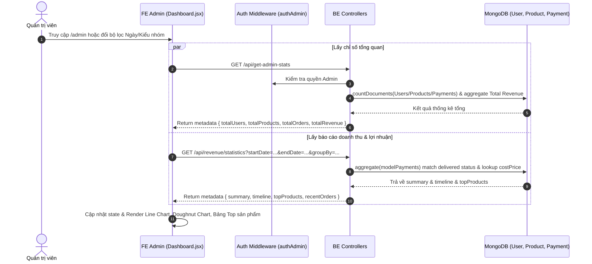

# TÀI LIỆU CONTEXT VÀ BỐI CẢNH NGHIỆP VỤ: CHỨC NĂNG BÁO CÁO & DOANH THU (DASHBOARD)

Document này mô tả chi tiết bối cảnh, luồng dữ liệu, luồng nghiệp vụ, các hàm lõi backend/frontend, state và các trường hợp đặc biệt (edge cases) của trang Báo cáo thống kê tổng quan (`Dashboard`) thuộc hệ thống Admin.

---

## 1. TỔNG QUAN CHỨC NĂNG

### 1.1 Chức năng chính
Trang Dashboard cung cấp cái nhìn toàn diện về hoạt động kinh doanh cho Quản trị viên (Admin), bao gồm:
1. **Thẻ chỉ số tổng quan (KPI Stat Cards)**: Tổng số người dùng, Tổng số sản phẩm, Tổng đơn hàng, Tổng doanh thực thực tế.
2. **Thống kê doanh thu theo khoảng thời gian (RangePicker & GroupBy)**: Lọc doanh thu theo khoảng ngày chọn và gom nhóm dữ liệu theo Ngày (`day`), Tuần (`week`), hoặc Tháng (`month`).
3. **Phân tích tài chính & Lợi nhuận gộp**:
   - Doanh thu gộp (`total_revenue`).
   - Giá vốn hàng bán (`cost_of_goods`).
   - Lợi nhuận gộp (`gross_profit` = Doanh thu - Giá vốn).
   - Tỉ suất lợi nhuận (`profit_margin` %).
   - Tỷ trọng doanh thu theo phương thức thanh toán (`COD` vs `VNPAY`).
4. **Biểu đồ trực quan (Chart.js)**:
   - Biểu đồ đường (`Line Chart`): Biến động doanh thu và lợi nhuận qua thời gian.
   - Biểu đồ tròn (`Doughnut Chart`): Cơ cấu phương thức thanh toán COD vs VNPAY.
5. **Top Sản phẩm bán chạy & Đơn hàng mới nhất**: Bảng xếp hạng các sản phẩm mang lại doanh thu cao nhất và danh sách các đơn hàng mới phát sinh.

### 1.2 Các thành phần chính
- **Frontend Component (`Dashboard.jsx`)**: Tích hợp Antd (Table, Card, DatePicker, Select, Tabs) và Chart.js (`react-chartjs-2`).
- **Frontend API**: `requestGetAdminStats()` và `requestGetRevenueStatistics(params)`.
- **Backend Controllers**: `users.controller.js` (`getAdminStats`), `payments.controller.js` (`getRevenueStatistics`).

---

## 2. SƠ ĐỒ LUỒNG DỮ LIỆU TỔNG QUÁT

---

## 3. GIẢI THÍCH TỪNG LUỒNG NGHIỆP VỤ CHÍNH

### 3.1 Luồng Tải Chỉ số KPI Tổng quan (`getAdminStats`)
- **Trigger**: Khi Admin mở trang Dashboard.
- **API**: `GET /api/get-admin-stats`.
- **Logic BE**:
  - Đếm tổng số người dùng (`modelUser.countDocuments()`).
  - Đếm tổng số sản phẩm (`modelProduct.countDocuments()`).
  - Đếm tổng số đơn hàng (`modelPayments.countDocuments()`).
  - Tính tổng doanh thu thực tế từ các đơn hàng giao thành công (`modelPayments.aggregate` sum `totalPrice` với `statusOrder: 'delivered'`).

---

### 3.2 Luồng Phân tích Doanh thu & Lợi nhuận theo Thời gian (`getRevenueStatistics`)
- **Trigger**: Admin chọn khoảng ngày trên `RangePicker` hoặc chọn kiểu nhóm `day`/`week`/`month`.
- **API**: `GET /api/revenue/statistics?startDate=...&endDate=...&groupBy=...`.
- **Logic BE**:
  1. Chỉ tính toán trên các đơn hàng có `statusOrder === 'delivered'`.
  2. Gom nhóm theo khoảng thời gian (`$dateToString` theo định dạng `YYYY-MM-DD`, `YYYY-WW` hoặc `YYYY-MM`).
  3. Duyệt mảng `products` trong đơn hàng, lấy `costPrice` từ `modelProduct` tại thời điểm thống kê để tính **Giá vốn hàng bán (`cost_of_goods`)**.
  4. Tính toán **Lợi nhuận gộp (`gross_profit = total_revenue - cost_of_goods`)** và **Tỉ suất lợi nhuận (`profit_margin = gross_profit / total_revenue * 100`)**.
  5. Tách biệt doanh thu theo cổng thanh toán `COD` và `VNPAY`.
  6. Thống kê Top 5 sản phẩm có doanh số/doanh thu cao nhất.

---

## 4. GIẢI THÍCH STATE VÀ HÀM LÕI FE

### 4.1 State Quan trọng
- `dateRange`: Mảng 2 ngày `[startDate, endDate]` (Dayjs object).
- `groupBy`: Kiểu gom nhóm (`'day'`, `'week'`, `'month'`).
- `adminStats`: Object chứa chỉ số KPI tổng quan.
- `revenueData`: Object chứa `summary`, `timeline`, `topProducts`, `recentOrders`.
- `loadingStats`, `loadingRevenue`: Trạng thái spinner khi đang fetch API.

### 4.2 Các hàm Helper
- `formatCurrency(value)`: Format tiền VNĐ (`toLocaleString('vi-VN') + ' đ'`).
- `formatRevenueChartLabel(period)`: Format nhãn ngày/tuần/tháng đẹp hiển thị trên trục hoành biểu đồ (VD: `"2025-05-20"` -> `"20/05/2025"`).

---

## 5. GHI CHÚ / RỦI RO PHÁT HIỆN ĐƯỢC

> [!NOTE]
> 1. **Chỉ tính doanh thu đơn `delivered`**: Doanh thu và lợi nhuận trên Dashboard chỉ ghi nhận khi đơn hàng chuyển sang trạng thái `delivered` (Đã giao hàng). Đơn hàng `pending`, `completed` hay `shipping` sẽ chưa được tính vào biểu đồ doanh thu.
> 2. **Tính toán giá vốn `cost_of_goods`**: BE query lại `costPrice` hiện tại từ `modelProduct`. Nếu admin thay đổi `costPrice` của sản phẩm trong tương lai, lợi nhuận gộp của các đơn hàng trong quá khứ có thể bị tính lại theo giá vốn mới.
