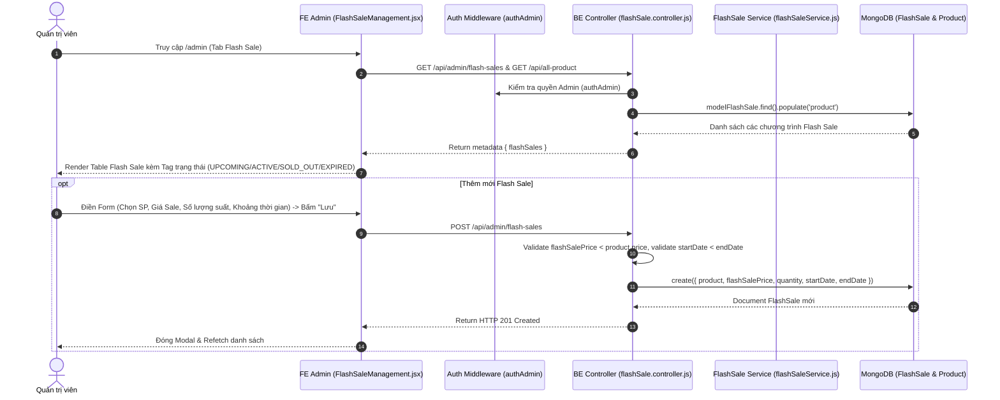

# TÀI LIỆU CONTEXT VÀ BỐI CẢNH NGHIỆP VỤ: QUẢN LÝ FLASH SALE (FLASH SALE MANAGEMENT)

Document này mô tả chi tiết bối cảnh, luồng dữ liệu, luồng nghiệp vụ, các hàm lõi backend/frontend, state và các trường hợp đặc biệt (edge cases) của tính năng Quản lý Khuyến mãi Flash Sale (Flash Sale Management) thuộc trang Admin.

---

## 1. TỔNG QUAN CHỨC NĂNG

### 1.1 Chức năng chính
Trang Quản lý Flash Sale (`FlashSaleManagement.jsx`) cho phép Quản trị viên (Admin):
1. **Xem danh sách & Trạng thái Flash Sale**: Bảng danh sách các chương trình Flash Sale kèm theo trạng thái thời gian thực:
   - `UPCOMING`: Sắp diễn ra (Chưa tới ngày `startDate`).
   - `ACTIVE`: Đang diễn ra (Trong khoảng `startDate <= now <= endDate` và chưa hết hàng).
   - `SOLD_OUT`: Đã hết hàng (`soldQuantity >= quantity`).
   - `EXPIRED`: Đã kết thúc (Quá ngày `endDate`).
   - `INACTIVE`: Đã bị admin chủ động tắt (`isActive = false`).
2. **Thêm chương trình Flash Sale (`createFlashSale`)**: Chọn sản phẩm, đặt Giá Flash Sale (`flashSalePrice`), Số lượng suất mở bán (`quantity`), Khoảng thời gian bắt đầu & kết thúc (`RangePicker`).
3. **Cập nhật Flash Sale (`updateFlashSale`)**: Chỉnh sửa giá sale, số lượng suất bán, điều chỉnh thời gian.
4. **Xóa Flash Sale (`deleteFlashSale`)**: Xóa chương trình khuyến mãi khỏi hệ thống.

### 1.2 Các thành phần chính
- **Frontend Component**: `FlashSaleManagement.jsx` (Table, Modal Form Antd, RangePicker).
- **Frontend API**: `requestGetFlashSales`, `requestCreateFlashSale`, `requestUpdateFlashSale`, `requestDeleteFlashSale`, `requestGetAllProduct`.
- **Backend Routes & Controller**: `flashSale.routes.js`, `flashSale.controller.js`.
- **Backend Service**: `flashSaleService.js` (`getActiveFlashSaleForProduct`, `incrementFlashSaleSoldQuantity`, `decrementFlashSaleSoldQuantity`).
- **Backend Model**: `flashSale.model.js`.

---

## 2. SƠ ĐỒ LUỒNG DỮ LIỆU TỔNG QUÁT

---

## 3. GIẢI THÍCH TỪNG LUỒNG NGHIỆP VỤ CHÍNH

### 3.1 Luồng Thẩm định Trạng thái Real-time
- **Trigger**: Khi Admin xem bảng danh sách Flash Sale.
- **Logic FE**: Duyệt qua từng item, so sánh thời gian hiện tại (`dayjs()`) với `startDate` và `endDate`:
  - `!isActive` -> Tag Đỏ `INACTIVE`.
  - `now < start` -> Tag Xanh lá `UPCOMING`.
  - `now > end` -> Tag Xám `EXPIRED`.
  - `soldQuantity >= quantity` -> Tag Cam `SOLD_OUT`.
  - Còn lại -> Tag Đỏ Nổi Nổi `ACTIVE`.

---

### 3.2 Luồng Thêm mới Flash Sale (`createFlashSale`)
- **Trigger**: Admin bấm "Thêm Flash Sale", điền thông tin và bấm "Lưu".
- **API**: `POST /api/admin/flash-sales` (`requestCreateFlashSale`).
- **Logic BE**:
  1. Kiểm tra sản phẩm tồn tại trong DB (`modelProduct.findById(product)`).
  2. Validate `flashSalePrice > 0` và bắt buộc phải **nhỏ hơn giá gốc sản phẩm** (`flashSalePrice < product.price`).
  3. Validate `quantity > 0` và `startDate < endDate`.
  4. Tạo document `modelFlashSale` mới.

---

### 3.3 Luồng Cập nhật & Xóa Flash Sale (`updateFlashSale` & `deleteFlashSale`)
- **Trigger**: Admin bấm Sửa trên 1 dòng đợt sale hoặc bấm Thùng rác -> Popconfirm "Có".
- **API**: 
  - Cập nhật: `PUT /api/admin/flash-sales/:id` (`requestUpdateFlashSale`).
  - Xóa: `DELETE /api/admin/flash-sales/:id` (`requestDeleteFlashSale`).
- **Logic BE**:
  - Khi cập nhật: Cho phép sửa `flashSalePrice`, `quantity`, `startDate`, `endDate`, `isActive`. Validate đảm bảo `soldQuantity <= quantity`.
  - Khi xóa: Gọi `modelFlashSale.findByIdAndDelete(id)`.

---

### 3.4 Tương tác với Luồng Mua Hàng & Vòng đời Đơn hàng (`flashSaleService.js`)
- Khi người dùng xem sản phẩm, thêm sản phẩm vào giỏ hoặc thanh toán, backend gọi `getActiveFlashSaleForProduct(productId)`:
  - Nếu tìm thấy 1 record Flash Sale thỏa mãn: `product == productId`, `isActive == true`, `startDate <= now <= endDate` và `soldQuantity < quantity` -> Đơn giá sản phẩm tự động ưu tiên tính bằng `flashSalePrice`.
- **Tăng suất đã bán (`incrementFlashSaleSoldQuantity`)**: Khi đơn hàng thanh toán/tạo thành công, backend tự động tăng `soldQuantity += qty`. Nếu `soldQuantity` đạt ngưỡng `quantity`, trạng thái đợt sale chuyển sang `SOLD_OUT`.
- **Hoàn lại suất sale (`decrementFlashSaleSoldQuantity`)**: Khi đơn hàng bị hủy (`cancelled`), backend tự động giảm `soldQuantity -= qty`, nhường suất ưu đãi cho người mua tiếp theo.

---

## 4. GIẢI THÍCH HÀM LÕI VÀ STATE

### 4.1 State Quan trọng
- `flashSales`: Mảng chứa danh sách các đợt Flash Sale.
- `products`: Mảng chứa danh sách tất cả sản phẩm để hiển thị trong Select chọn sản phẩm khuyến mãi.
- `editingFlashSale`: Object Flash Sale đang chỉnh sửa.
- `modalOpen`: Trạng thái ẩn/hiện Modal Form.

---

## 5. GHI CHÚ / RỦI RO PHÁT HIỆN ĐƯỢC

> [!NOTE]
> 1. **Một sản phẩm có thể thuộc nhiều Flash Sale khác nhau ở các mốc giờ**: `getActiveFlashSaleForProduct` sẽ lấy đợt sale đầu tiên đang active trong khung giờ hiện tại.
> 2. **Giá Flash Sale vượt qua Discount thông thường**: Khi Flash Sale active, giá sale được ưu tiên tuyệt đối hơn so với các chương trình giảm giá % sản phẩm thông thường.
> 3. **Vòng đời suất sale khép kín**: Cơ chế cộng/trừ `soldQuantity` khi Đặt đơn / Hủy đơn giúp hệ thống quản lý chính xác từng suất khuyến mãi mà không bị thất thoát.
