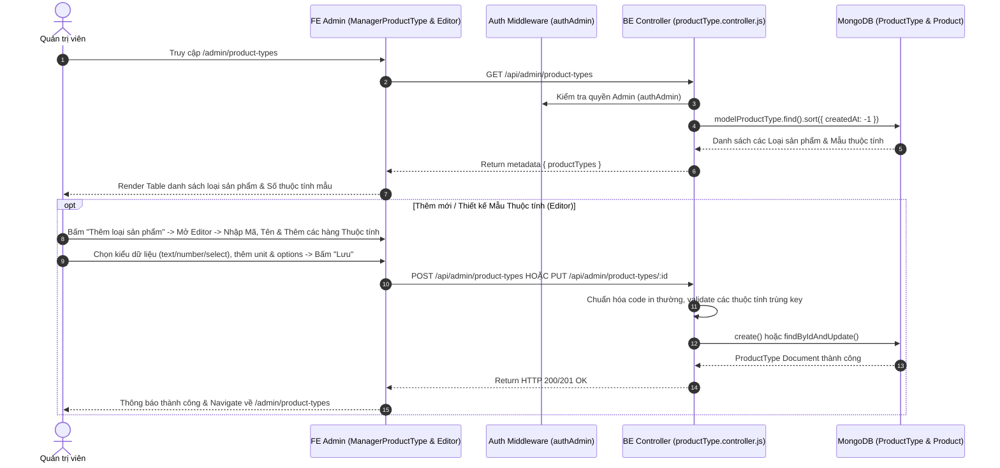

# TÀI LIỆU CONTEXT VÀ BỐI CẢNH NGHIỆP VỤ: QUẢN LÝ LOẠI SẢN PHẨM & THẤU KÍNH THUỘC TÍNH (PRODUCT TYPE MANAGEMENT)

Document này mô tả chi tiết bối cảnh, luồng dữ liệu, luồng nghiệp vụ, các hàm lõi backend/frontend, state và các trường hợp đặc biệt (edge cases) của tính năng Quản lý Loại Sản phẩm & Mẫu Thuộc tính động (Product Type & Attribute Template Editor) thuộc trang Admin.

---

## 1. TỔNG QUAN CHỨC NĂNG

### 1.1 Chức năng chính
Hệ thống Quản lý Loại sản phẩm (`ManagerProductType`) đóng vai trò là "Schema Engine" cho toàn bộ catalogue sản phẩm của shop:
1. **Xem danh sách Loại sản phẩm (`ManagerProductType.jsx`)**: Bảng thống kê các loại mặt hàng (Ví dụ: `macbook`, `imac`, `macmini`, `ipad`, `iphone`...) kèm theo Mã code duy nhất, Tên hiển thị và Số lượng thuộc tính mẫu (`attributesCount`).
2. **Trình thiết kế Mẫu Thuộc tính động (`ManagerProductTypeEditor.jsx`)**: Cho phép Admin thiết kế danh sách các trường thông số kỹ thuật (`attributesTemplate`) dành riêng cho loại sản phẩm đó.
   - Mỗi thuộc tính gồm: Mã key (`key`), Nhãn tiếng Việt (`label`), Kiểu dữ liệu (`type`: text, number, select, boolean), Đơn vị đo (`unit`: GB, GHz, inch, kg...), Bắt buộc nhập (`required`), và Danh sách tùy chọn nếu là kiểu Select (`options`).
3. **Xóa loại sản phẩm (`deleteProductType`)**: Kiểm tra và xóa loại sản phẩm khỏi hệ thống (Ngăn chặn xóa nếu còn sản phẩm tồn tại thuộc loại đó).

### 1.2 Các thành phần chính
- **Frontend Components**: `ManagerProductType.jsx` (List View) và `ManagerProductTypeEditor.jsx` (Dynamic Template Form Builder).
- **Frontend API**: `requestGetAllProductTypes`, `requestGetProductTypeById`, `requestCreateProductType`, `requestUpdateProductType`, `requestDeleteProductType`.
- **Backend Routes & Controller**: `productType.routes.js`, `productType.controller.js`.
- **Backend Model**: `productType.model.js`.

---

## 2. SƠ ĐỒ LUỒNG DỮ LIỆU TỔNG QUÁT

---

## 3. GIẢI THÍCH TỪNG LUỒNG NGHIỆP VỤ CHÍNH

### 3.1 Luồng Thiết kế Mẫu Thuộc tính Động (`ManagerProductTypeEditor.jsx`)
- **Trigger**: Admin mở trang tạo mới (`/admin/product-types/add`) hoặc chỉnh sửa (`/admin/product-types/:id/edit`).
- **Logic FE**:
  1. Cho phép thêm động các dòng thuộc tính (`attributesTemplate`).
  2. Với mỗi dòng thuộc tính, Admin nhập `key` (mã tham chiếu tiếng Anh), `label` (tên hiển thị tiếng Việt), chọn `type` (`text` - Chữ, `number` - Số, `select` - Chọn từ danh sách, `boolean` - Đúng/Sai), và tick `required` (Bắt buộc).
  3. Nếu `type === 'select'`, FE mở ô nhập `options` (các tùy chọn phân cách bằng dấu phẩy).
  4. Nếu `type === 'number'` hoặc `'text'`, cho phép nhập đơn vị đo `unit` (ví dụ: `GB`, `GHz`, `mAh`, `inch`).

---

### 3.2 Luồng Thêm mới & Cập nhật Loại sản phẩm (`createProductType` & `updateProductType`)
- **Trigger**: Admin bấm nút "Lưu" trên trang Editor.
- **API**: `POST /api/admin/product-types` hoặc `PUT /api/admin/product-types/:id`.
- **Logic BE**:
  1. Chuẩn hóa `code` thành chữ in thường không khoảng trắng (Ví dụ: `"macbook-pro"`).
  2. Kiểm tra trùng lặp `code` trong DB.
  3. Validate mảng `attributesTemplate`: Đảm bảo các `key` của thuộc tính không được trùng nhau trong cùng một Loại sản phẩm.
  4. Lưu cấu hình `attributesTemplate` vào DB.

---

### 3.3 Luồng Xóa Loại sản phẩm & Ràng buộc Tồn tại (`deleteProductType`)
- **Trigger**: Admin bấm biểu tượng Thùng rác trên 1 dòng Loại sản phẩm -> Xác nhận Popconfirm.
- **API**: `DELETE /api/admin/product-types/:id` (`requestDeleteProductType`).
- **Guard Rule**:
  - BE kiểm tra xem có bất kỳ sản phẩm nào trong `modelProduct` đang sử dụng `componentType === code` của loại sản phẩm này hay không (`modelProduct.exists({ componentType: code })`).
  - Nếu phát hiện có ít nhất 1 sản phẩm đang dùng -> BE chặn xóa và ném lỗi `BadRequestError("Không thể xóa loại sản phẩm đang có sản phẩm liên kết")`.

---

## 4. GIẢI THÍCH HÀM LÕI VÀ STATE

### 4.1 State Quan trọng (`ManagerProductTypeEditor.jsx`)
- `productType`: Object loại sản phẩm đang chỉnh sửa (nếu Edit).
- `attributes`: Mảng chứa danh sách các dòng thuộc tính động do Admin thêm vào form.
- `loading`, `saving`: Trạng thái fetch và lưu dữ liệu.

### 4.2 Tác động Tích hợp lên `UpsertProduct.jsx`
- Khi Admin tạo một sản phẩm mới ở trang `UpsertProduct.jsx` và chọn `componentType`, form sẽ đọc mảng `attributesTemplate` từ `ProductType` này để **tự động sinh ra đúng các ô input phù hợp**, giúp việc nhập liệu thông số kỹ thuật chuẩn hóa 100%.

---

## 5. GHI CHÚ / RỦI RO PHÁT HIỆN ĐƯỢC

> [!NOTE]
> 1. **Bảo vệ ràng buộc dữ liệu**: Không cho phép xóa `ProductType` khi đang có sản phẩm liên kết giúp hệ thống không bị lỗi mồ côi schema thông số kỹ thuật.
> 2. **Chuẩn hóa Key thuộc tính**: Các `key` thuộc tính (ví dụ: `ram`, `storage`, `cpu`, `screen_size`) nên được viết thường và nối bằng dấu gạch dưới để việc truy vấn và so sánh sản phẩm (Compare) đạt hiệu năng tốt nhất.
