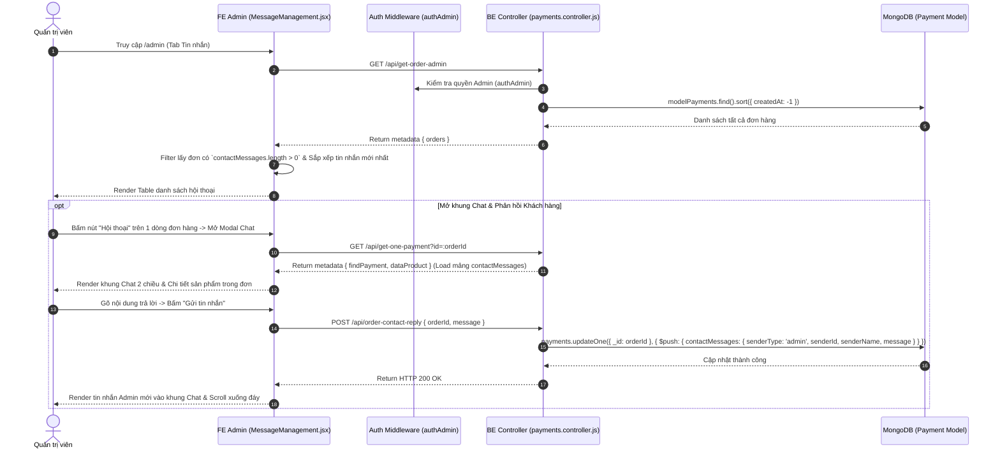

# TÀI LIỆU CONTEXT VÀ BỐI CẢNH NGHIỆP VỤ: QUẢN LÝ TIN NHẮN HỖ TRỢ ĐƠN HÀNG (MESSAGE MANAGEMENT)

Document này mô tả chi tiết bối cảnh, luồng dữ liệu, luồng nghiệp vụ, các hàm lõi backend/frontend, state và các trường hợp đặc biệt (edge cases) của tính năng Quản lý Tin nhắn & Hỗ trợ Đơn hàng (Message / Order Contact Management) thuộc trang Admin.

---

## 1. TỔNG QUAN CHỨC NĂNG

### 1.1 Chức năng chính
Trang Quản lý Tin nhắn (`MessageManagement.jsx`) là trung tâm Chăm sóc khách hàng & Hỗ trợ sau bán hàng dành cho Admin:
1. **Lọc danh sách Đơn hàng có tin nhắn hỗ trợ**: Chỉ lọc và hiển thị danh sách các đơn hàng phát sinh tin nhắn trao đổi giữa Khách hàng và Shop (`totalMessages > 0`), sắp xếp theo thời gian tin nhắn mới nhất.
2. **Khung Chat 2 chiều Chi tiết (Modal Chat)**:
   - Hiển thị tóm tắt đơn hàng (Khách hàng, SĐT, Trạng thái đơn, Danh sách sản phẩm mua kèm hình ảnh biến thể màu).
   - Hiển thị chuỗi tin nhắn hội thoại phân định rõ ràng giữa Khách hàng (`senderType === 'user'`) và Admin (`senderType === 'admin'`).
3. **Phản hồi tin nhắn Khách hàng (`addOrderContactMessageByAdmin`)**: Admin gõ câu trả lời và gửi trực tiếp vào luồng hội thoại của đơn hàng.
4. **Xóa tin nhắn vi phạm / rác (`deleteOrderContactMessageByAdmin`)**: Admin có quyền xóa bất kỳ tin nhắn nào trong hội thoại.

### 1.2 Các thành phần chính
- **Frontend Component**: `MessageManagement.jsx` (Table lọc tin nhắn, Modal khung Chat 2 chiều).
- **Frontend API**: `requestGetOrderAdmin`, `requestGetOnePayment`, `requestReplyOrderContactMessage`, `requestDeleteOrderContactMessage`.
- **Backend Routes & Controller**: `payments.routes.js`, `payments.controller.js` (`addOrderContactMessageByAdmin`, `deleteOrderContactMessageByAdmin`).
- **Backend Model**: `payments.model.js` (Mảng `contactMessages`).

---

## 2. SƠ ĐỒ LUỒNG DỮ LIỆU TỔNG QUÁT

---

## 3. GIẢI THÍCH TỪNG LUỒNG NGHIỆP VỤ CHÍNH

### 3.1 Luồng Lọc danh sách Đơn hàng có Tin nhắn (`fetchOrders`)
- **Trigger**: Khi Admin mở tab Quản lý tin nhắn.
- **Logic FE**:
  1. Lấy danh sách toàn bộ đơn hàng từ `requestGetOrderAdmin`.
  2. Lọc loại bỏ các đơn không có tin nhắn (`filter(order => order.totalMessages > 0)`).
  3. Sắp xếp các đơn hàng có tin nhắn mới gửi lên đầu bảng (`sort((a, b) => b.lastMessageAt - a.lastMessageAt)`).

---

### 3.2 Luồng Xem Hội thoại & Phản hồi Khách hàng (`handleSendReply`)
- **Trigger**: Admin mở Modal Chat, gõ câu trả lời và bấm "Gửi tin nhắn".
- **API**: `POST /api/order-contact-reply` (`requestReplyOrderContactMessage`).
- **Logic BE**:
  1. Kiểm tra đơn hàng tồn tại.
  2. Thêm một phần tử mới vào mảng `contactMessages`:
     - `senderType`: `'admin'`.
     - `senderId`: ID Admin đang đăng nhập (`req.user.id`).
     - `senderName`: Họ tên Admin (`req.user.fullName` hoặc `'Quản trị viên'`).
     - `message`: Nội dung phản hồi.
     - `createdAt`: Thời gian hiện tại.
  3. FE nhận kết quả thành công, nạp lại dữ liệu tin nhắn mới và cuộn mượt xuống cuối khung chat.

---

### 3.3 Luồng Xóa Tin nhắn (`handleDeleteMessage`)
- **Trigger**: Admin bấm biểu tượng Thùng rác bên cạnh một bong bóng tin nhắn trong khung Chat -> Popconfirm.
- **API**: `DELETE /api/order-contact-message` (`requestDeleteOrderContactMessage`).
- **Logic BE**:
  - Tìm đơn hàng theo `orderId`, dùng toán tử `$pull` để loại bỏ phần tử tin nhắn theo `messageId` trong mảng `contactMessages`.
  - Phù hợp để Admin dọn dẹp các tin nhắn rác hoặc nội dung vi phạm.

---

## 4. GIẢI THÍCH HÀM LÕI VÀ STATE

### 4.1 State Quan trọng
- `orders`: Danh sách các đơn hàng có tin nhắn hỗ trợ.
- `selectedOrderId`: ID đơn hàng đang mở trong Modal Chat.
- `selectedOrderInfo`: Dữ liệu đơn hàng chi tiết đang tương tác.
- `orderProducts`: Mảng chứa hình ảnh và thông tin các sản phẩm đã mua của đơn hàng đó.
- `messages`: Mảng chứa lịch sử các tin nhắn trong đơn hàng (`contactMessages`).
- `replyValue`: Chuỗi text Admin đang gõ trong ô chat input.

---

## 5. GHI CHÚ / RỦI RO PHÁT HIỆN ĐƯỢC

> [!NOTE]
> 1. **Khung Chat thời gian thực**: Hiện tại việc nạp tin nhắn mới sử dụng cơ chế refetch API sau khi bấm gửi.
> 2. **Trải nghiệm CSKH chuyên nghiệp**: Việc hiển thị ảnh và tên biến thể màu của sản phẩm trong đơn hàng ngay cạnh khung chat giúp Admin nắm bắt ngay bối cảnh thắc mắc của khách mà không cần mở lại trang chi tiết đơn hàng.
