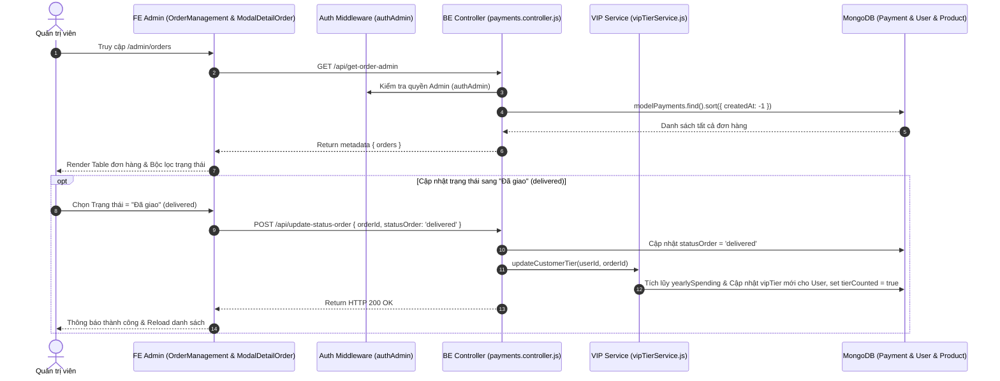

# TÀI LIỆU CONTEXT VÀ BỐI CẢNH NGHIỆP VỤ: QUẢN LÝ ĐƠN HÀNG (ORDER MANAGEMENT & CHI TIẾT ĐƠN HÀNG)

Document này mô tả chi tiết bối cảnh, luồng dữ liệu, luồng nghiệp vụ, các hàm lõi backend/frontend, state và các trường hợp đặc biệt (edge cases) của tính năng Quản lý Đơn hàng (Order Management & Detail Modal) thuộc trang Admin.

---

## 1. TỔNG QUAN CHỨC NĂNG

### 1.1 Chức năng chính
Trang Quản lý Đơn hàng cho phép Quản trị viên (Admin):
1. **Xem danh sách & Lọc đơn hàng (`OrderManagement.jsx`)**: Hiển thị bảng tất cả đơn hàng phát sinh trong hệ thống với các bộ lọc theo Mã đơn hàng / Họ tên / SĐT (`searchText`), Trạng thái đơn hàng (`statusFilter`: pending, completed, shipping, delivered, cancelled), Phương thức thanh toán (COD, VNPAY), Hạng VIP của khách lúc đặt đơn (`renderVipTag`).
2. **Cập nhật trạng thái đơn hàng (`handleUpdateStatus`)**: Thay đổi vòng đời đơn hàng giữa các nấc: `Chờ xác nhận` -> `Đã xác nhận` -> `Đang giao` -> `Đã giao` -> `Đã hủy`.
3. **Tự động Tích lũy Doanh số VIP khi Đã giao**: Khi đơn chuyển sang `delivered`, BE tự động cộng dồn doanh số năm để thăng hạng VIP cho user. Ngược lại, nếu hủy/đổi trạng thái khỏi `delivered`, BE tự động thu hồi (`revertCustomerTier`).
4. **Xem Chi tiết Đơn hàng (`ModalDetailOrder.jsx`)**: Modal hiển thị biên lai hóa đơn đầy đủ (Danh sách sản phẩm, biến thể màu sắc, hình ảnh, đơn giá, số lượng, giảm giá VIP, giảm giá Voucher, thành tiền cuối cùng).
5. **Tạo tài khoản từ Đơn hàng vãng lai (`requestCreateUserFromOrder`)**: Nếu khách mua hàng chưa có tài khoản, Admin có thể bấm nút "Tạo tài khoản" (`UserAddOutlined`) để hệ thống tự tạo tài khoản mới từ email đơn hàng, sinh mật khẩu ngẫu nhiên và gửi mail thông báo cho khách.
6. **Xóa đơn hàng (`handleDeleteOrder`)**: Xóa đơn hàng khỏi hệ thống (Bảo vệ bởi `authAdmin`).

### 1.2 Các thành phần chính
- **Frontend Components**: `OrderManagement.jsx` (List & Filter) và `ModalDetailOrder.jsx` (Detail Modal).
- **Frontend API**: `requestGetOrderAdmin`, `requestUpdateStatusOrder`, `requestDeleteOrder`, `requestCreateUserFromOrder`, `requestGetOnePayment`.
- **Backend Controller**: `payments.controller.js` (`getOrderAdmin`, `updateStatusOrder`, `deleteOrderByAdmin`, `createUserFromOrder`, `getOnePayment`).
- **Backend Services**: `vipTierService.js` (`updateCustomerTier`, `revertCustomerTier`), `mailService.js` (`sendNewAccountEmail`).
- **Backend Model**: `payments.model.js`.

---

## 2. SƠ ĐỒ LUỒNG DỮ LIỆU TỔNG QUÁT

---

## 3. GIẢI THÍCH TỪNG LUỒNG NGHIỆP VỤ CHÍNH

### 3.1 Luồng Cập nhật Trạng thái Đơn hàng & Tích lũy VIP (`updateStatusOrder`)
- **Trigger**: Admin chọn giá trị mới từ Dropdown "Trạng thái" trên bảng đơn hàng.
- **API**: `POST /api/update-status-order` (`requestUpdateStatusOrder`).
- **Logic BE**:
  1. Cập nhật `findPayment.statusOrder = newStatus`.
  2. Nếu `newStatus === 'delivered'` và trạng thái trước đó `!== 'delivered'`: Gọi `updateCustomerTier` để tính tổng chi tiêu năm của user, nâng hạng VIP và đánh dấu `tierCounted = true`.
  3. Nếu `newStatus !== 'delivered'` mà trước đó `tierCounted === true`: Gọi `revertCustomerTier` để trừ lại số tiền khỏi tổng chi tiêu năm và hạ lại hạng VIP nếu không đủ điều kiện.
  4. Nếu `newStatus === 'cancelled'`, gọi `decrementFlashSaleSoldQuantity` để trả lại số lượng Flash Sale đã bán.

---

### 3.2 Luồng Tạo Tài khoản cho Khách hàng từ Đơn hàng (`createUserFromOrder`)
- **Trigger**: Bấm nút "Tạo tài khoản" (`UserAddOutlined`) ở dòng đơn hàng của khách chưa có tài khoản.
- **API**: `POST /api/create-user-from-order` (`requestCreateUserFromOrder`).
- **Logic BE**:
  1. Lấy thông tin `email`, `fullName`, `phone`, `address` từ đơn hàng.
  2. Kiểm tra email đã có tài khoản trong DB chưa. Nếu có -> Ném lỗi.
  3. Tự động sinh mật khẩu ngẫu nhiên an toàn (`generateRandomPassword()`).
  4. Mã hóa bcrypt và tạo `modelUser` mới.
  5. Cập nhật `userId` mới tạo vào document đơn hàng `modelPayments`.
  6. Gửi email chứa thông tin tài khoản và mật khẩu vừa khởi tạo cho khách hàng qua `sendNewAccountEmail`.

---

### 3.3 Luồng Xem Chi tiết Đơn hàng (`ModalDetailOrder.jsx`)
- **Trigger**: Bấm biểu tượng Con mắt (`EyeOutlined`) trên 1 dòng đơn hàng.
- **API**: `GET /api/get-one-payment?id=...` (`requestGetOnePayment`).
- **Logic FE**: Mởi Modal hiển thị thông tin người nhận, địa chỉ, SĐT, phương thức thanh toán, danh sách sản phẩm (ảnh màu chọn, tên, giá, số lượng), bảng phân rã chiết khấu Hạng VIP, Voucher giảm giá và Thành tiền.

---

## 4. GIẢI THÍCH HÀM LÕI VÀ STATE

### 4.1 State Quan trọng
- `orders`: Mảng lưu tất cả đơn hàng từ API.
- `statusFilter`: Trạng thái lọc (`'all'`, `'pending'`, `'completed'`, `'shipping'`, `'delivered'`, `'cancelled'`).
- `selectedOrder`: ID đơn hàng đang mở trong Modal chi tiết.
- `isModalVisible`: Trạng thái ẩn/hiện Modal chi tiết đơn hàng.

### 4.2 Các hàm Helper
- `renderVipTag`: Hiển thị Tag Antd với màu và tên hạng VIP tương ứng (`dong`, `bac`, `vang`, `kimcuong`).
- `statusOptions`: Mảng các tùy chọn trạng thái đơn hàng tiếng Việt.

---

## 5. GHI CHÚ / RỦI RO PHÁT HIỆN ĐƯỢC

> [!NOTE]
> 1. **Tạo tài khoản tự động từ Đơn hàng**: Khi tạo tài khoản từ đơn hàng vãng lai, hệ thống tự động sinh mật khẩu ngẫu nhiên và gửi mail. Cần đảm bảo cấu hình Nodemailer/MailService hoạt động bình thường.
> 2. **Cờ `tierCounted` chống tính trùng**: Đơn hàng chỉ được cộng chi tiêu VIP 1 lần duy nhất nhờ cờ `tierCounted`. Nếu đơn bị chuyển qua lại giữa các trạng thái, `revertCustomerTier` đảm bảo số tiền chi tiêu được hoàn tác chính xác.
