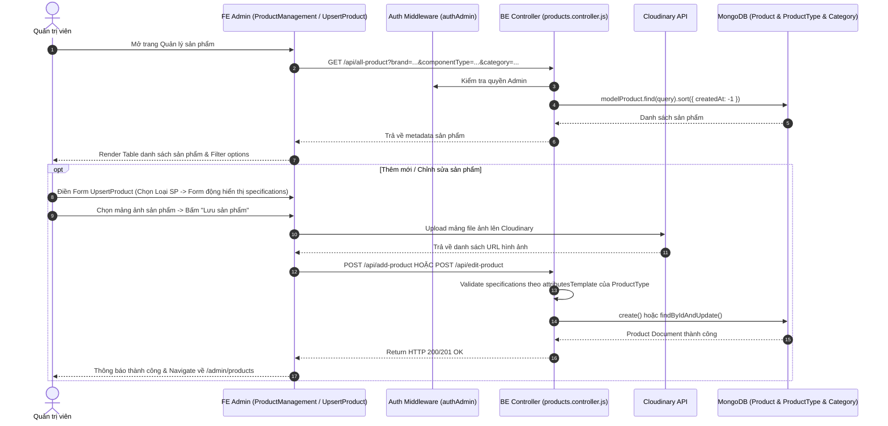

# TÀI LIỆU CONTEXT VÀ BỐI CẢNH NGHIỆP VỤ: QUẢN LÝ SẢN PHẨM (PRODUCT MANAGEMENT & UPSERT PRODUCT)

Document này mô tả chi tiết bối cảnh, luồng dữ liệu, luồng nghiệp vụ, các hàm lõi backend/frontend, state và các trường hợp đặc biệt (edge cases) của tính năng Quản lý Sản phẩm (Danh sách & Thêm/Sửa sản phẩm) thuộc trang Admin.

---

## 1. TỔNG QUAN CHỨC NĂNG

### 1.1 Chức năng chính
Hệ thống Quản lý Sản phẩm cho phép Quản trị viên (Admin):
1. **Xem danh sách & Lọc sản phẩm (`ProductManagement.jsx`)**: Hiển thị bảng danh sách sản phẩm với các bộ lọc theo Tên sản phẩm (Search), Hãng sản xuất (`brand`), Loại sản phẩm (`componentType`), Danh mục (`category`), sắp xếp theo Giá/Tồn kho/Thời gian tạo.
2. **Thao tác nhanh**: Nút Nhân bản (`CopyOutlined`) để tạo nhanh sản phẩm tương tự, Nút Chỉnh sửa (`EditOutlined`), Nút Xóa sản phẩm (`DeleteOutlined`).
3. **Thêm mới & Chỉnh sửa sản phẩm nâng cao (`UpsertProduct.jsx`)**:
   - Form động tự sinh các trường Thông số kỹ thuật (`specifications`) dựa trên Template của loại sản phẩm (`componentType`).
   - Quản lý tùy chọn Màu sắc (Color options: tên màu, hex code, hình ảnh màu, giá riêng, màu mặc định).
   - Tải lên mảng hình ảnh sản phẩm (Upload Cloudinary).
   - Thiết lập % Giảm giá (`discount`), Giá nhập (`costPrice`), Tồn kho (`stock`).

### 1.2 Các thành phần chính
- **Frontend Components**: `ProductManagement.jsx` (List & Filter) và `UpsertProduct.jsx` (Add & Edit Form).
- **Frontend API**: `requestGetAllProduct`, `requestAddProduct`, `requestEditProduct`, `requestDeleteProduct`, `requestUploadImage`...
- **Backend Routes & Controller**: `products.routes.js`, `products.controller.js` (`getAllProduct`, `addProduct`, `editProduct`, `deleteProduct`).
- **Backend Model**: `products.model.js`.

---

## 2. SƠ ĐỒ LUỒNG DỮ LIỆU TỔNG QUÁT

---

## 3. GIẢI THÍCH TỪNG LUỒNG NGHIỆP VỤ CHÍNH

### 3.1 Luồng Hiển thị & Lọc Danh sách Sản phẩm (`ProductManagement.jsx`)
- **Trigger**: Khi Admin mở trang `/admin/products` hoặc đổi giá trị bộ lọc.
- **API**: `GET /api/all-product` (`requestGetAllProduct`).
- **Logic FE**:
  - Tự động trích xuất danh sách duy nhất các Hãng (`brands`) và Loại sản phẩm (`componentTypes`) từ kết quả API để tạo các option cho thẻ `<Select>` lọc.
  - Lọc client-side kết hợp với server-side search text.
  - Hiển thị giá nhập (`costPrice`), giá bán (`price`), giảm giá (`discount`), tồn kho (`stock`), trạng thái tồn kho (Thẻ màu Đỏ nếu `stock === 0`).

---

### 3.2 Luồng Thêm mới & Chỉnh sửa Sản phẩm Form Động (`UpsertProduct.jsx`)
- **Trigger**: Admin bấm "Thêm sản phẩm" (`/admin/products/add`) hoặc "Chỉnh sửa" (`/admin/products/:productId/edit`).
- **API**: `POST /api/add-product` (`requestAddProduct`) và `POST /api/edit-product` (`requestEditProduct`).
- **Logic xử lý chi tiết FE & BE**:
  1. Khi chọn Loại sản phẩm (`componentType`): FE fetch template thuộc tính từ `modelProductType` (`attributesTemplate`).
  2. Tự động sinh ra các trường nhập liệu tương ứng: Text, Number, Select, Checkbox.
  3. Validate bắt buộc với các trường thuộc tính có `required: true`.
  4. Quản lý Tùy chọn màu sắc (`colorOptions`): Cho phép thêm/sửa/xóa từng màu sắc (tên màu, mã hex, ảnh đại diện màu, giá riêng của màu đó, tích chọn màu mặc định `isDefault`).
  5. Xử lý Upload ảnh: Upload file ảnh local lên Cloudinary qua API `requestUploadImage`, nhận về mảng URL để lưu vào DB.
  6. **BE Validation Core**:
     - `normalizeSpecificationsByTemplate`: Kiểm tra mảng thông số `specifications` gửi lên, ép kiểu đúng theo `type` (chữ, số, chọn từ danh sách) của `attributesTemplate`.
     - `ensureRequiredSpecifications`: Đảm bảo tất cả các thuộc tính bắt buộc của `ProductType` đều có dữ liệu trong `specifications`.

---

### 3.3 Luồng Nhân bản Sản phẩm (`Duplicate Product`)
- **Trigger**: Admin bấm biểu tượng Copy (`CopyOutlined`) trên 1 dòng sản phẩm trong bảng.
- **Logic FE**:
  1. Đọc dữ liệu sản phẩm gốc (`record`).
  2. Chuyển hướng sang `/admin/products/add` kèm `location.state = { duplicateFrom: record }`.
  3. Form `UpsertProduct.jsx` phát hiện `duplicateFrom`, tự động fill lại toàn bộ thông tin (Tên sản phẩm thêm hậu tố `"(Bản sao)"`, Hãng, Loại sản phẩm, Thông số kỹ thuật `specifications`, Mảng hình ảnh, Biến thể màu sắc `colorOptions`).
  4. Loại bỏ trường `_id` để khi bấm "Lưu sản phẩm", hệ thống thực hiện `requestAddProduct` tạo một sản phẩm hoàn toàn mới.

---

### 3.4 Luồng Xóa Sản phẩm (`deleteProduct`)
- **Trigger**: Admin bấm biểu tượng Thùng rác (`DeleteOutlined`) -> Xác nhận Popconfirm.
- **API**: `DELETE /api/delete-product?id=...` (`requestDeleteProduct`).
- **Logic BE**: `modelProduct.findByIdAndDelete(id)`. Trả về OK -> FE xóa dòng sản phẩm khỏi Table.

---

## 4. GIẢI THÍCH HÀM LÕI VÀ STATE

### 4.1 State Quan trọng (`UpsertProduct.jsx`)
- `form`: Form Antd instance quản lý các field chính.
- `selectedComponentType`: Loại sản phẩm đang được chọn.
- `attributesTemplate`: Danh sách mẫu thuộc tính tương ứng với `selectedComponentType`.
- `colorOptions`: Mảng lưu các biến thể màu sắc.
- `fileList`: Mảng chứa thông tin các file ảnh tải lên.

### 4.2 Backend Helper Validation (`products.controller.js`)
- `normalizeSpecificationsByTemplate`: Kiểm tra và chuẩn hóa mảng `specifications` khớp với kiểu dữ liệu (`text`, `number`, `select`) được định nghĩa trong `attributesTemplate`.
- `ensureRequiredSpecifications`: Đảm bảo các thông số kỹ thuật bắt buộc không bị bỏ trống trước khi lưu vào DB.

---

## 5. GHI CHÚ / RỦI RO PHÁT HIỆN ĐƯỢC

> [!NOTE]
> 1. **Dữ liệu `specifications` phụ thuộc vào `ProductType`**: Nếu một loại sản phẩm bị xóa hoặc sửa `attributesTemplate`, các sản phẩm cũ thuộc loại đó khi chỉnh sửa có thể cần được cập nhật lại để thỏa mãn các thuộc tính bắt buộc mới.
> 2. **Ảnh biến thể màu sắc**: Nếu admin tải ảnh màu sắc cho từng `colorOptions`, ảnh đó cần được upload lên Cloudinary trước khi lưu form.
> 3. **Nhân bản giúp tăng tốc nhập liệu**: Tính năng Duplicate cho phép tạo nhiều biến thể cấu hình sản phẩm cùng một dòng nhanh chóng mà không cần gõ lại toàn bộ thông số kỹ thuật.
