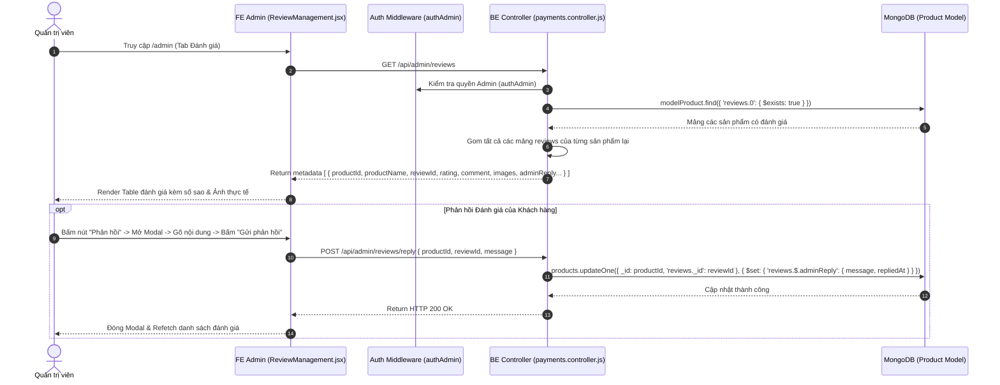

# TÀI LIỆU CONTEXT VÀ BỐI CẢNH NGHIỆP VỤ: QUẢN LÝ ĐÁNH GIÁ & PHẢN HỒI (REVIEW MANAGEMENT)

Document me tả chi tiết bối cảnh, luồng dữ liệu, luồng nghiệp vụ, các hàm lõi backend/frontend, state và các trường hợp đặc biệt (edge cases) của tính năng Quản lý Đánh giá & Phản hồi Khách hàng (Review Management) thuộc trang Admin.

---

## 1. TỔNG QUAN CHỨC NĂNG

### 1.1 Chức năng chính
Trang Quản lý Đánh giá (`ReviewManagement.jsx`) cho phép Quản trị viên (Admin):
1. **Xem toàn bộ Đánh giá từ Khách hàng (`getProductReviewsAdmin`)**: Hiển thị bảng tổng hợp tất cả các nhận xét của người mua đối với sản phẩm trên trang web, gồm: Tên sản phẩm, Ảnh sản phẩm, Tên người dùng, Số sao rating (1-5 sao), Nội dung bình luận, Hình ảnh chụp thực tế đính kèm, Ngày đánh giá và Trạng thái phản hồi của Admin.
2. **Viết & Cập nhật Phản hồi của Admin (`replyProductReviewByAdmin`)**: Mở Modal gõ câu trả lời của Shop (`adminReply`). Phản hồi này sẽ được hiển thị ngay bên dưới nhận xét của khách ở trang Chi tiết Sản phẩm (`DetailProduct.jsx`).
3. **Xóa Đánh giá vi phạm (`deleteProductReviewByAdmin`)**: Cho phép Admin xóa các nhận xét chứa từ ngữ không phù hợp hoặc tin nhắn rác.

### 1.2 Các thành phần chính
- **Frontend Component**: `ReviewManagement.jsx` (Table, Modal Form Phản hồi, Rating sao Antd).
- **Frontend API**: `requestGetAdminReviews`, `requestReplyAdminReview`, `requestDeleteAdminReview`.
- **Backend Routes & Controller**: `payments.routes.js`, `payments.controller.js` (`getProductReviewsAdmin`, `replyProductReviewByAdmin`, `deleteProductReviewByAdmin`).
- **Backend Model**: `products.model.js` (Mảng `reviews` chứa `adminReply`).

---

## 2. SƠ ĐỒ LUỒNG DỮ LIỆU TỔNG QUÁT

---

## 3. GIẢI THÍCH TỪNG LUỒNG NGHIỆP VỤ CHÍNH

### 3.1 Luồng Tổng hợp Danh sách Đánh giá (`getProductReviewsAdmin`)
- **Trigger**: Khi Admin mở tab Quản lý Đánh giá.
- **API**: `GET /api/admin/reviews` (`requestGetAdminReviews`).
- **Logic BE**:
  1. Tìm tất cả các sản phẩm có chứa mảng `reviews` không rỗng (`modelProduct.find({ 'reviews.0': { $exists: true } })`).
  2. Phẳng hóa (flatten) tất cả các nhận xét từ các sản phẩm thành một danh sách duy nhất.
  3. Bổ sung thông tin `productName`, `productImage`, `reviewId` vào từng phần tử.
  4. Trả về cho FE sắp xếp theo thời gian gửi mới nhất.

---

### 3.2 Luồng Phản hồi Đánh giá của Admin (`replyProductReviewByAdmin`)
- **Trigger**: Admin bấm nút "Phản hồi" (hoặc "Sửa phản hồi") trên 1 dòng đánh giá, nhập nội dung câu trả lời và bấm "Gửi phản hồi".
- **API**: `POST /api/admin/reviews/reply` (`requestReplyAdminReview`).
- **Logic BE**:
  1. Tìm sản phẩm theo `productId` và tìm phần tử review theo `reviewId`.
  2. Gán thông tin `adminReply`:
     - `message`: Nội dung trả lời của Admin.
     - `repliedAt`: Thời gian phản hồi (`new Date()`).
     - `adminName`: Họ tên Admin.
  3. Lưu lại vào DB -> FE refetch lại danh sách và đổi nhãn nút sang Tag Xanh lá **"Đã Phản Hồi"**.

---

### 3.3 Luồng Xóa Đánh giá (`deleteProductReviewByAdmin`)
- **Trigger**: Admin bấm biểu tượng Thùng rác trên 1 dòng đánh giá -> Popconfirm "Có".
- **API**: `DELETE /api/admin/reviews?productId=...&reviewId=...` (`requestDeleteAdminReview`).
- **Logic BE**:
  - Dùng toán tử `$pull` trong Mongoose: `modelProduct.updateOne({ _id: productId }, { $pull: { reviews: { _id: reviewId } } })`.
  - Loại bỏ hoàn toàn đánh giá đó khỏi sản phẩm.

---

## 4. GIẢI THÍCH HÀM LÕI VÀ STATE

### 4.1 State Quan trọng
- `reviews`: Mảng danh sách tất cả các đánh giá sản phẩm.
- `searchText`: Từ khóa tìm kiếm theo tên sản phẩm, tên khách hàng hoặc nội dung comment.
- `selectedReview`: Object đánh giá đang mở trong Modal phản hồi.
- `replyValue`: Chuỗi nội dung câu trả lời do Admin gõ.
- `isReplyModalOpen`: Trạng thái ẩn/hiện Modal Form phản hồi.

---

## 5. GHI CHÚ / RỦI RO PHÁT HIỆN ĐƯỢC

> [!NOTE]
> 1. **Đồng bộ hiển thị trên Chi tiết Sản phẩm**: Khi Admin trả lời nhận xét tại trang này, câu trả lời sẽ xuất hiện ngay lập tức trên trang Chi tiết sản phẩm (`DetailProduct.jsx`) của khách hàng ở ô nhận xét tương ứng.
> 2. **Chỉnh sửa Phản hồi**: Nếu đánh giá đã có `adminReply`, khi bấm nút Phản hồi, ô input sẽ tự nạp câu trả lời cũ cho phép Admin cập nhật hoặc chỉnh sửa lại câu trả lời bất kỳ lúc nào.
