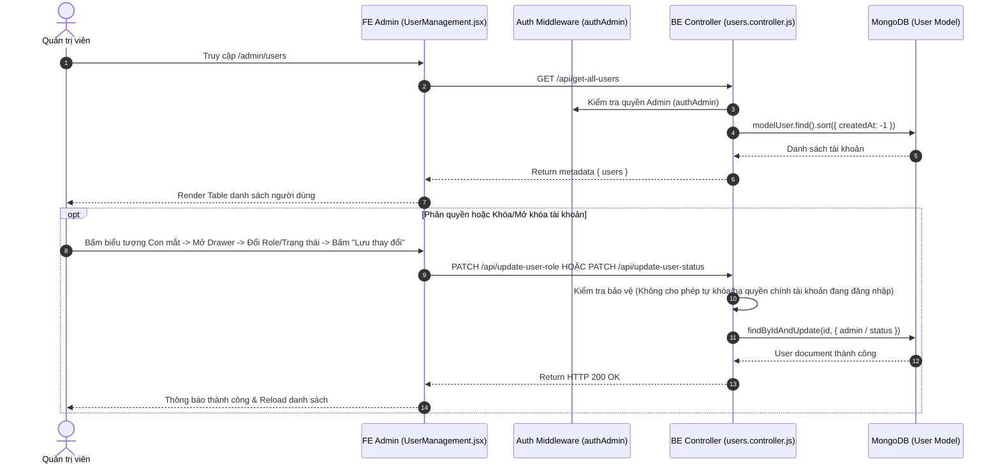

# TÀI LIỆU CONTEXT VÀ BỐI CẢNH NGHIỆP VỤ: QUẢN LÝ NGƯỜI DÙNG (USER MANAGEMENT & PHÂN QUYỀN)

Document này mô tả chi tiết bối cảnh, luồng dữ liệu, luồng nghiệp vụ, các hàm lõi backend/frontend, state và các trường hợp đặc biệt (edge cases) của tính năng Quản lý Người dùng (User Management) thuộc trang Admin.

---

## 1. TỔNG QUAN CHỨC NĂNG

### 1.1 Chức năng chính
Trang Quản lý Người dùng (`UserManagement.jsx`) cho phép Quản trị viên (Admin):
1. **Xem danh sách & Lọc tài khoản**: Hiển thị bảng toàn bộ người dùng trong hệ thống với bộ lọc theo tên/email/SĐT, phân loại quyền (Admin vs Người dùng), trạng thái hoạt động (Active vs Inactive), Hạng VIP (Thành viên, Đồng, Bạc, Vàng, Kim Cương) và Chi tiêu năm.
2. **Xem chi tiết tài khoản (Drawer)**: Xem thông tin đầy đủ của một người dùng bao gồm ngày đăng ký, ngày cập nhật cuối cùng, hình thức đăng nhập (Email vs Google OAuth).
3. **Phân quyền Admin (`updateUserRole`)**: Thay đổi vai trò giữa Admin (`admin = true`) và Người dùng bình thường (`admin = false`).
4. **Bật/Tắt trạng thái tài khoản (`updateUserStatus`)**: Khóa tài khoản (`status = false`) hoặc mở khóa tài khoản (`status = true`).
5. **Thêm mới tài khoản Admin/User (`createUser`)**: Form Modal tạo tài khoản mới với đầy đủ kiểm tra định dạng SĐT Việt Nam và mã hóa mật khẩu.

### 1.2 Các thành phần chính
- **Frontend Component**: `UserManagement.jsx` (Table, Drawer chi tiết, Modal tạo user).
- **Frontend API**: `requestGetAllUser`, `requestUpdateUserRole`, `requestUpdateUserStatus`, `requestCreateUser`.
- **Backend Routes & Controller**: `users.routes.js`, `users.controller.js` (`getAllUser`, `updateUserRole`, `updateUserStatus`, `createUser`).
- **Backend Model**: `users.model.js`.

---

## 2. SƠ ĐỒ LUỒNG DỮ LIỆU TỔNG QUÁT

---

## 3. GIẢI THÍCH TỪNG LUỒNG NGHIỆP VỤ CHÍNH

### 3.1 Luồng Hiển thị Danh sách Người dùng (`getAllUser`)
- **Trigger**: Khi Admin mở trang Quản lý người dùng.
- **API**: `GET /api/get-all-users` (`requestGetAllUser`).
- **Logic FE**: Hiển thị họ tên, email, SĐT, phân loại quyền (Tag Admin tím / Tag Người dùng xanh), Tag hạng VIP kèm % giảm giá tương ứng (`renderVipTag`), tổng chi tiêu năm `yearlySpending` và trạng thái hoạt động.

---

### 3.2 Luồng Phân quyền & Khóa/Mở khóa Tài khoản (`updateUserRole` & `updateUserStatus`)
- **Trigger**: Admin mở Drawer chi tiết tài khoản, thay đổi giá trị Dropdown "Vai trò" hoặc "Trạng thái" và bấm "Lưu thay đổi".
- **API**: `PATCH /api/update-user-role` và `PATCH /api/update-user-status`.
- **Cơ chế bảo vệ đặc biệt (Guard Rule)**:
  - FE & BE ngăn chặn tuyệt đối việc **Admin tự khóa hoặc tự hạ quyền Admin của chính tài khoản mà mình đang sử dụng để đăng nhập** (`isCurrentUserSelected`).
  - Nếu cố tình thực hiện trên tài khoản chính mình -> FE disable hoặc BE ném lỗi `BadRequestError("Không thể tự thay đổi vai trò/trạng thái của chính mình")`.

---

### 3.3 Luồng Tạo mới Tài khoản Người dùng / Admin (`createUser`)
- **Trigger**: Admin bấm "Thêm tài khoản", điền Form Modal và bấm "Tạo tài khoản".
- **API**: `POST /api/admin/create-user` (`requestCreateUser`).
- **Logic Validation**:
  - Validate định dạng Email chuẩn.
  - Validate Số điện thoại Việt Nam (`phoneRule` regex `^(0(?:3|5|7|8|9)\d{8})$`, tự động chuẩn hóa đầu số `+84` thành `0`).
  - BE kiểm tra trùng lặp Email và SĐT trong DB trước khi tạo. Mã hóa mật khẩu bằng `bcrypt.hash`.

---

## 4. GIẢI THÍCH HÀM LÕI VÀ STATE

### 4.1 State Quan trọng
- `dataUsers`: Mảng chứa danh sách tất cả tài khoản.
- `selectedUser`: User document đang được xem trong Drawer.
- `selectedRole`, `selectedStatus`: Trạng thái vai trò và khóa/mở khóa tạm thời trên Drawer.
- `isCurrentUserSelected` *(useMemo)*: Boolean kiểm tra `selectedUser._id === dataUser._id` để chặn tự thao tác trên chính mình.

### 4.2 Các hàm Helper
- `phoneRule`: Validator bất đồng bộ định dạng SĐT Việt Nam cho Antd Form.
- `renderVipTag`: Render Tag màu và tỉ lệ % giảm giá theo key hạng VIP (`dong`: 2%, `bac`: 5%, `vang`: 10%, `kimcuong`: 15%).

---

## 5. GHI CHÚ / RỦI RO PHÁT HIỆN ĐƯỢC

> [!NOTE]
> 1. **Khóa tài khoản (Status = false)**: Khi tài khoản bị khóa (`status = false`), middleware kiểm tra auth sẽ từ chối đăng nhập và chặn các request gửi từ tài khoản đó.
> 2. **Tài khoản Đăng nhập Google (OAuth)**: Trường `loginType` của user Google là `'google'`. Admin không thể sửa mật khẩu cho tài khoản Google nhưng vẫn có thể phân quyền Admin hoặc khóa/mở khóa tài khoản bình thường.
