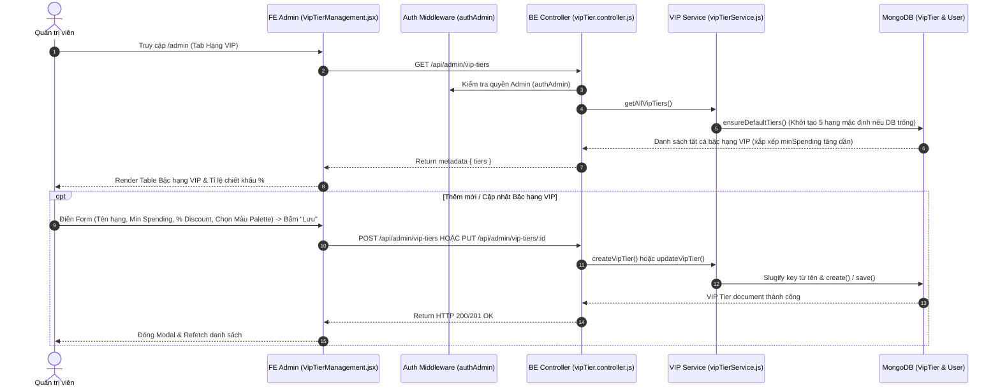

# TÀI LIỆU CONTEXT VÀ BỐI CẢNH NGHIỆP VỤ: QUẢN LÝ BẬC HẠNG VIP (VIP TIER MANAGEMENT)

Document này mô tả chi tiết bối cảnh, luồng dữ liệu, luồng nghiệp vụ, các hàm lõi backend/frontend, state và các trường hợp đặc biệt (edge cases) của tính năng Quản lý Bậc hạng VIP (VIP Tier Management) thuộc trang Admin.

---

## 1. TỔNG QUAN CHỨC NĂNG

### 1.1 Chức năng chính
Trang Quản lý Bậc hạng VIP (`VipTierManagement.jsx`) cho phép Quản trị viên (Admin):
1. **Cấu hình Bậc hạng VIP linh hoạt**: Quản lý danh sách các cấp độ thành viên trong hệ thống (Tên bậc hạng, Mức chi tiêu tối thiểu năm `minSpending`, Tỉ lệ % giảm giá `discountRate`, Mã màu hiển thị `color`).
2. **Thêm Bậc hạng VIP mới (`createVipTier`)**: Tạo cấp độ VIP mới với công cụ chọn màu sắc mã Hex động (Bảng ma trận màu `COLOR_PALETTE_GRID`).
3. **Cập nhật Bậc hạng VIP (`updateVipTier`)**: Chỉnh sửa mức chi tiêu tích lũy tối thiểu, đổi % ưu đãi chiết khấu và màu đại diện.
4. **Xóa Bậc hạng VIP (`deleteVipTier`)**: Xóa bậc hạng khỏi hệ thống (Bảo vệ hạng mặc định "Thành viên" `key === 'none'`).

### 1.2 Các thành phần chính
- **Frontend Component**: `VipTierManagement.jsx` (Table, Form Modal, Palette ma trận màu 5x11).
- **Frontend API**: `requestGetAdminVipTiers`, `requestCreateVipTier`, `requestUpdateVipTier`, `requestDeleteVipTier`.
- **Backend Routes & Controller**: `vipTier.routes.js`, `vipTier.controller.js`.
- **Backend Service**: `vipTierService.js` (`ensureDefaultTiers`, `getAllVipTiers`, `calculateTierFromSpending`, `updateCustomerTier`, `revertCustomerTier`).
- **Backend Model**: `vipTier.model.js`.

---

## 2. SƠ ĐỒ LUỒNG DỮ LIỆU TỔNG QUÁT

---

## 3. GIẢI THÍCH TỪNG LUỒNG NGHIỆP VỤ CHÍNH

### 3.1 Luồng Khởi tạo Dữ liệu Mặc định (`ensureDefaultTiers`)
- **Trigger**: Khi backend khởi động hoặc khi gọi API tra cứu danh sách VIP tiers lần đầu.
- **Logic Service**: Nếu bảng `modelVipTier` chưa có dữ liệu (`count === 0`), service tự động seeding 5 bậc hạng chuẩn:
  1. `none`: Thành viên (Min 0đ, Giảm 0%, Màu `#8c8c8c`).
  2. `dong`: Đồng (Min 5,000,000đ, Giảm 2%, Màu `#cd7f32`).
  3. `bac`: Bạc (Min 20,000,000đ, Giảm 5%, Màu `#c0c0c0`).
  4. `vang`: Vàng (Min 50,000,000đ, Giảm 10%, Màu `#ffd700`).
  5. `kimcuong`: Kim Cương (Min 100,000,000đ, Giảm 15%, Màu `#b9f2ff`).

---

### 3.2 Luồng Thêm mới & Cập nhật Bậc hạng VIP (`createVipTier` & `updateVipTier`)
- **Trigger**: Admin mở Modal, nhập tên hạng, mức chi tiêu tối thiểu, % chiết khấu và chọn ô màu từ Ma trận `COLOR_PALETTE_GRID`.
- **Logic BE**:
  1. Tự động chuyển đổi Tên hạng -> Key ASCII không dấu bằng `slugifyKey(name)` (Ví dụ: `"Bạch Kim"` -> `"bachkim"`).
  2. Kiểm tra trùng lặp `key` trong DB.
  3. Khi cập nhật (`updateVipTier`), giữ cố định `key` để đảm bảo tính toàn vẹn dữ liệu đơn hàng và profile người dùng cũ.

---

### 3.3 Luồng Xóa Bậc hạng VIP (`deleteVipTier`)
- **Trigger**: Admin bấm nút Thùng rác trên 1 dòng bậc hạng.
- **Guard Rule**: **Không thể xóa hạng mặc định "Thành viên" (`key === 'none'`)**. Nếu cố xóa -> BE ném lỗi `Error("Không thể xóa hạng mặc định 'Thành viên'")`.
- **Xử lý cascade**: Khi xóa một bậc hạng thành công, service tự động chuyển tất cả người dùng thuộc hạng bị xóa về hạng mặc định `'none'`.

---

## 4. GIẢI THÍCH HÀM LÕI VÀ STATE

### 4.1 State Quan trọng
- `tiers`: Mảng danh sách các bậc hạng VIP.
- `selectedColor`: Mã Hex màu sắc đại diện được chọn từ bảng màu Ma trận 5x11.
- `editingTier`: Object bậc hạng đang chỉnh sửa.

### 4.2 Backend Helper (`vipTierService.js`)
- `slugifyKey`: Hàm biến đổi tên bậc hạng tiếng Việt thành key không dấu (VD: `"Kim Cương"` -> `"kimcuong"`).
- `calculateTierFromSpending(spending)`: Duyệt danh sách bậc hạng sắp xếp giảm dần theo `minSpending` để tìm bậc hạng cao nhất mà số tiền chi tiêu `spending` đạt đủ điều kiện.

---

## 5. GHI CHÚ / RỦI RO PHÁT HIỆN ĐƯỢC

> [!NOTE]
> 1. **Khóa cố định `key` khi Edit**: Giữ cố định `key` giúp cho các đơn hàng cũ và lịch sử chi tiêu của người dùng không bị lệch liên kết dữ liệu.
> 2. **Tự động áp dụng chiết khấu**: Tỉ lệ `% discountRate` cấu hình tại trang này sẽ lập tức có hiệu lực cho toàn bộ giỏ hàng và đơn hàng của các khách hàng thuộc hạng VIP tương ứng.
