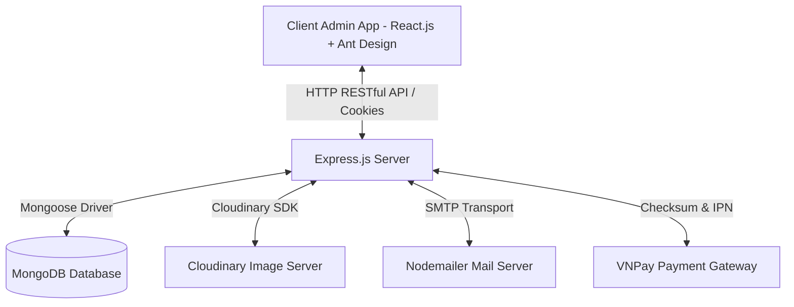
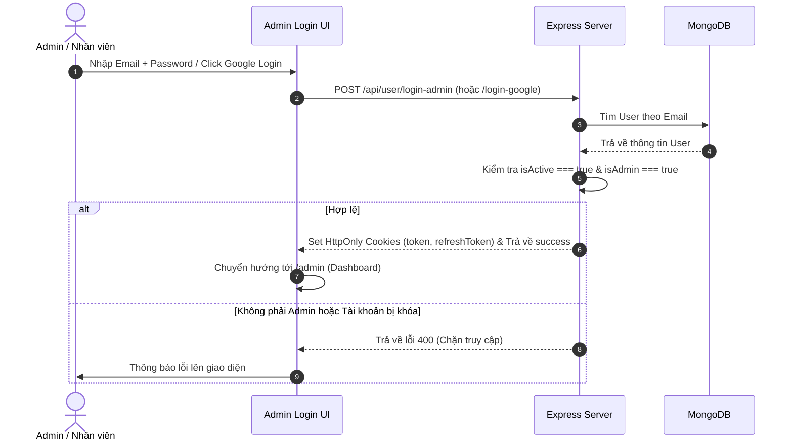
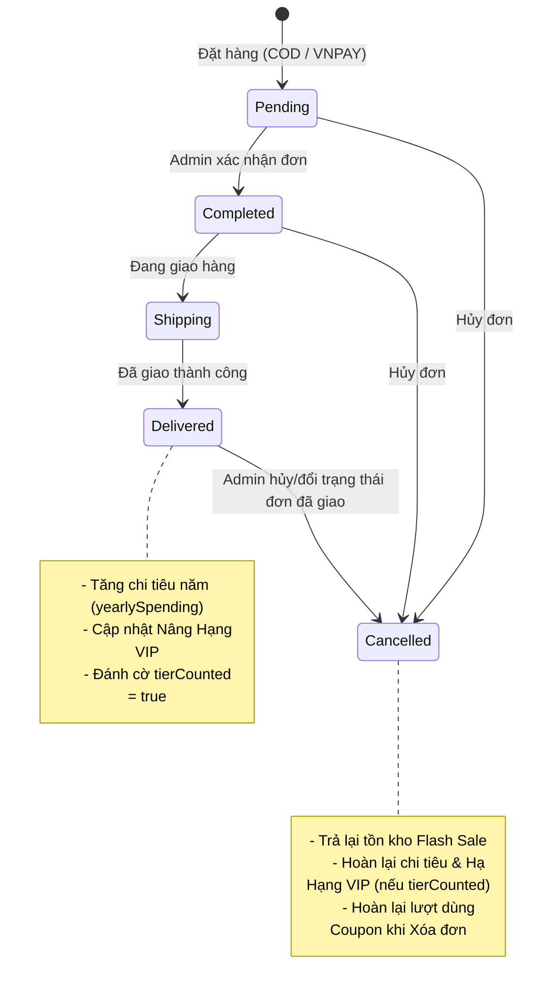

# HƯỚNG DẪN CHI TIẾT BỐI CẢNH, LUỒNG NGHIỆP VỤ VÀ CÁC CHỨC NĂNG QUẢN TRỊ (ADMIN DASHBOARD)

---

## PHẦN 1: BỐI CẢNH VÀ TỔNG QUAN KIẾN TRÚC HỆ THỐNG

Hệ thống quản trị **Mac Shop Admin** là trung tâm điều hành toàn bộ hoạt động kinh doanh thương mại điện tử của cửa hàng (bán các sản phẩm công nghệ như MacBook, iPhone, iPad, Phụ kiện). System được xây dựng theo mô hình **Client-Server (RESTful API)** tách biệt rõ ràng giữa giao diện người dùng và xử lý nghiệp vụ:

### 1.1. Công nghệ sử dụng
- **Frontend (Client)**: 
  - **Framework**: React.js (Vite làm công cụ đóng gói phát triển tốc độ cao).
  - **Giao diện (UI)**: Ant Design (Antd) - Thư viện UI chuẩn mực cho trang quản trị thương mại điện tử với hệ thống Bảng, Form, Modal, Drawer, Notification phong phú.
  - **Styling**: SCSS Modules (đảm bảo css không bị xung đột giữa các trang).
  - **Điều hướng (Routing)**: React Router v6.
  - **Biểu đồ (Chart)**: Chart.js & `react-chartjs-2` (vẽ biểu đồ đường Doanh thu / Lợi nhuận và biểu đồ tròn trạng thái đơn).
- **Backend (Server)**:
  - **Nền tảng**: Node.js & Express.js framework.
  - **Cơ sở dữ liệu**: MongoDB kết hợp ORM/ODM Mongoose Schema.
- **Bảo mật & Phiên làm việc**:
  - **JWT (JSON Web Token)**: Quản lý đăng nhập với cặp cờ `token` (ngắn hạn 15 phút) và `refreshToken` (dài hạn 1 ngày) lưu trong HttpOnly Cookies.
  - **Mã hóa**: `bcrypt` mã hóa mật khẩu, `crypto-js` (AES) bảo vệ dữ liệu nhạy cảm.
- **Dịch vụ tích hợp bên thứ ba (Third-party Services)**:
  - **Cloudinary**: Lưu trữ và tối ưu hóa hình ảnh sản phẩm, ảnh đại diện, logo thương hiệu.
  - **VNPay Sandbox**: Cổng thanh toán trực tuyến thử nghiệm.
  - **Nodemailer (SMTP Mailer)**: Tự động gửi email thông báo tài khoản mới và cấp lại mật khẩu.

### 1.2. Sơ đồ tương tác tổng thể


---

## PHẦN 2: LUỒNG XÁC THỰC, BẢO MẬT VÀ PHÂN QUYỀN (AUTH & SECURITY)



### 2.1. Đăng nhập bằng Email & Mật khẩu (`loginAdmin`)
1. Người dùng nhập Email và Mật khẩu tại giao diện `AdminLogin.jsx`.
2. Client gửi Yêu cầu POST tới API `requestAdminLogin`.
3. Server kiểm tra:
   - Email có tồn tại trong Database không.
   - Loại tài khoản có phải `typeLogin === 'email'` hay không (nếu là tài khoản Google sẽ báo lỗi yêu cầu đăng nhập bằng Google).
   - Kiểm tra cờ `isActive`: Nếu bằng `false`, tài khoản đã bị khóa $\rightarrow$ Ném lỗi `BadUser2RequestError`.
   - Đối sánh mật khẩu mã hóa bằng `bcrypt.compareSync(password, user.password)`.
   - **Kiểm tra phân quyền Admin**: Nếu `user.isAdmin === false` $\rightarrow$ Chặn với thông báo *"Bạn không có quyền truy cập trang quản trị"*.
4. Nếu tất cả hợp lệ: Server cấp cờ ApiKey mới, đính kèm Cookie `token` (15 phút), `refreshToken` (24 giờ), `logged` (1 ngày) và gửi phản hồi thành công.

### 2.2. Đăng nhập bằng Google OAuth (`loginGoogle`)
1. Admin click nút **Đăng nhập bằng Google**, nhận credential từ Google.
2. Client gửi credential lên API `loginGoogle`.
3. Server decode token Google lấy email:
   - Nếu User chưa tồn tại: Tạo mới User trong DB.
   - Nếu User đã tồn tại: Kiểm tra cờ `isActive`.
4. Ngay sau khi đăng nhập thành công với Google, Client thực hiện kiểm tra quyền Admin bằng cách gọi API `requestAdmin()`. Nếu cờ `isAdmin` trong cơ sở dữ liệu là `false`, phiên làm việc lập tức bị từ chối.

### 2.3. Bảo vệ Đường dẫn Quản trị (Route Guard Protection)
- Trong `MainLayout.jsx`, mỗi khi Admin di chuyển qua lại giữa các trang trong `/admin/*`, hàm `useEffect` sẽ thực thi gọi API `/admin/auth` (`requestAdmin()`).
- Nếu Token hết hạn hoặc cờ `isAdmin` không thỏa mãn, ứng dụng tự động xóa bộ nhớ tạm và chuyển hướng người dùng về trang `/admin/login`.

---

## PHẦN 3: TỔNG HOÀN CÁC LUỒNG NGHIỆP VỤ HỆ THỐNG (BUSINESS LOGIC)

### 3.1. Luồng Quản lý Sản phẩm, Biến thể Màu sắc & Thuộc tính Động

#### A. Thuộc tính động của Sản phẩm theo Template (`ProductType`)
Để linh hoạt kinh doanh nhiều loại thiết bị công nghệ khác nhau mà không phải sửa DB:
1. **Định nghĩa Template (`productType.model.js`)**: Mỗi loại sản phẩm (ví dụ `macbook`, `iphone`, `ipad`) có một `attributesTemplate` chứa danh sách các trường thuộc tính (như RAM, CPU, Dung lượng ổ cứng, Kích thước màn hình, Loại Card đồ họa...).
2. **Render động trên Giao diện (`UpsertProduct.jsx`)**: Khi chọn Loại sản phẩm nào, Form sẽ tự động duyệt qua danh sách template của loại đó và sinh ra các ô nhập liệu tương ứng (Text, Number, hoặc Dropdown Select).
3. **Lưu trữ linh hoạt**: Tất cả thuộc tính được lưu dạng mảng object `specifications: [{ key, label, value }]` trong MongoDB.

#### B. Quản lý Biến thể Màu sắc & Cơ chế Đồng bộ Giá mặc định (`colorPriceSync.js`)
- Một sản phẩm (ví dụ iPhone 15 Pro Max) có thể có nhiều màu sắc (Natural Titanium, Blue Titanium, Black Titanium...).
- Mối biến thể màu có: `name` (Tên màu), `image` (Ảnh riêng của màu), `price` (Giá riêng của màu đó), `isDefault` (Cờ đánh dấu màu đại diện).
- **Quy tắc đồng bộ giá mặc định**:
  - Giá của màu được tích chọn cờ `isDefault: true` chính là Giá bán hiển thị chính (`price`) của sản phẩm.
  - Khi Admin chọn hoặc đổi màu mặc định, hàm `syncProductPriceWithDefaultColor` sẽ tự động cập nhật ô nhập **Giá bán sản phẩm** theo giá của màu mặc định đó và khóa ô nhập (`disabled`).

#### C. Công thức tính Giá sau giảm (`finalPrice`)
- Giá bán sản phẩm sau giảm giá được tính theo công thức:
  $$\text{FinalPrice} = \max\left(0, \text{Math.round}\left(\frac{\text{BasePrice} \times (100 - \text{Discount})}{100}\right)\right)$$
- `Discount` là số phần trăm giảm giá từ 0% đến 100%.

---

### 3.2. Luồng Xử lý Vòng đời Đơn hàng & Tích lũy Hạng VIP Khách hàng



#### Xử lý chi tiết theo từng trạng thái đơn hàng (`payments.controller.js`):
1. **Khi Đơn hàng đổi sang `delivered` (Đã giao thành công)**:
   - Hệ thống tự động gọi hàm `updateCustomerTier(userId, orderId)`.
   - Tăng tổng chi tiêu tích lũy năm `yearlySpending` của khách hàng bằng đúng giá trị thanh toán thực tế của đơn hàng.
   - So sánh `yearlySpending` với bảng hạn mức VIP (`vipTier.model.js`), tự động nâng cấp cờ `vipTier` cho User (Ví dụ: Từ Thành viên $\rightarrow$ VIP Đồng $\rightarrow$ VIP Bạc $\rightarrow$ VIP Vàng $\rightarrow$ VIP Kim Cương).
   - Gán cờ `tierCounted = true` cho bản ghi đơn hàng để đảm bảo không tính lặp chi tiêu.
2. **Khi Đơn hàng bị Hủy (`cancelled`)**:
   - **Tồn kho Flash Sale**: Tự động giảm số lượng đã bán `soldQuantity` của chương trình Flash Sale, trả lại số lượng ưu đãi cho các khách hàng khác.
   - **Hoàn lại Hạng VIP**: Nếu đơn hàng đó đã từng tính doanh số VIP (`tierCounted === true`), hệ thống gọi `revertCustomerTier` để trừ lại `yearlySpending` và hạ hạng VIP của khách hàng về đúng cấp độ thực tế.
3. **Khi Admin Xóa Đơn hàng đã Hủy (`deleteOrderByAdmin`)**:
   - Chỉ cho phép xóa khi đơn đã ở trạng thái `cancelled`.
   - Gọi `rollbackCouponUsageByOrder`: Giảm số lần đã sử dụng `usedCount` của mã giảm giá trong DB và xóa bản ghi lịch sử `couponUsage`.

---

### 3.3. Luồng Tính toán Khuyến mãi Kép (VIP Discount + Coupon Discount)

Khi khách hàng chốt đơn, hệ thống tính toán chiết khấu qua 2 bước nghiêm ngặt:

1. **Bước 1: Giảm giá Hạng VIP (Tính trên Tổng tiền hàng gốc)**:
   - Lấy tỷ lệ chiết khấu `%` của hạng VIP mà khách hàng đang sở hữu (`vipDiscountRate`).
   - $$\text{VIPDiscountAmount} = \left\lfloor \frac{\text{TotalPriceBeforeDiscount} \times \text{VipDiscountRate}}{100} \right\rfloor$$
   - $$\text{SubtotalAfterVip} = \text{TotalPriceBeforeDiscount} - \text{VIPDiscountAmount}$$

2. **Bước 2: Giảm giá Voucher/Coupon (Tính trên số tiền còn lại sau VIP)**:
   - Kiểm tra mã Coupon thỏa mãn: Còn thời hạn, trạng thái `ACTIVE`, số lượt dùng chưa vượt hạn mức, đơn hàng $\ge$ `minOrderValue`.
   - Nếu loại coupon là **Giảm theo phần trăm (`PERCENT`)**:
     $$\text{CouponDiscount} = \min\left(\text{maxDiscount}, \frac{\text{SubtotalAfterVip} \times \text{Value}}{100}\right)$$
   - Nếu loại coupon là **Số tiền cố định (`FIXED`)**:
     $$\text{CouponDiscount} = \text{Value}$$
   - **Thành tiền cuối cùng thanh toán**:
     $$\text{FinalTotalPrice} = \max(0, \text{SubtotalAfterVip} - \text{CouponDiscount})$$

---

### 3.4. Luồng Thống kê Báo cáo Tài chính & Lợi nhuận Gộp (`revenue.controller.js`)

1. **Tổng doanh thu thực nhận (`total_revenue`)**: Tổng giá trị thanh toán của tất cả đơn hàng đã giao thành công (`statusOrder === 'delivered'`) trong mốc thời gian lọc.
2. **Giá vốn hàng bán (`cost_of_goods`)**: 
   $$\text{CostOfGoods} = \sum (\text{Số lượng bán của sản phẩm} \times \text{costPrice giá nhập của sản phẩm đó})$$
3. **Lợi nhuận gộp (`gross_profit`)**:
   $$\text{GrossProfit} = \text{TotalRevenue} - \text{CostOfGoods}$$
4. **Tỷ suất lợi nhuận (`profit_margin`)**:
   $$\text{ProfitMargin} = \text{Math.round}\left(\frac{\text{GrossProfit}}{\text{TotalRevenue}} \times 100\right) \% $$
5. **Phân bổ Doanh thu dòng sản phẩm theo Màu sắc (`color_breakdown`)**:
   - Nếu đơn hàng gồm nhiều sản phẩm và có mã giảm giá tổng, doanh thu thực tế thu về của từng món được phân bổ theo tỷ lệ Doanh thu trước giảm, giúp báo cáo chính xác phiên bản màu sắc nào bán chạy và mang lại lợi nhuận cao nhất.

---

## PHẦN 4: HƯỚNG DẪN CHI TIẾT TỪNG COMPONENT GIAO DIỆN (ADMIN COMPONENTS)

Mỗi file trong thư mục `client/src/Pages/Admin/Components` đảm nhận một mảng quản trị riêng biệt:

```
client/src/Pages/Admin/Components/
├── Dashboard.jsx                   # Trang tổng quan & báo cáo doanh thu tài chính
├── ProductManagement.jsx           # Quản lý danh sách sản phẩm & bộ lọc
├── UpsertProduct.jsx               # Form thêm/sửa/nhân bản sản phẩm & upload ảnh
├── OrderManagement.jsx             # Quản lý danh sách đơn hàng & đổi trạng thái
├── ModalDetailOrder.jsx            # Modal xem chi tiết đơn hàng & tài chính đơn
├── UserManagement.jsx              # Quản lý tài khoản, phân quyền Admin, khóa user
├── CategoryManagement.jsx          # Quản lý danh mục sản phẩm
├── BrandManagement.jsx             # Quản lý hãng sản xuất & logo
├── ManagerProductType/             # Quản lý loại sản phẩm & template thuộc tính
│   ├── ManagerProductType.jsx
│   └── ManagerProductTypeEditor.jsx
├── CouponManagement.jsx            # Quản lý mã giảm giá (Voucher)
├── FlashSaleManagement.jsx         # Quản lý chương trình Flash Sale khuyến mãi
├── VipTierManagement.jsx           # Quản lý bậc hạng VIP & bảng màu
├── ReviewManagement.jsx            # Quản lý & phản hồi đánh giá sản phẩm
└── MessageManagement.jsx           # Quản lý & trả lời tin nhắn hỗ trợ theo đơn
```

---

### 4.1. `Dashboard.jsx` - Trang Tổng Quan & Báo Cáo Tài Chính

#### A. Mục đích & Ý nghĩa
Cung cấp cái nhìn toàn cảnh về tình hình kinh doanh thời gian thực, báo cáo tổng doanh thu, lợi nhuận gộp, tỷ suất lợi nhuận và danh sách sản phẩm/khách hàng đóng góp lớn nhất.

#### B. Thành phần giao diện (UI) & Dữ liệu hiển thị
1. **Header Realtime**: Hiển thị thời gian cập nhật dữ liệu tự động (mỗi 5 phút).
2. **4 Thẻ Thống kê nhanh (StatCard)**:
   - **Tổng số người dùng**: Tổng tài khoản User đăng ký trong DB (`blue-card`).
   - **Đơn hàng mới**: Số đơn đang chờ xác nhận `pending` (`purple-card`).
   - **Đơn đang giao**: Số đơn đang vận chuyển `shipping` (`amber-card`).
   - **Doanh thu hôm nay**: Tổng tiền thu được từ các đơn giao hôm nay (`green-card`).
3. **Thanh điều khiển Bộ lọc Doanh thu**:
   - `RangePicker`: Chọn khoảng ngày bắt đầu - ngày kết thúc (mặc định 30 ngày gần nhất).
   - `Select`: Nhóm dữ liệu theo Ngày (`day`), Tuần (`week`), hoặc Tháng (`month`).
   - Nút **"Áp dụng bộ lọc"**: Kích hoạt hàm `fetchRevenueStats`.
4. **Khu vực Biểu đồ & Thẻ Tài chính**:
   - **Biểu đồ Line Chart (`react-chartjs-2`)**: Trục hoành là thời gian, trục tung là số tiền. Vẽ 2 đường: Đường xanh dương đại diện Doanh thu, đường xanh lá đại diện Lợi nhuận.
   - **Báo cáo tài chính nhanh**: Hiển thị Tổng doanh thu, Tổng lợi nhuận gộp, Tỷ lệ lợi nhuận %, Giá trị đơn trung bình, Số đơn bán được, Số sản phẩm bán được, Tổng tiền giảm giá ưu đãi, và Phân rã Doanh thu qua COD vs VNPay.
5. **Biểu đồ Tròn Phân tích Đơn hàng (Doughnut Chart)**:
   - Hiển thị tỷ lệ % của 5 trạng thái đơn hàng (Chờ xác nhận, Đã xác nhận, Đang giao, Hoàn thành, Đã hủy).
6. **Các Bảng chi tiết**:
   - **Đơn hàng gần đây**: Có Tab lọc nhanh các đơn theo từng trạng thái.
   - **Top 10 sản phẩm theo doanh thu**: Cột hiển thị hình ảnh thumbnail (`ProductCell`), tên sản phẩm, hãng, số lượng bán, giá bán trung bình, tổng doanh thu và lợi nhuận mang về.
   - **Top 10 khách hàng theo doanh thu**: Tên khách hàng, số đơn đã mua, tổng số lượng mua, tổng doanh thu đóng góp và giá trị trung bình trên mỗi đơn.

#### C. Logic code & API
- Calls: `requestGetAdminStats()` và `requestGetRevenueStatistics({ start_date, end_date, group_by })`.

---

### 4.2. `ProductManagement.jsx` - Quản Lý Danh Sách Sản Phẩm

#### A. Mục đích & Ý nghĩa
Cho phép Admin theo dõi danh sách toàn bộ sản phẩm, tìm kiếm, lọc nhanh theo thương hiệu/loại/danh mục, và thực hiện các thao tác Thêm, Sửa, Nhân bản, Xóa.

#### B. Thành phần giao diện & Thao tác
1. **Thanh Công Cụ (Toolbar Filter)**:
   - Ô tìm kiếm từ khóa (`Input.Search`): Tìm kiếm real-time theo tên sản phẩm, thương hiệu hoặc giá tiền.
   - Dropdown `Select` Hãng sản xuất (`brandFilter`): Lọc sản phẩm theo hãng (Apple, Asus, Dell...).
   - Dropdown `Select` Danh mục (`categoryFilter`): Lọc theo danh mục.
   - Dropdown `Select` Loại sản phẩm (`componentTypeFilter`): Lọc theo loại sản phẩm.
   - Nút **"Thêm sản phẩm"**: Chuyển hướng sang trang `/admin/products/add`.
2. **Bảng Danh Sách Sản Phẩm (`Table`)**:
   - **Hình ảnh**: Thumbnail đại diện 80x80px kèm chức năng xem phóng to ảnh (`Image` modal).
   - **Tên sản phẩm**: Cho phép click sắp xếp A-Z.
   - **Hãng**: `Tag color="blue"`.
   - **Loại sản phẩm**: `Tag color="purple"`.
   - **Giá bán & Giá nhập**: Format dạng tiền tệ `xxx,xxx VNĐ`.
   - **Tồn kho**: `Tag color="green"` nếu còn hàng (ví dụ "15 sản phẩm"), `Tag color="red"` nếu bằng 0 ("Hết hàng").
3. **Cột Thao tác (Action Buttons)**:
   - **Nút Chỉnh sửa (`EditOutlined`)**: Chuyển hướng sang `/admin/products/:id/edit`.
   - **Nút Nhân bản (`CopyOutlined`)**: Xác nhận `Popconfirm` $\rightarrow$ Chuyển hướng sang `/admin/products/add?duplicate=:id`. Tự động sao chép toàn bộ thông tin sản phẩm cũ để Admin tạo sản phẩm mới tương tự.
   - **Nút Xóa (`DeleteOutlined`)**: Xác nhận `Popconfirm` $\rightarrow$ Gọi API `requestDeleteProduct(id)` xóa sản phẩm khỏi Database.

---

### 4.3. `UpsertProduct.jsx` - Thêm Mới / Chỉnh Sửa / Nhân Bản Sản Phẩm

#### A. Mục đích & Ý nghĩa
Form tạo mới hoặc cập nhật thông tin chi tiết của một sản phẩm, bao gồm thông tin cơ bản, hình ảnh, thông số kỹ thuật động và biến thể màu sắc.

#### B. Các tính năng nổi bật trong Code
1. **Xử lý 3 Mode hoạt động**:
   - **Add Mode**: Khi đường dẫn là `/admin/products/add`.
   - **Edit Mode**: Khi đường dẫn chứa `productId` (`/admin/products/:id/edit`). Tải dữ liệu cũ điền vào Form.
   - **Duplicate Mode**: Khi có query `?duplicate=id`. Tải dữ liệu cũ nhưng tự động đổi tên thành `[Tên cũ] (Bản sao)` để tạo mới.
2. **Kéo - Thả Sắp xếp Vị trí Ảnh (Drag & Drop Upload)**:
   - Tùy biến thuộc tính `itemRender` của Antd `Upload` cho phép Admin dùng chuột kéo thả trực tiếp các ô ảnh thumbnail để thay đổi thứ tự ưu tiên của ảnh (ảnh đầu tiên là ảnh đại diện chính).
3. **Quản lý Biến thể Màu sắc (`Form.List colorOptions`)**:
   - Thêm không giới hạn các ô màu. Mỗi ô gồm: Tên màu, Tải ảnh riêng cho màu, Giá riêng của màu, và Cờ chọn màu đại diện (`isDefault`).
   - Tự động khóa ô nhập **Giá bán sản phẩm** khi có màu mặc định và đồng bộ giá bán chính theo màu mặc định đó (`colorPriceSync.js`).
4. **Render Thông số kỹ thuật Động theo Template**:
   - Khi chọn `componentType`, form đọc `attributesTemplate` của loại đó và sinh danh sách ô nhập.
   - Cho phép Admin nhấn nút **Ẩn (`handleHideAttribute`)** đối với các thông số không áp dụng cho sản phẩm này và **Khôi phục (`handleRestoreAttribute`)** khi cần.

---

### 4.4. `OrderManagement.jsx` & `ModalDetailOrder.jsx` - Quản Lý Đơn Hàng

#### A. `OrderManagement.jsx` (Danh sách đơn hàng)
1. **Hiển thị Bảng đơn hàng**:
   - Khách hàng: Hiển thị Tên người nhận kèm Tag phân biệt: Tag màu cam **"Khách vãng lai"** (chưa đăng ký tài khoản) hoặc Tag Hạng VIP (**VIP Đồng**, **VIP Bạc**, **VIP Vàng**, **VIP Kim Cương**).
   - Số điện thoại, Ngày đặt, Tổng tiền thanh toán, Phương thức (`COD`, `MOMO`, `VNPAY`).
2. **Cập nhật Trạng thái Trực tiếp (`handleUpdateStatus`)**:
   - Cột trạng thái là một ô `Select` Dropdown gồm: *Chờ xác nhận*, *Đã xác nhận*, *Đang giao*, *Đã giao*, *Đã hủy*.
   - Admin đổi trạng thái ngay tại dòng đó mà không cần mở trang mới.
3. **Tính năng Tạo Tài khoản từ Đơn hàng Vãng lai (`UserAddOutlined`)**:
   - Nếu đơn hàng được đặt bởi Khách vãng lai (`isGuest === true`) và có Email, nút **Tạo tài khoản** sẽ xuất hiện.
   - Khi Admin nhấn nút, hệ thống gọi API `requestCreateUserFromOrder(orderId)`: Tự động đăng ký tài khoản User mới từ Email/Tên/SĐT trong đơn hàng và gửi Email chứa mật khẩu khởi tạo cho khách.
4. **Nút Xóa Đơn hàng**:
   - Chỉ xuất hiện đối với các đơn hàng đã ở trạng thái **Đã hủy (`cancelled`)**.

#### B. `ModalDetailOrder.jsx` (Modal xem chi tiết đơn)
- Hiển thị khi Admin click nút Xem chi tiết (`EyeOutlined`).
- **Phần 1: Danh sách sản phẩm mua**: Thumbnail ảnh theo đúng màu khách chọn, Tên sản phẩm, Tên màu sắc chọn, Số lượng `xN`, Đơn giá.
- **Phần 2 (Chia 2 cột 50|50)**:
  - Cột Trái: Thông tin giao hàng (Tên, Email, SĐT, Địa chỉ chi tiết, Phương thức thanh toán).
  - Cột Phải: Bảng tính toán tổng quan tài chính đơn hàng (Tổng tiền hàng gốc, Mức giảm giá Hạng VIP `-X%`, Voucher giảm giá `-Y VNĐ`, và Thành tiền thanh toán cuối cùng).

---

### 4.5. `UserManagement.jsx` - Quản Lý Người Dùng & Phân Quyền Admin

#### A. Mục đích & Ý nghĩa
Quản lý toàn bộ tài khoản trong hệ thống, phân quyền quản trị viên, theo dõi hạng VIP và khóa/mở khóa tài khoản người dùng.

#### B. Giao diện & Thao tác
1. **Bảng Người Dùng**:
   - Cột: Tên người dùng, Email, SĐT, Vai trò (`Tag red` Admin / `Tag blue` Người dùng), Trạng thái (`Tag green` Đang hoạt động / `Tag red` Ngừng hoạt động), Hạng VIP (Đồng/Bạc/Vàng/Kim Cương), Loại tài khoản (`Email` / `Google`).
   - Đầy đủ bộ lọc Filter theo Vai trò, Trạng thái, Hạng VIP, Loại đăng nhập.
2. **Thêm mới người dùng (`Modal`)**:
   - Admin nhập Họ tên, Email, SĐT và chọn Vai trò (Admin/User).
   - Hệ thống tự tạo Mật khẩu ngẫu nhiên 12 ký tự mã hóa BCrypt và tự động gửi Email thông tin đăng nhập cho người dùng.
3. **Drawer Chi Tiết & Thay Đổi Phân Quyền**:
   - Xem tổng chi tiêu tích lũy năm `yearlySpending` của người dùng.
   - Thay đổi Trạng thái tài khoản (Mở khóa / Khóa tài khoản).
   - Thay đổi Vai trò (Người dùng / Admin).
   - **Quy tắc an toàn**: Dropdown thay đổi quyền và khóa tài khoản sẽ tự động bị vô hiệu hóa (`disabled`) nếu người dùng được chọn chính là tài khoản Admin đang đăng nhập (ngăn Admin tự tước quyền hoặc tự khóa chính mình).

---

### 4.6. `CategoryManagement.jsx` & `BrandManagement.jsx` - Quản Lý Danh Mục & Hãng Sản Xuất

#### A. `CategoryManagement.jsx` (Danh mục)
- Quản lý danh mục loại sản phẩm chính (Điện thoại, Máy tính bảng, Laptop...).
- Bảng hiển thị: Tên danh mục, Trạng thái hoạt động, Số lượng sản phẩm đang thuộc danh mục này (`productCount`).
- Modal Thêm/Sửa: Nhập Tên, Mô tả, Tải ảnh biểu tượng (chuyển đổi Base64), Công tắc kích hoạt `isActive`.

#### B. `BrandManagement.jsx` (Hãng sản xuất)
- Quản lý các thương hiệu (Apple, Asus, Dell, Lenovo...).
- Tải ảnh Logo hãng trực tiếp lên Cloudinary thư mục `mac-shop/brands`.
- **Đồng bộ tự động**: Khi Admin đổi tên một Hãng sản xuất, Backend sẽ tự động cập nhật lại tên thương hiệu trên toàn bộ các sản phẩm thuộc hãng đó trong DB.
- **Ràng buộc an toàn**: Không cho phép xóa Hãng sản xuất nếu đang có sản phẩm thuộc hãng đó.

---

### 4.7. `ManagerProductType.jsx` & `ManagerProductTypeEditor.jsx` - Quản Lý Loại Sản Phẩm & Template Thuộc Tính

#### A. `ManagerProductType.jsx`
- Bảng danh sách các Loại sản phẩm (Mã loại `code`, Tên loại `name`, Số lượng thuộc tính cấu hình trong template `attributesCount`).

#### B. `ManagerProductTypeEditor.jsx` (Trình biên soạn Template)
- **Tự động tạo Mã loại**: Nhập tên loại "Máy tính bảng" $\rightarrow$ Click nút đính kèm $\rightarrow$ Tự động sinh mã `may-tinh-bang`.
- **Xác thực Mã Unique**: Kiểm tra mã loại chưa tồn tại trong hệ thống qua API `requestCheckProductTypeCodeExists`.
- **Cấu hình Danh sách Thuộc tính (`Form.List`)**:
  - Nhập Tên thuộc tính (Ví dụ "Dung lượng RAM") $\rightarrow$ Click nút đính kèm $\rightarrow$ Tự động sinh mã thuộc tính `dung_luong_ram`.
  - Chọn Kiểu dữ liệu (`inputType`):
    - `Text`: Ô nhập văn bản bình thường.
    - `Number`: Ô nhập số.
    - `Select`: Ô chọn Dropdown. Cho phép Admin nhập danh sách các lựa chọn (`optionsText`) dạng Tag (Ví dụ: `8GB`, `16GB`, `32GB`).

---

### 4.8. `CouponManagement.jsx` - Quản Lý Mã Giảm Giá (Voucher)

#### A. Mục đích & Ý nghĩa
Tạo và quản lý các mã giảm giá cho các chiến dịch marketing khuyến mãi.

#### B. Giao diện & Xử lý Code
- **Bảng danh sách Coupon**: Mã code, Loại giảm giá (`PERCENT` % hoặc `FIXED` tiền cố định), Giá trị giảm, Thời gian áp dụng, Trạng thái (`ACTIVE` / `INACTIVE`).
- **Tự động khóa hết hạn**: Tự động chuyển trạng thái hiển thị thành `INACTIVE` nếu thời gian hiện tại vượt quá ngày kết thúc `endAt`.
- **Modal Thêm / Sửa Coupon**:
  - Nhập Mã code (Tự động chuyển chữ hoa và xóa khoảng trắng).
  - Chọn Loại giảm giá. Ô nhập **Giá trị** sẽ tự động đổi đơn vị hiển thị (`%` hoặc `VND`) và áp dụng quy tắc kiểm tra (nếu là phần trăm thì không vượt quá 100%).
  - Chọn thời gian hiệu lực qua ô chọn khoảng ngày `RangePicker`.

---

### 4.9. `FlashSaleManagement.jsx` - Quản Lý Flash Sale

#### A. Mục đích & Ý nghĩa
Tạo các chương trình bán hàng giá sốc theo khung giờ giới hạn cho từng sản phẩm.

#### B. Giao diện & Xử lý Code
- **Bảng Flash Sale**: Hiển thị ảnh & tên sản phẩm, Giá bán gốc vs Giá Flash Sale (`color: '#ff4d4f'`), Số lượng mở bán, Số lượng đã bán (`soldQuantity / quantity`), Thời gian bắt đầu - kết thúc chi tiết ngày giờ phút.
- **Hệ thống Tag Trạng Thái Thông Minh (`statusLabel`)**:
  - `Đang diễn ra` (ACTIVE - Màu xanh lá)
  - `Chưa kích hoạt` (INACTIVE - Màu xám)
  - `Sắp diễn ra` (UPCOMING - Màu xanh dương)
  - `Đã kết thúc` (EXPIRED - Màu đỏ)
  - `Hết hàng` (SOLD_OUT - Màu cam)
- **Ràng buộc Validation**:
  - Giá Flash Sale bắt buộc phải nhỏ hơn Giá gốc của sản phẩm.
  - Kiểm tra trùng lặp: Không cho phép tạo Flash Sale mới nếu sản phẩm đó đã có một chương trình Flash Sale khác đang hoạt động trong cùng khoảng thời gian chọn.

---

### 4.10. `VipTierManagement.jsx` - Quản Lý Bậc Hạng VIP

#### A. Mục đích & Ý nghĩa
Cấu hình các cấp độ thành viên thân thiết, mức chi tiêu tích lũy tối thiểu và % giảm giá ưu đãi tương ứng.

#### B. Giao diện & Thao tác
- **Bảng Bậc Hạng**: Tên hạng (Đồng, Bạc, Vàng, Kim Cương...), Màu sắc đại diện, Mức chi tiêu tối thiểu năm (`minSpending`), Tỷ lệ chiết khấu (`discountRate %`).
- **Ma Trận Chọn Màu Sắc UI (Color Palette Grid)**:
  - Tích hợp Ma trận bảng màu 5 hàng x 11 cột với 55 tông màu thiết kế sẵn (Tông tươi sáng, Pastel nhạt, Rực rỡ, Tông đậm).
  - Hỗ trợ ô nhập màu mã Hex tùy chỉnh ngẫu nhiên.
- **Ràng buộc an toàn**: Hạng mặc định (`none` / Thành viên) bị khóa không cho xóa. Khi Admin xóa một hạng VIP, toàn bộ người dùng ở hạng đó sẽ tự động được hệ thống chuyển về hạng Thành viên.

---

### 4.11. `ReviewManagement.jsx` - Quản Lý Đánh Giá Sản Phẩm

#### A. Mục đích & Ý nghĩa
Theo dõi, quản lý các đánh giá nhận xét từ khách hàng và gửi phản hồi chính thức từ cửa hàng.

#### B. Giao diện & Thao tác
- **Bảng đánh giá**: Tên sản phẩm, Người đánh giá, Số sao (`Rate` component), Nội dung nhận xét, Ngày đánh giá, Trạng thái phản hồi (`Tag green` Đã phản hồi / `Tag gray` Chưa phản hồi).
- **Modal Phản Hồi Đánh Giá**:
  - Xem chi tiết nội dung đánh giá và xem toàn bộ ảnh đính kèm từ khách hàng (`Image.PreviewGroup` hỗ trợ phóng to ảnh).
  - Ô `TextArea` cho phép Admin nhập nội dung câu trả lời từ Shop (`requestReplyAdminReview`).
- **Xóa đánh giá**: Nút Xóa đính kèm `Popconfirm` để gỡ bỏ các đánh giá rác hoặc vi phạm tiêu chuẩn.

---

### 4.12. `MessageManagement.jsx` - Quản Lý Tin Nhắn Hỗ Trợ Theo Đơn Hàng

#### A. Mục đích & Ý nghĩa
Kênh trao đổi trực tiếp giữa Admin và Khách hàng liên quan tới thông tin từng đơn hàng cụ thể.

#### B. Giao diện & Thao tác
- **Bảng hội thoại**: Gom nhóm các tin nhắn theo từng Mã đơn hàng (`orderId`). Hiển thị tên khách hàng, SĐT, trạng thái đơn hàng, nội dung tin nhắn mới nhất và tổng số tin nhắn.
- **Modal Khung ChatBox**:
  - Tóm tắt danh sách sản phẩm trong đơn hàng ở góc trên.
  - Khung lịch sử tin nhắn dạng bong bóng chat: Phân biệt màu nền giữa tin nhắn từ Khách hàng (`#f5f5f5`) và tin nhắn trả lời từ Shop Admin (`#f6ffed`).
  - Ô nhập phản hồi và nút **"Gửi phản hồi"** (`requestReplyOrderContactMessage`).
  - Cho phép Admin xóa tin nhắn do chính Admin gửi (`requestDeleteOrderContactMessage`).

---

## PHẦN 5: TÓM TẮT SƠ ĐỒ THẦN THÁCH CÁC BẢNG DỮ LIỆU & QUAN HỆ (DATA MODELS & ERD)

| Model Name | File Path | Mô tả chính | Khóa chính & Tham chiếu (Foreign Keys) |
| :--- | :--- | :--- | :--- |
| **User** | `models/users.model.js` | Tài khoản người dùng, vai trò Admin, trạng thái, chi tiêu năm `yearlySpending`. | `_id`, `vipTier` $\rightarrow$ VipTier |
| **Product** | `models/products.model.js` | Thông tin sản phẩm, mảng màu sắc `colorOptions`, thông số kỹ thuật `specifications`. | `_id`, `category` $\rightarrow$ Category, `componentType` $\rightarrow$ ProductType |
| **ProductType** | `models/productType.model.js` | Template định nghĩa cấu trúc thuộc tính kỹ thuật động cho dòng sản phẩm. | `_id`, `code` (unique) |
| **Payments** | `models/payments.model.js` | Đơn hàng thanh toán, sản phẩm mua, giá giảm VIP & Coupon, lịch sử tin nhắn chat. | `_id`, `userId` $\rightarrow$ User, `couponId` $\rightarrow$ Coupon |
| **Coupon** | `models/coupon.model.js` | Mã giảm giá, loại giảm (`PERCENT`/`FIXED`), hạn mức và thời gian hiệu lực. | `_id`, `code` (unique) |
| **CouponUsage** | `models/couponUsage.model.js` | Nhật ký lịch sử sử dụng mã giảm giá của người dùng theo đơn hàng. | `_id`, `couponId` $\rightarrow$ Coupon, `userId` $\rightarrow$ User, `orderId` $\rightarrow$ Payments |
| **FlashSale** | `models/flashSale.model.js` | Chương trình bán hàng giá sốc theo khung giờ và số lượng giới hạn. | `_id`, `product` $\rightarrow$ Product |
| **VipTier** | `models/vipTier.model.js` | Bảng cấu hình các mức hạng VIP, hạn mức chi tiêu tích lũy & % chiết khấu. | `_id`, `key` (unique) |
| **Category** | `models/category.model.js` | Danh mục sản phẩm (MacBook, iPhone, iPad...). | `_id`, `slug` (unique) |
| **Brand** | `models/brand.model.js` | Hãng sản xuất (Apple, Asus, Dell...) và đường dẫn Logo. | `_id`, `slug` (unique) |

---

## PHẦN 6: KẾT LUẬN

Tài liệu trên đã mô tả toàn bộ kiến trúc, luồng xác thực, quy trình xử lý nghiệp vụ và chi tiết từng component giao diện của hệ thống **Mac Shop Admin**. Kiến trúc được thiết kế tối ưu, có tính mở rộng cao và đảm bảo tính nhất quán dữ liệu trong môi trường thương mại điện tử thực tế.
