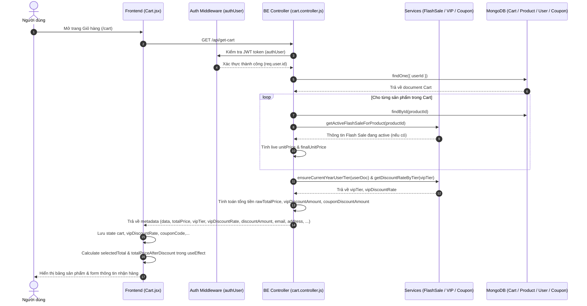

# TÀI LIỆU CONTEXT VÀ BỐI CẢNH NGHIỆP VỤ: LUỒNG GIỎ HÀNG (CART)

Document này mô tả chi tiết bối cảnh, luồng dữ liệu, luồng nghiệp vụ, các hàm lõi backend, state frontend và các trường hợp đặc biệt (edge cases) của tính năng Giỏ hàng (Cart) trong hệ thống shop.

---

## 1. TỔNG QUAN CHỨC NĂNG

### 1.1 Chức năng chính của Cart
Hệ thống Giỏ hàng (Cart) cho phép người dùng lưu trữ các sản phẩm dự định mua, chọn mua từng phiên bản màu sắc/biến thể khác nhau, điều chỉnh số lượng mua, áp dụng mã giảm giá (coupon), nhận ưu đãi chiết khấu theo hạng VIP, điền/cập nhật thông tin giao hàng và tiến hành thanh toán (COD hoặc VNPAY).

### 1.2 Các thành phần chính và mối liên hệ
1. **Frontend Component (`Cart.jsx`)**:
   - Hiển thị danh sách sản phẩm trong giỏ hàng, bảng tính tiền (tạm tính, giảm giá VIP, giảm giá Coupon, tổng tiền).
   - Quản lý state chọn mua từng dòng sản phẩm (`selectedRowKeys`), tự động tính lại tổng tiền trực tiếp ở FE dựa trên các thông tin tỉ lệ chiết khấu VIP (`vipDiscountRate`) và coupon từ BE.
   - Xử lý debounce khi thay đổi số lượng, chọn địa chỉ gợi ý qua Goong API, và validate email bất đồng bộ trên sự kiện `onBlur`.
   - Tự động gọi API gỡ bỏ coupon khi người dùng rời khỏi trang giỏ hàng (`useEffect` cleanup).

2. **Backend Routes (`cart.routes.js`)**:
   - Định nghĩa các endpoint làm việc với giỏ hàng:
     - `POST /api/add-to-cart`: Thêm sản phẩm (có chọn màu).
     - `GET /api/get-cart`: Lấy thông tin giỏ hàng, tính toán giá live (bao gồm Flash Sale), hạng VIP, coupon.
     - `DELETE /api/delete-cart`: Xóa dòng sản phẩm theo `productId` và `selectedColorKey`.
     - `PUT /api/update-quantity-cart`: Cập nhật số lượng sản phẩm trong giỏ (tính lại delta stock).
     - `POST /api/update-info-user-cart`: Cập nhật thông tin người nhận hàng.
     - `GET /api/check-email-exists`: Kiểm tra email đã được đăng ký tài khoản bởi người dùng khác hay chưa.

3. **Backend Controller (`cart.controller.js`)**:
   - Chứa logic nghiệp vụ chính của giỏ hàng: validate dữ liệu đầu vào, snapshot biến thể màu, tính toán giá dòng sản phẩm dựa trên Flash Sale hoặc discount sản phẩm, tương tác đồng bộ số lượng kho (`stock`), gọi các service bổ trợ (`couponService`, `flashSaleService`, `vipTierService`).

4. **Backend Models**:
   - `cart.model.js`: Định nghĩa schema lưu giỏ hàng của từng `userId`. Mảng `product` chứa thông tin từng dòng sản phẩm cùng snapshot màu sắc (`selectedColorKey`, `selectedColorName`, `selectedColorHex`, `selectedColorImage`), đơn giá snapshot (`unitPrice`, `finalUnitPrice`). Lưu tổng tiền `totalPrice`, `totalPriceAfterDiscount`, `discountAmount`, `couponId`, `couponCode` và thông tin người nhận hàng (`fullName`, `phone`, `address`, `email`).
   - `products.model.js`, `users.model.js`, `coupon.model.js`, `flashSale.model.js`, `vipTier.model.js`: Các model dữ liệu liên quan.

---

## 2. SƠ ĐỒ LUỒNG DỮ LIỆU TỔNG QUÁT



---

## 3. GIẢI THÍCH TỪNG LUỒNG NGHIỆP VỤ CHÍNH

### 3.1 Thêm sản phẩm vào giỏ (Add to Cart)
- **Trigger**: User click "Thêm vào giỏ" ở trang chi tiết sản phẩm hoặc danh sách sản phẩm.
- **Hàm FE xử lý**: `requestAddToCart({ productId, quantity, selectedColorKey })` (từ component Detail/Product list).
- **API gọi**: `POST /api/add-to-cart` (bảo vệ bởi middleware `authUser`).
- **Hàm BE xử lý**: `controllerCart.addToCart`.
- **Logic xử lý chi tiết**:
  1. Validate `productId` (ObjectId hợp lệ) và `quantity` (phải là số hữu hạn `>= 1`).
  2. Tìm sản phẩm trong DB (`modelProduct.findById`). Nếu không thấy -> báo lỗi.
  3. Lấy thông tin Flash Sale active (nếu có) gắn vào `findProduct.activeFlashSale`.
  4. Gọi `resolveColorSnapshotForCart` để snapshot thông tin màu sắc chọn (`selectedColorKey`, `name`, `hex`, `image`, `unitPrice`, `finalUnitPrice`). Nếu sản phẩm có tùy chọn màu nhưng người dùng không truyền `selectedColorKey` -> báo lỗi "Vui lòng chọn màu sắc".
  5. Kiểm tra giỏ hàng của user (`modelCart.findOne({ userId })`):
     - **Nếu chưa có giỏ**: Validate `quantity <= product.stock`. Tạo document `modelCart` mới với 1 item.
     - **Nếu đã có giỏ**: Tìm xem item với đúng `productId` VÀ đúng `selectedColorKey` đã tồn tại chưa:
       - *Nếu đã tồn tại*: Tính tổng số lượng mới (`existingQuantity + normalizedQuantity`), kiểm tra stock với `newQuantity > product.stock + existingQuantity`. Cập nhật số lượng, cập nhật `unitPrice`, `finalUnitPrice` và cộng dồn `totalPrice`.
       - *Nếu chưa tồn tại*: Kiểm tra stock (`normalizedQuantity > product.stock`), push item mới vào mảng `cart.product` và cộng dồn `totalPrice`.
  6. Gọi `recalculateCartTotals` để tính lại coupon (nếu giỏ hàng đang gài sẵn couponCode).
  7. Trừ trực tiếp số lượng tồn kho sản phẩm trong DB: `modelProduct.updateOne({ _id }, { $inc: { stock: -normalizedQuantity } })`.
- **Phản hồi FE**: Trả về `OK` kèm `metadata` giỏ hàng mới. FE cập nhật số lượng giỏ trên Header/Icon giỏ hàng.

---

### 3.2 Cập nhật số lượng sản phẩm (Update Quantity with Debounce)
- **Trigger**: User bấm nút `+` / `-` hoặc nhập số lượng mới trực tiếp trên bảng giỏ hàng.
- **Hàm FE xử lý**:
  1. `handleUpdateQuantity(record, newQuantity)`: Cập nhật **ngay lập tức** state local `cart` ở FE để UI phản hồi mượt mà không bị giật lag.
  2. Bật trạng thái `updatingQuantity[record.cartItemKey] = true`.
  3. Gọi `debouncedUpdateAPI` (wrap từ `useDebounceCallback` với delay 800ms) để gom các lần bấm liên tục.
  4. `updateQuantityAPI`: Gọi API backend.
- **API gọi**: `PUT /api/update-quantity-cart`.
- **Hàm BE xử lý**: `controllerCart.updateQuantity`.
- **Logic xử lý chi tiết**:
  1. Validate `productId`, `quantity >= 1`.
  2. Tìm giỏ hàng và sản phẩm trong DB. Lấy Flash Sale active nếu có.
  3. Tìm vị trí item trong `cart.product` trùng `productId` và `selectedColorKey` (nếu giỏ có nhiều dòng cùng sản phẩm khác màu, bắt buộc kiểm tra `selectedColorKey`).
  4. Tính mức chênh lệch số lượng: `quantityDiff = normalizedQuantity - currentQuantity`.
  5. Nếu `quantityDiff > 0` (tăng số lượng): Kiểm tra `quantityDiff > product.stock`. Nếu không đủ kho -> báo lỗi `BadRequestError("Số lượng trong kho không đủ")`.
  6. Cập nhật `cart.totalPrice += finalPricePerItem * quantityDiff`.
  7. Cập nhật số lượng `cartItem.quantity = normalizedQuantity`, cập nhật `unitPrice` và `finalUnitPrice`.
  8. Trừ/Cộng số lượng kho tương ứng với chênh lệch: `modelProduct.updateOne({ _id }, { $inc: { stock: -quantityDiff } })`.
  9. Gọi `recalculateCartTotals` tính lại coupon và lưu giỏ hàng.
- **Phản hồi FE**: BE trả về kết quả thành công -> FE gọi `fetchCart()` để đồng bộ lại dữ liệu chuẩn từ BE, bắn event `window.dispatchEvent(new Event('cart-updated'))` và tắt spinner loading item. Nếu có lỗi, FE khôi phục lại dữ liệu giỏ bằng cách re-fetch `fetchCart()`.

---

### 3.3 Xóa sản phẩm khỏi giỏ (Delete Item)
- **Trigger**: User bấm nút "Xóa" tại một dòng sản phẩm trong bảng.
- **Hàm FE xử lý**: `handleDelete(record)` trong `Cart.jsx`.
- **API gọi**: `DELETE /api/delete-cart?productId=...&selectedColorKey=...`.
- **Hàm BE xử lý**: `controllerCart.deleteProductCart`.
- **Logic xử lý chi tiết**:
  1. Lấy `productId` và `selectedColorKey` từ query string.
  2. Lọc các item trùng `productId` trong giỏ hàng:
     - Nếu truyền `selectedColorKey`, so sánh chính xác màu.
     - Nếu có nhiều dòng cùng `productId` khác màu mà request KHÔNG truyền `selectedColorKey` -> báo lỗi "Vui lòng chọn đúng phiên bản màu cần xóa".
  3. Tính tổng tiền dòng sản phẩm sắp xóa (`lineFinalUnitPrice * removedProduct.quantity`).
  4. Trừ `cart.totalPrice` đi tiền của dòng sản phẩm đó.
  5. Xóa item khỏi mảng `cart.product.splice(index, 1)`.
  6. Gọi `recalculateCartTotals` tính lại coupon.
  7. Hoàn trả số lượng tồn kho lại cho sản phẩm: `modelProduct.updateOne({ _id }, { $inc: { stock: +removedProduct.quantity } })`.
- **Phản hồi FE**: FE gọi lại `fetchCart()`, bắn event `cart-updated` để các component khác (Header counter) cập nhật theo, hiển thị `message.success`.

---

### 3.4 Áp dụng / Hủy mã giảm giá (Coupon)
- **Luồng Áp dụng Mã giảm giá**:
  - **Trigger**: User chọn coupon từ danh sách xổ xuống (`Select`) hoặc nhập mã và bấm "Áp dụng".
  - **Hàm FE xử lý**: `handleApplyCoupon(code)`.
  - **API gọi**: `POST /api/coupons/apply` (`requestApplyCoupon`).
  - **Hàm BE xử lý**: (xử lý tại controller coupon / `couponService.validateCouponForCart` & `recalculateCartTotals`).
  - **Logic xử lý**:
    - Validate trạng thái coupon (`ACTIVE`), ngày hiệu lực (`startAt <= now <= endAt`), điều kiện đơn hàng tối thiểu (`cartTotal >= minOrderValue`), giới hạn tổng lượt dùng (`totalUsageLimit`) và giới hạn lượt dùng của user (`perUserUsageLimit`).
    - Tính mức giảm: Nếu `PERCENT` -> `Math.floor(cartTotal * value / 100)` (khống chế bởi `maxDiscount` nếu có). Nếu `FIXED` -> giảm số tiền `value`.
    - Gán `couponId`, `couponCode`, `discountAmount`, `totalPriceAfterDiscount` vào document Cart.
  - **Phản hồi FE**: Set state `discountAmount`, `totalPriceAfterDiscount`, `couponCode` và `selectedCouponCode`.
- **Luồng Hủy Mã giảm giá**:
  - **Trigger**: User bấm nút "Hủy" cạnh tag mã giảm giá đã áp dụng, HOẶC user chuyển hướng rời khỏi trang Giỏ hàng.
  - **Hàm FE xử lý**: `handleRemoveCoupon()` hoặc `useEffect` cleanup.
  - **API gọi**: `POST /api/coupons/remove` (`requestRemoveCoupon`).
  - **Logic BE**: Đặt `cart.couponId = null`, `cart.couponCode = ''`, `cart.discountAmount = 0`, `cart.totalPriceAfterDiscount = cart.totalPrice`.
  - **Phản hồi FE**: Reset các state coupon về 0/rỗng.

---

### 3.5 Tính giảm giá theo hạng VIP (VIP Tier Discount)
- **Cơ chế tính toán**:
  1. Khi FE gọi `GET /api/get-cart`, BE lấy thông tin người dùng `modelUser.findById(id)`.
  2. BE gọi `ensureCurrentYearUserTier(userDoc)` để đảm bảo hạng VIP cập nhật theo chi tiêu năm hiện tại, sau đó lấy tỉ lệ giảm giá `%` tương ứng qua `getDiscountRateByTier(userDoc.vipTier)` (Ví dụ: Đồng = 2%, Bạc = 5%, Vàng = 10%, Kim Cương = 15%).
  3. BE trả về `vipTier`, `vipDiscountRate`, và số tiền giảm giá VIP trên toàn bộ giỏ (`vipDiscountAmount`).
  4. **Ở Frontend (`Cart.jsx`)**: Vì người dùng chỉ tích chọn thanh toán một số item (`selectedRowKeys`), FE tự tính lại giá trị ưu đãi VIP **dựa trên các item được chọn**:
     $$\text{selectedTotal} = \sum (\text{price} \times \text{quantity})_{\text{selected}}$$
     $$\text{calculatedVipDiscount} = \lfloor \frac{\text{selectedTotal} \times \text{vipDiscountRate}}{100} \rfloor$$
     $$\text{totalPriceAfterDiscount} = \max(0, \text{selectedTotal} - \text{calculatedVipDiscount} - \text{couponDiscount})$$

---

### 3.6 Cập nhật thông tin người nhận hàng & Async Email Validator
- **Trigger**: User thay đổi thông tin (Họ tên, SĐT, Email, Địa chỉ) hoặc khi submit bấm nút Thanh toán.
- **Form UI**: Dùng Ant Design Form. Field `address` sử dụng `AutoComplete` kết hợp với Goong API (`https://rsapi.goong.io/Place/AutoComplete`) qua hook `useDebounce(valueAddress, 500)`.
- **Luồng Async Email Validator (`onBlur`)**:
  - Khi user gõ xong email và blur out khỏi ô input, validator `async (_, value)` kích hoạt:
  - Nếu email trùng với email tài khoản đăng nhập hiện tại (`dataUser?.email`) -> Bỏ qua check, hợp lệ.
  - Ngược lại, gọi API `GET /api/check-email-exists?email=...` (`requestCheckEmailExists`).
  - Hàm BE `checkEmailExists` kiểm tra xem email đã tồn tại trong `modelUser` chưa (nếu là user đã đăng nhập, loại trừ `_id` của chính user đó).
  - Nếu BE trả về `exists: true` -> FE reject Promise với lỗi: *"Email này đã được đăng ký. Vui lòng đăng nhập để tiếp tục mua hàng."*
- **Submit thông tin**:
  - Khi bấm Thanh toán, FE gọi `handleSubmit(values)` -> gửi `POST /api/update-info-user-cart`.
  - BE validate lại email, kiểm tra trùng lặp email với user khác. Nếu hợp lệ, lưu `fullName`, `phone`, `address`, `email` vào document `cart`.

---

### 3.7 Thanh toán (COD và VNPAY)
- **Trigger**: User bấm nút "Thanh toán khi nhận hàng (COD)" hoặc "Thanh toán qua VNPAY".
- **Hàm FE xử lý**: `handlePayments(typePayment)`.
- **Luồng xử lý**:
  1. Kiểm tra đã chọn ít nhất 1 sản phẩm chưa (`selectedRowKeys.length > 0`). Nếu chưa -> báo lỗi.
  2. Validate toàn bộ các field trong Form thông tin nhận hàng (`form.validateFields()`).
  3. Gọi `handleSubmit(values)` để lưu thông tin người nhận vào giỏ hàng trên DB.
  4. Gọi API thanh toán: `requestPayment(typePayment)` (`POST /api/payment`).
  5. Xử lý kết quả trả về từ Payment Controller:
     - **Nếu là COD**: `codRes.metadata` chứa `paymentId` -> FE thực hiện `navigate('/payment/' + codRes.metadata)`.
     - **Nếu là VNPAY**: `vnpayRes.metadata` chứa URL thanh toán VNPAY -> FE mở cửa sổ mới `window.open(vnpayRes.metadata, '_blank')`.

---

### 3.8 Đồng bộ giá khi có Flash Sale đang active
- Khi user gọi `GET /api/get-cart` hoặc khi BE xử lý thêm/cập nhật giỏ hàng:
  1. BE duyệt qua từng sản phẩm trong giỏ và gọi `getActiveFlashSaleForProduct(productId)`.
  2. Hàm này kiểm tra trong DB `modelFlashSale` xem có chiến dịch nào thoả mãn: `product == productId`, `isActive == true`, `startDate <= now <= endDate` và `soldQuantity < quantity`.
  3. Nếu có Flash Sale active, BE gán `product.activeFlashSale = flashSale`.
  4. Khi tính `finalUnitPrice` thông qua hàm lõi `resolveCartLineFinalUnitPrice`, giá Flash Sale (`product.activeFlashSale.flashSalePrice`) được **ưu tiên hàng đầu**, ghi đè lên giá gốc và giá discount thông thường của sản phẩm.
  5. Giá này được trả về cho FE hiển thị và dùng làm căn cứ tính tổng tiền giỏ hàng.

---

## 4. GIẢI THÍCH CÁC HÀM "LÕI" QUAN TRỌNG Ở BE

Các hàm trợ giúp này nằm ngoài class `controllerCart` trong `cart.controller.js`, đóng vai trò xử lý snapshot, tính toán giá và hình ảnh nhất quán.

### 4.1 `resolveColorSnapshotForCart`
- **Input**: `{ product, selectedColorKey }`
- **Output**: An object chứa `{ selectedColorKey, selectedColorName, selectedColorHex, selectedColorImage, unitPrice, finalUnitPrice }`.
- **Dùng ở luồng nào**: Luồng `addToCart`.
- **Vì sao cần tồn tại**: Khi sản phẩm có nhiều phương án màu (`colorOptions`), mỗi màu sắc có thể có hình ảnh và mức giá khác nhau. Hàm này chuẩn hóa danh sách màu, kiểm tra `selectedColorKey` mà client gửi lên có khớp với tùy chọn màu của sản phẩm hay không, trích xuất snapshot thông tin màu cùng mức giá tương ứng tại thời điểm thêm vào giỏ. Nếu sản phẩm không có màu sắc, nó trả về thông tin rỗng kèm giá mặc định của sản phẩm.

---

### 4.2 `resolveItemUnitPrice`
- **Input**: `{ cartItem, product }`
- **Output**: `unitPrice` (nguyên giá / giá niêm yết của biến thể hoặc sản phẩm - dạng số không âm).
- **Dùng ở luồng nào**: `addToCart`, `getCart`, `deleteProductCart`, `updateQuantity`.
- **Vì sao cần tồn tại**: Giải quyết bài toán giỏ hàng lưu snapshot đơn giá (`cartItem.unitPrice`). Nếu trong giỏ đã có sẵn `unitPrice` `>= 0`, hàm sẽ ưu tiên dùng lại snapshot này. Nếu dữ liệu cũ bị thiếu snapshot, hàm sẽ tra cứu lại biến thể màu sắc trong `product.colorOptions` hoặc lấy `product.price` làm fallback.

---

### 4.3 `resolveCartLineFinalUnitPrice`
- **Input**: `{ cartItem, product }`
- **Output**: `finalUnitPrice` (giá bán thực tế cuối cùng của 1 đơn vị sản phẩm sau khi tính Flash Sale / Discount).
- **Dùng ở luồng nào**: `addToCart`, `getCart`, `deleteProductCart`, `updateQuantity`, `resolveColorSnapshotForCart`.
- **Vì sao cần tồn tại**: Đây là hàm tính giá quyết định mức tiền người dùng thực sự phải trả cho mỗi dòng sản phẩm. Thứ tự ưu tiên tính giá:
  1. **Flash Sale đang active** (`product.activeFlashSale`): Trả về `flashSalePrice` ngay lập tức.
  2. **Snapshot finalUnitPrice** trong giỏ: Nếu đã lưu `>= 0` và không có Flash Sale active.
  3. **Phần trăm giảm giá của sản phẩm** (`product.discount > 0`): `baseUnitPrice * (100 - discount) / 100`.
  4. **Số tiền giảm giá cố định cũ** (`product.priceDiscount`): Nếu nhỏ hơn `baseUnitPrice`.
  5. **Nguyên giá** (`baseUnitPrice`).

---

### 4.4 `resolveCartItemImage`
- **Input**: `{ cartItem, product }`
- **Output**: URL hình ảnh hiển thị cho sản phẩm trong giỏ hàng (chuỗi string).
- **Dùng ở luồng nào**: Luồng `getCart` (trả về danh sách cho FE).
- **Vì sao cần tồn tại**: Đảm bảo hình ảnh hiển thị trên giỏ hàng chính xác theo biến thể màu người dùng đã chọn. Ưu tiên lấy theo thứ tự:
  1. Snapshot ảnh màu đã chọn (`cartItem.selectedColorImage`).
  2. Tra cứu ảnh màu từ `product.colorOptions` theo `selectedColorKey`.
  3. Ảnh đầu tiên trong mảng ảnh sản phẩm gốc (`product.images[0]`).

---

### 4.5 `recalculateCartTotals` (trong `couponService.js`)
- **Input**: `{ cart, userId }`
- **Output**: `{ applied: boolean, error?: Error }`
- **Dùng ở luồng nào**: Gọi tự động ở BE sau mọi thao tác làm thay đổi tổng tiền giỏ hàng (`addToCart`, `getCart`, `deleteProductCart`, `updateQuantity`).
- **Vì sao cần tồn tại**: Khi tổng tiền thô (`cart.totalPrice`) thay đổi (do thêm/xóa/sửa số lượng sản phẩm), mã giảm giá đang gài trong giỏ hàng có thể không còn đủ điều kiện áp dụng nữa (ví dụ: `cartTotal < minOrderValue` hoặc mã bị hết hạn). Hàm này thẩm định lại mã coupon `cart.couponCode` với giá trị giỏ hàng mới:
  - Nếu vẫn hợp lệ: Cập nhật lại `discountAmount` và `totalPriceAfterDiscount`.
  - Nếu không còn hợp lệ: Tự động gỡ bỏ coupon (`couponId = null`, `couponCode = ''`, `discountAmount = 0`, `totalPriceAfterDiscount = cart.totalPrice`).

---

## 5. GIẢI THÍCH CÁC STATE QUAN TRỌNG Ở FE (`Cart.jsx`)

| State Name | Kiểu dữ liệu | Ý nghĩa & Vai trò | Phụ thuộc / Cập nhật khi nào |
| :--- | :--- | :--- | :--- |
| `cart` | `Array` | Danh sách các dòng sản phẩm trong giỏ hàng nhận từ API BE. | Cập nhật khi `fetchCart()` chạy, hoặc cập nhật tức thì (optimistic UI) trong `handleUpdateQuantity`. |
| `selectedRowKeys` | `Array` | Danh sách các khóa (`cartItemKey`) đại diện cho các dòng sản phẩm được người dùng tích chọn checkbox để thanh toán. | Cập nhật khi người dùng thao tác trên checkbox bảng giỏ hàng (`rowSelection.onChange`). Tự động lọc bớt key không còn tồn tại khi `fetchCart()` hoàn tất. |
| `totalPrice` | `Number` | Tổng tiền tạm tính của **các sản phẩm được chọn**. | Tính lại trong `useEffect` khi `cart` hoặc `selectedRowKeys` thay đổi. |
| `vipTier` | `String` | Tên key hạng VIP của người dùng (ví dụ: `'none'`, `'dong'`, `'bac'`, `'vang'`, `'kimcuong'`). | Cập nhật từ kết quả API `fetchCart()`. |
| `vipDiscountRate` | `Number` | Tỉ lệ % giảm giá theo hạng VIP (ví dụ: `0`, `2`, `5`, `10`, `15`). | Cập nhật từ kết quả API `fetchCart()`. |
| `vipDiscountAmount` | `Number` | Số tiền giảm giá VIP tính riêng cho **các sản phẩm được chọn**. | Tính lại trong `useEffect`: $\lfloor \text{totalPrice} \times \text{vipDiscountRate} / 100 \rfloor$. |
| `discountAmount` | `Number` | Số tiền giảm giá từ Coupon (Voucher) áp dụng cho toàn bộ giỏ hàng. | Cập nhật từ API `fetchCart()`, `handleApplyCoupon()`, hoặc reset về `0` khi `handleRemoveCoupon()`. |
| `totalPriceAfterDiscount` | `Number` | Thành tiền cuối cùng người dùng cần thanh toán sau khi trừ ưu đãi VIP và Coupon. | Tính lại trong `useEffect`: $\max(0, \text{totalPrice} - \text{vipDiscountAmount} - \text{discountAmount})$. |
| `couponCode` | `String` | Mã giảm giá đang áp dụng hiện tại. | Cập nhật từ API `fetchCart()`, `handleApplyCoupon()`, reset về `''` khi hủy. |
| `selectedCouponCode` | `String` | Mã giảm giá đang được chọn trên dropdown `Select` (chưa ấn Áp dụng). | Cập nhật khi user chọn item từ danh sách mã khả dụng. |
| `updatingQuantity` | `Object` | Key-value map (`{ [cartItemKey]: boolean }`) đánh dấu dòng sản phẩm nào đang trong quá trình chờ API update số lượng. | Dùng để disable nút `+`/`-` và input số lượng nhằm tránh spam request. |
| `availableCoupons` | `Array` | Danh sách tất cả mã giảm giá công khai hệ thống trả về để hiển thị trong dropdown. | Cập nhật từ `fetchAvailableCoupons()` khi render trang. |
| `valueAddress` & `addressOptions` | `String` / `Array` | Giá trị nhập địa chỉ và danh sách gợi ý địa chỉ từ Goong API. | `addressOptions` được cập nhật khi `useDebounce(valueAddress, 500)` thay đổi. |

### Các `useEffect` chính trong `Cart.jsx`:
1. `useEffect` (Cleanup coupon khi unmount): Tự động gọi `requestRemoveCoupon()` nếu rời trang giỏ hàng mà đang có `couponCode`.
2. `useEffect` (Khởi tạo): Gọi `fetchCart()` và `fetchAvailableCoupons()` khi component mount.
3. `useEffect` (Tính toán tổng tiền): Chạy mỗi khi `cart`, `selectedRowKeys`, `couponCode`, `discountAmount`, `vipDiscountRate` thay đổi. Tính toán lại `totalPrice`, `vipDiscountAmount`, và `totalPriceAfterDiscount`.
4. `useEffect` (Địa chỉ Goong API): Chạy khi `debounce` (từ `valueAddress`) thay đổi để fetch danh sách địa chỉ gợi ý từ Goong API.

---

## 6. CÁC CASE ĐẶC BIỆT / EDGE CASES ĐÁNG CHÚ Ý

1. **Sản phẩm có nhiều biến thể màu sắc trong cùng giỏ hàng**:
   - Nếu user thêm cùng 1 sản phẩm (`productId`) nhưng với 2 màu khác nhau (`selectedColorKey` khác nhau), BE sẽ lưu thành 2 phần tử độc lập trong mảng `cart.product`.
   - FE phân biệt từng dòng bằng `cartItemKey` có định dạng `${productId}-${selectedColorKey || 'default'}`.
   - Khi xóa hoặc cập nhật số lượng, BE bắt buộc kiểm tra cả `productId` lẫn `selectedColorKey`.

2. **Xử lý khi sản phẩm bị xóa khỏi hệ thống (DB) nhưng vẫn nằm trong giỏ hàng của user**:
   - Trong hàm `getCart`, BE sử dụng `Promise.all` duyệt danh sách item và `modelProduct.findById(item.productId)`. Nếu sản phẩm trả về `null` (đã bị xóa khỏi DB), BE tự động loại bỏ item đó ra khỏi giỏ (`validProducts = resolvedProducts.filter(Boolean)`), tính lại `totalPrice`, gọi `recalculateCartTotals` và `save()` lại giỏ hàng một cách âm thầm.

3. **Cơ chế trừ / hoàn trả tồn kho (`stock`) ngay ở giỏ hàng**:
   - Trong thiết kế hiện tại của hệ thống, số lượng kho `product.stock` bị **trừ trực tiếp** ngay khi người dùng thêm vào giỏ (`addToCart`) hoặc tăng số lượng (`updateQuantity`). Khi người dùng giảm số lượng hoặc xóa sản phẩm khỏi giỏ (`deleteProductCart`), số lượng kho mới được cộng hoàn lại (`$inc: { stock: quantity }`).
   - *Lưu ý*: Điều này nghĩa là việc giữ hàng diễn ra ngay từ bước cho vào giỏ, không phải chờ đến bước chốt đơn thanh toán.

4. **Tự động hủy mã giảm giá khi rời trang Giỏ hàng**:
   - `Cart.jsx` có hook cleanup:
     ```javascript
     useEffect(() => {
         return () => {
             if (couponCode) {
                 requestRemoveCoupon().catch(...);
             }
         };
     }, [couponCode]);
     ```
   - Điều này đảm bảo coupon không bị "treo" hay chiếm giữ vô thời hạn nếu người dùng bỏ dở quá trình thanh toán và chuyển sang trang khác.

5. **Trường hợp email giao hàng trùng người dùng khác**:
   - Khi điền email người nhận ở giỏ hàng (khách mua hàng hoặc đổi email nhận thông báo), validator bất đồng bộ kiểm tra email tồn tại trên hệ thống. Nếu email đó thuộc về một tài khoản đã đăng ký khác, hệ thống sẽ yêu cầu người dùng phải Đăng nhập chứ không cho phép dùng email của tài khoản khác để đặt đơn dưới dạng vãng lai/thông tin tự điền.

---

## 7. GHI CHÚ / RỦI RO PHÁT HIỆN ĐƯỢC

> [!NOTE]
> Các ghi chú dưới đây ghi nhận thực tế từ codebase hiện tại để hỗ trợ dev mới nắm bắt, không thực hiện chỉnh sửa code.

1. **Rủi ro giữ kho (`stock`) ngay từ bước Add to Cart**:
   - **Hiện trạng**: Khi người dùng thêm sản phẩm vào giỏ hoặc tăng số lượng, BE thực hiện `$inc: { stock: -quantity }` ngay lập tức.
   - **Rủi ro**: Nếu người dùng thêm sản phẩm vào giỏ rồi đóng trình duyệt/không mua và không bấm xóa giỏ hàng, số lượng tồn kho sản phẩm sẽ bị giảm ảo trong DB cho đến khi có cơ chế dọn dẹp hoặc xoá giỏ (chưa thấy cơ chế tự động release stock cho giỏ hàng quá hạn).

2. **Sự không đồng nhất trong việc tính giảm giá VIP giữa BE và FE**:
   - **Hiện trạng**: BE trả về `vipDiscountRate` (ví dụ `10%`) và tính `vipDiscountAmount` trên **toàn bộ giỏ hàng** (`rawTotalPrice`). Tuy nhiên, FE lại cho phép người dùng tích chọn một vài item cụ thể (`selectedRowKeys`) để mua, nên FE tự tính lại `calculatedVipDiscount` dựa trên tổng tiền các item được chọn.
   - **Rủi ro**: BE `GET /api/get-cart` tính tổng `totalPriceAfterDiscount` bao gồm coupon + VIP discount trên 100% giỏ hàng, nhưng khi sang bước thanh toán COD/VNPAY, nếu FE chỉ gửi lệnh thanh toán mà BE lấy lại `cart.totalPriceAfterDiscount` cũ từ DB thì có thể gây lệch tiền so me những gì FE đang hiển thị (khi người dùng chỉ tích chọn 1 phần giỏ hàng).

3. **Mã giảm giá (Coupon) áp dụng cho toàn bộ giỏ vs Tích chọn item**:
   - `couponService.js` tính giảm giá coupon dựa trên `cart.totalPrice` (tổng tiền toàn bộ giỏ). Khi người dùng bỏ chọn một số dòng sản phẩm ở FE, `discountAmount` của coupon giữ nguyên từ BE có thể vượt quá tổng tiền của các item được chọn nếu không được kiểm tra lại.

4. **Xóa dòng sản phẩm khi có nhiều biến thể màu cùng ID nhưng không truyền `selectedColorKey`**:
   - Trong `deleteProductCart` và `updateQuantity` ở BE, nếu trong giỏ có 2 dòng cùng `productId` (khác màu) mà client gửi request thiếu `selectedColorKey`, BE sẽ ném lỗi `BadRequestError("Vui lòng chọn đúng phiên bản màu...")`. Đây là cơ chế guard tốt, nhưng FE cần luôn đảm bảo truyền chính xác `selectedColorKey`.
