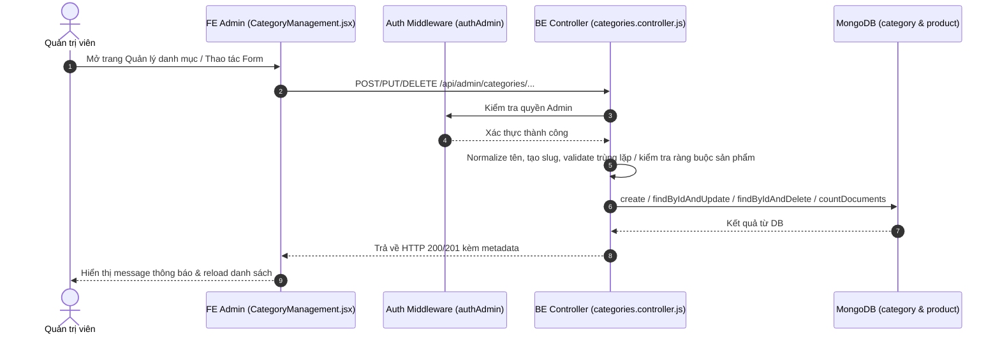
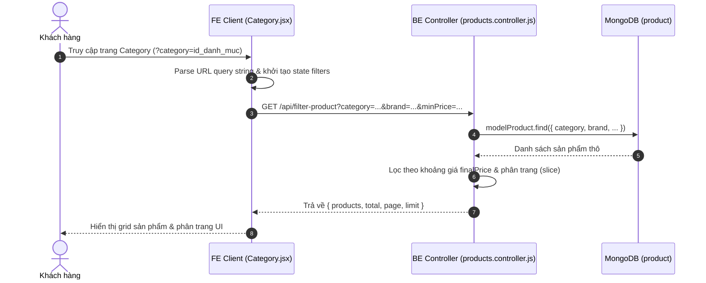

# TÀI LIỆU CONTEXT VÀ BỐI CẢNH NGHIỆP VỤ: CHỨC NĂNG QUẢN LÝ & HIỂN THỊ DANH MỤC (CATEGORY)

Document này mô tả chi tiết bối cảnh, luồng dữ liệu, luồng nghiệp vụ, các hàm lõi backend/frontend, state và các trường hợp đặc biệt (edge cases) của chức năng Danh mục (Category) trong hệ thống shop.

---

## 1. TỔNG QUAN CHỨC NĂNG

### 1.1 Chức năng chính của Category
Hệ thống Danh mục (Category) phục vụ 2 mục đích chính:
1. **Phía Người dùng (Client)**: Cho phép khách hàng lọc và xem danh sách sản phẩm theo danh mục (`category`), kết hợp cùng các tiêu chí lọc khoảng giá, hãng sản xuất (`brand`), sắp xếp giá tăng/giảm và so sánh sản phẩm.
2. **Phía Quản trị viên (Admin)**: Quản lý toàn bộ danh mục sản phẩm (thêm, sửa, xóa, tìm kiếm, phân trang, bật/tắt trạng thái hiển thị `isActive`, upload ảnh đại diện danh mục).

### 1.2 Các thành phần chính và mối liên hệ
1. **Frontend Client Component (`Category.jsx`)**:
   - Hiển thị danh sách sản phẩm đã được lọc theo danh mục, thương hiệu, khoảng giá.
   - Nhận tham số danh mục từ URL (`?category=...`), tự động đồng bộ filters và fetch sản phẩm tương ứng.
   - Cho phép chọn 2 sản phẩm để chuyển hướng qua trang So sánh (`/compare-product/...`).

2. **Frontend Admin Component (`CategoryManagement.jsx`)**:
   - Quản lý CRUD danh mục dưới dạng bảng (Table Antd), có ô tìm kiếm debounce, phân trang.
   - Form Modal thêm/sửa danh mục với Upload ảnh Base64, công tắc bật/tắt trạng thái hoạt động (`isActive`).

3. **Frontend Request Layer (`request.jsx`)**:
   - Chứa các hàm giao tiếp API: `requestGetAdminCategories`, `requestCreateCategory`, `requestUpdateCategory`, `requestDeleteCategory`, `requestFilterProduct`, `requestGetBrands`...

4. **Backend Routes (`categories.routes.js`)**:
   - `/api/categories` (GET public): Lấy danh sách danh mục active kèm danh sách thương hiệu (`brands`) thuộc danh mục đó.
   - `/api/admin/categories` (POST, GET, PUT, DELETE - AuthAdmin): Quản trị CRUD danh mục.

5. **Backend Controller (`categories.controller.js` & `products.controller.js`)**:
   - `categories.controller.js`: Đảm nhận việc tạo slug tự động từ tên, kiểm tra trùng lặp slug, đếm số lượng sản phẩm gắn liền với danh mục (`productCount`), chặn xóa danh mục nếu đang chứa sản phẩm.
   - `products.controller.js`: Đảm nhận việc lọc sản phẩm theo `category` trong API `filterProduct`.

6. **Backend Model (`category.model.js` & `products.model.js`)**:
   - `category.model.js`: Lưu thông tin `name`, `slug` (unique), `description`, `image`, `isActive`.
   - `products.model.js`: Trường `category` lưu `ObjectId` ref tới model `category`.

---

## 2. SƠ ĐỒ LUỒNG DỮ LIỆU TỔNG QUÁT

### 2.1 Luồng Admin Quản lý Danh mục (CRUD)

### 2.2 Luồng Khách hàng Lọc Sản phẩm theo Danh mục

---

## 3. GIẢI THÍCH TỪNG LUỒNG NGHIỆP VỤ CHÍNH

### 3.1 Luồng Xem danh sách Danh mục dành cho Khách hàng (Public API)
- **Trigger**: Khách hàng mở trang web hoặc xem các dropdown danh mục.
- **Hàm FE xử lý**: Gọi `request.get('/api/categories')`.
- **API gọi**: `GET /api/categories`.
- **Hàm BE xử lý**: `CategoriesController.getAllActive`.
- **Logic xử lý**:
  1. Lấy tất cả danh mục có `isActive: true`, sắp xếp theo tên A-Z (`sort({ name: 1 })`).
  2. Với mỗi danh mục, dùng `modelProduct.distinct("brand", { category: cat._id })` để lấy danh sách các thương hiệu có sản phẩm thuộc danh mục đó.
  3. Trả về mảng danh mục kèm trường `brands`.

---

### 3.2 Luồng Khách hàng Xem & Lọc Sản phẩm theo Danh mục
- **Trigger**: User bấm vào một danh mục từ Menu, hoặc thay đổi các bộ lọc Khoảng giá (`Slider`), Thương hiệu (`Select`), Sắp xếp giá (`Select`), Chuyển trang (`Pagination`).
- **Hàm FE xử lý**: `fetchProducts(nextFilters, page)` trong `Category.jsx`.
- **API gọi**: `GET /api/filter-product?category=...&brand=...&minPrice=...&maxPrice=...&pricedes=...&page=...&limit=12`.
- **Hàm BE xử lý**: `controllerProducts.filterProduct` (trong `products.controller.js`).
- **Logic xử lý**:
  1. Tìm các sản phẩm trong DB thỏa mãn điều kiện `brand` và `category` (nếu khác `"all"`).
  2. Format danh sách sản phẩm (`formatProductListOutput`), tính đơn giá thực tế `finalPrice` (dựa trên `priceDiscount` hoặc `price`).
  3. Lọc tiếp theo khoảng giá `minPrice` và `maxPrice` (hoặc chuỗi `priceRange` legacy).
  4. Sắp xếp danh sách theo `pricedes` (`"asc"`: giá thấp đến cao, `"desc"`: giá cao đến thấp).
  5. Cắt mảng sản phẩm theo phân trang: `data.slice((page - 1) * limit, page * limit)`.
- **Phản hồi FE**: Trả về `products`, `total`, `page`, `limit`. FE lưu state `dataProduct`, `totalProducts` và render danh sách `CardBody`.

---

### 3.3 Luồng Lấy danh sách Danh mục phía Admin (Search & Pagination)
- **Trigger**: Admin mở trang Quản lý danh mục hoặc gõ từ khóa vào ô Tìm kiếm (`Search`).
- **Hàm FE xử lý**: `fetchCategories` trong `CategoryManagement.jsx` (kết hợp `useDebounce` 300ms cho từ khóa tìm kiếm).
- **API gọi**: `GET /api/admin/categories?page=...&limit=...&search=...`.
- **Hàm BE xử lý**: `CategoriesController.getAll`.
- **Logic xử lý**:
  1. Xử lý tham số `page` (mặc định 1), `limit` (mặc định 10), escape từ khóa `search`.
  2. Nếu có `search`, tạo query regex tìm kiếm không phân biệt hoa thường theo tên: `{ name: { $regex: search, $options: "i" } }`.
  3. Tính tổng số record (`countDocuments`) và query danh sách sắp xếp giảm dần theo thời gian tạo (`sort({ createdAt: -1 })`).
  4. Duyệt qua từng danh mục trong kết quả, đếm số sản phẩm thuộc danh mục đó: `modelProduct.countDocuments({ category: cat._id })`.
  5. Gắn trường `productCount` vào từng item danh mục.
- **Phản hồi FE**: Trả về `{ data, total, page, limit }`. FE cập nhật state `categories`, `total`, `page`.

---

### 3.4 Luồng Thêm mới Danh mục (Admin)
- **Trigger**: Admin bấm nút "Thêm danh mục", điền Form Modal (Tên, Mô tả, Tải ảnh, Trạng thái) và bấm "Lưu".
- **Hàm FE xử lý**: `handleSubmit` trong `CategoryManagement.jsx`.
- **API gọi**: `POST /api/admin/categories` (Bảo vệ bởi `authAdmin`).
- **Hàm BE xử lý**: `CategoriesController.create`.
- **Logic xử lý**:
  1. Chuẩn hóa tên danh mục `normalizeName(req.body.name)`. Kiểm tra nếu rỗng -> ném lỗi `BadRequestError("Vui lòng nhập tên danh mục")`.
  2. Sinh `slug` tự động qua hàm `toSlug(name)`. Nếu slug rỗng -> ném lỗi `BadRequestError("Tên danh mục không hợp lệ")`.
  3. Thẩm định trùng lặp slug trong DB (`modelCategory.findOne({ slug })`). Nếu đã tồn tại -> ném lỗi `ConflictRequestError("Danh mục đã tồn tại")`.
  4. Tạo document mới trong DB (`modelCategory.create({ name, slug, description, image, isActive })`).
- **Phản hồi FE**: Trả về `Created` (201). FE hiển thị thông báo thành công, đóng Modal, reset Form và refetch danh sách danh mục về trang 1.

---

### 3.5 Luồng Cập nhật Danh mục (Admin)
- **Trigger**: Admin bấm nút Edit (biểu tượng bút chì) ở một dòng danh mục, chỉnh sửa thông tin trong Modal và bấm "Lưu".
- **Hàm FE xử lý**: `handleOpenEdit` (fill dữ liệu cũ vào Form) -> `handleSubmit`.
- **API gọi**: `PUT /api/admin/categories/:id` (Bảo vệ bởi `authAdmin`).
- **Hàm BE xử lý**: `CategoriesController.update`.
- **Logic xử lý**:
  1. Kiểm tra sự tồn tại của danh mục theo `id` (`modelCategory.findById(id)`).
  2. Chuẩn hóa tên mới, tạo `slug` mới từ tên.
  3. Kiểm tra xem slug mới có bị trùng với danh mục KHÁC hay không: `modelCategory.findOne({ slug, _id: { $ne: id } })`. Nếu trùng -> ném lỗi `ConflictRequestError("Danh mục đã tồn tại")`.
  4. Cập nhật các trường `name`, `slug`, `description`, `image`, `isActive` qua `findByIdAndUpdate`.
- **Phản hồi FE**: Trả về `OK` (200). FE thông báo thành công, đóng Modal và reload danh sách danh mục.

---

### 3.6 Luồng Xóa Danh mục (Admin)
- **Trigger**: Admin bấm nút Delete (biểu tượng thùng rác) -> Popconfirm Antd hiển thị "Bạn có chắc muốn xóa?" -> Admin chọn "Có".
- **Hàm FE xử lý**: `handleDelete(id)` trong `CategoryManagement.jsx`.
- **API gọi**: `DELETE /api/admin/categories/:id` (Bảo vệ bởi `authAdmin`).
- **Hàm BE xử lý**: `CategoriesController.delete`.
- **Logic xử lý**:
  1. Kiểm tra sự tồn tại của danh mục theo `id`.
  2. **Kiểm tra ràng buộc dữ liệu**: Gọi `modelProduct.exists({ category: category._id })`.
  3. Nếu tìm thấy **ít nhất 1 sản phẩm** đang tham chiếu tới danh mục này -> Ném lỗi `BadRequestError("Danh mục đang có sản phẩm, không thể xoá")` và hủy thao tác xóa.
  4. Nếu không có sản phẩm nào thuộc danh mục -> Thực hiện xóa danh mục khỏi DB (`findByIdAndDelete(id)`).
- **Phản hồi FE**: Trả về `OK` (200). FE hiển thị thông báo "Xóa danh mục thành công" và reload danh sách.

---

### 3.7 Luồng So sánh Sản phẩm trên Trang Category
- **Trigger**: User bấm nút "So sánh" trên thanh công cụ trang `Category.jsx`, sau đó bấm chọn 2 sản phẩm bất kỳ.
- **Hàm FE xử lý**: `handleCompare(item)` trong `Category.jsx`.
- **Logic xử lý**:
  1. Lưu ID sản phẩm được chọn vào mảng state `productCompare`.
  2. `useEffect` theo dõi `productCompare`: Khi `productCompare.length === 2`, tự động chuyển hướng giao diện qua đường dẫn `/compare-product/${id1}/${id2}`.

---

## 4. GIẢI THÍCH CÁC HÀM "LÕI" VÀ HELPER QUAN TRỌNG

### 4.1 `normalizeName` (Backend Helper)
- **File**: `categories.controller.js`
- **Input**: `value` (string)
- **Output**: Chuỗi đã được cắt khoảng trắng 2 đầu và thu gọn nhiều khoảng trắng liên tiếp thành 1 khoảng trắng đơn (`value.trim().replace(/\s+/g, " ")`).
- **Dùng ở luồng nào**: Luồng `create` và `update` danh mục.
- **Mục đích**: Tránh việc người dùng cố tình nhập tên dạng `"  Điện   Thoại  "` gây lỗi hiển thị hoặc tạo ra các slug trùng lặp không đáng có.

---

### 4.2 `toSlug` (Backend Helper)
- **File**: `categories.controller.js`
- **Input**: `value` (string - Tên danh mục)
- **Output**: Chuỗi slug chuẩn URL dạng ASCII không dấu, ngăn cách bằng dấu gạch ngang (ví dụ: `"Điện thoại & Máy tính"` -> `"dien-thoai-may-tinh"`).
- **Cách hoạt động**:
  1. Chuyển thành chữ thường (`toLowerCase()`).
  2. Tách dấu tiếng Việt bằng chuẩn Unicode NFD (`normalize("NFD").replace(/[\u0300-\u036f]/g, "")`).
  3. Thay thế mọi ký tự không phải chữ cái a-z hoặc số bằng dấu `-`.
  4. Cắt bỏ dấu `-` ở đầu và cuối chuỗi.
- **Dùng ở luồng nào**: Luồng `create` và `update` danh mục.
- **Mục đích**: Đảm bảo đường dẫn slug duy nhất, chuẩn SEO và an toàn trên URL.

---

### 4.3 `getBase64` (Frontend Helper)
- **File**: `CategoryManagement.jsx`
- **Input**: `file` (File object từ thẻ Upload Antd)
- **Output**: Promise trả về chuỗi Data URL Base64 (`data:image/png;base64,...`).
- **Dùng ở luồng nào**: Luồng chọn ảnh đại diện cho danh mục trong Modal Admin.
- **Mục đích**: Chuyển trực tiếp file ảnh local của người dùng thành chuỗi Base64 để lưu vào form state và xem trước ảnh ngay trên UI mà không cần upload lên Cloudinary.

---

## 5. GIẢI THÍCH CÁC STATE QUAN TRỌNG Ở FE

### 5.1 Trang Client Category (`Category.jsx`)

| State Name | Kiểu dữ liệu | Ý nghĩa & Vai trò | Phụ thuộc / Cập nhật khi nào |
| :--- | :--- | :--- | :--- |
| `filters` | `Object` | Chứa các điều kiện lọc hiện tại: `{ priceRange, pricedes, brand, category }`. | Khởi tạo từ URL search params (`useEffect`). Cập nhật khi user thay đổi Slider, Select hoặc bấm Bỏ lọc. |
| `dataProduct` | `Array` | Danh sách sản phẩm được BE trả về sau khi lọc. | Cập nhật sau khi hàm `fetchProducts` hoàn tất. |
| `brands` | `Array` | Danh sách các thương hiệu active để hiển thị trong dropdown bộ lọc Hãng. | Cập nhật 1 lần duy nhất từ `fetchBrands()` khi mount trang. |
| `currentPage` | `Number` | Trang hiện tại của danh sách sản phẩm. | Cập nhật khi người dùng chuyển trang trên `Pagination` hoặc khi đổi bộ lọc (reset về 1). |
| `totalProducts` | `Number` | Tổng số sản phẩm thỏa mãn bộ lọc (dùng cho phân trang). | Cập nhật từ `res.metadata.total` của API `filterProduct`. |
| `productCompare` | `Array` | Mảng chứa các ID sản phẩm được chọn để so sánh. | Cập nhật khi user chọn sản phẩm khi chế độ so sánh đang bật. |
| `checkSelectCompare` | `Boolean` | Trạng thái bật/tắt chế độ chọn sản phẩm để so sánh. | Cập nhật khi bấm nút "So sánh" / "Bỏ so sánh". |

### 5.2 Trang Admin Category Management (`CategoryManagement.jsx`)

| State Name | Kiểu dữ liệu | Ý nghĩa & Vai trò | Phụ thuộc / Cập nhật khi nào |
| :--- | :--- | :--- | :--- |
| `categories` | `Array` | Danh sách danh mục hiển thị trong bảng Admin. | Cập nhật khi `fetchCategories` chạy xong. |
| `loading` | `Boolean` | Trạng thái xoay spinner cho Bảng dữ liệu. | `true` khi đang fetch API danh mục, `false` khi hoàn tất. |
| `saving` | `Boolean` | Trạng thái loading của nút "Lưu" trong Form Modal. | `true` khi đang submit API Create/Update, `false` khi kết thúc. |
| `searchText` | `String` | Từ khóa nhập trong ô Tìm kiếm. | Cập nhật trực tiếp theo từng phím gõ của Admin. |
| `debouncedSearch` | `String` | Từ khóa tìm kiếm đã qua hook `useDebounce` 300ms. | Tự động cập nhật 300ms sau khi Admin dừng gõ. Trigger `useEffect` fetch lại danh mục. |
| `isModalOpen` | `Boolean` | Trạng thái ẩn/hiện Modal Form thêm/sửa. | Chuyển `true` khi bấm Thêm/Sửa, `false` khi bấm Hủy/Đóng/Lưu thành công. |
| `editing` | `Object / null` | Chứa dữ liệu record danh mục đang sửa (nếu null là đang Thêm mới). | Cập nhật khi bấm nút Sửa (`handleOpenEdit`) hoặc nút Thêm (`handleOpenCreate`). |
| `uploadFileList` | `Array` | Danh sách file ảnh hiển thị trên component `Upload` của Antd. | Cập nhật khi chọn ảnh mới hoặc điền dữ liệu cũ vào Modal Edit. |

---

## 6. CÁC CASE ĐẶC BIỆT / EDGE CASES ĐÁNG CHÚ Ý

1. **Ràng buộc toàn vẹn dữ liệu khi Xóa Danh mục**:
   - Backend ngăn chặn tuyệt đối việc xóa danh mục nếu có ít nhất 1 sản phẩm đang gắn `category` đó (`modelProduct.exists({ category: category._id })`). Điều này giúp tránh tình trạng sản phẩm bị mồ côi danh mục (`dangling reference`).

2. **Chế độ Upload ảnh dạng Base64 phía Client**:
   - Khác với Sản phẩm sử dụng Cloudinary URL, Danh mục lưu trực tiếp ảnh dưới dạng chuỗi Data URL Base64 (`data:image/...;base64,...`).
   - Hàm `handleBeforeUpload` trong Antd Upload sử dụng `return Upload.LIST_IGNORE` để **ngăn Antd tự động trigger request upload file lên server**, đồng thời đọc file bằng `FileReader` sang Base64 để lưu vào form.
   - Giới hạn kích thước ảnh upload: Tối đa 5MB (`file.size / 1024 / 1024 < 5`).

3. **Xử lý trùng lặp Slug khi Sửa Danh mục**:
   - Khi cập nhật danh mục, query kiểm tra trùng lặp slug loại trừ chính ID của danh mục đó: `modelCategory.findOne({ slug, _id: { $ne: id } })`. Điều này cho phép người dùng giữ nguyên tên danh mục cũ và chỉ sửa mô tả/trạng thái mà không bị báo lỗi trùng slug với chính nó.

4. **In-memory Pagination & Filtering đối với API Filter Product**:
   - Trong `products.controller.js` -> `filterProduct`: BE query tất cả sản phẩm thỏa `brand` và `category` từ DB vào bộ nhớ Node.js (`let products = await modelProduct.find(query)`), sau đó mới thực hiện format giá discount, lọc theo khoảng giá `minPrice`/`maxPrice`, sắp xếp giá và cắt mảng phân trang bằng `.slice((page - 1) * limit, page * limit)`.

5. **Đồng bộ Filter từ URL Query Params ở Client**:
   - Khi khách hàng truy cập bằng link trực tiếp có chứa tham số (ví dụ `/category?brand=Apple&category=64f...`), `Category.jsx` trích xuất các tham số này từ `location.search`, thực hiện `JSON.parse` an toàn cho `priceRange` (có try-catch) để thiết lập state `filters` ban đầu.

---

## 7. GHI CHÚ / RỦI RO PHÁT HIỆN ĐƯỢC

> [!NOTE]
> Các ghi chú dưới đây ghi nhận thực tế từ codebase hiện tại để hỗ trợ dev mới nắm bắt, không thực hiện chỉnh sửa code.

1. **Lưu trữ ảnh Danh mục dạng Base64 trực tiếp vào MongoDB**:
   - **Hiện trạng**: Trong `CategoryManagement.jsx`, ảnh được chuyển thành chuỗi Base64 và lưu trực tiếp vào trường `image` (kiểu String) của DB `category`.
   - **Rủi ro**: Chuỗi Base64 có dung lượng lớn hơn 33% so với file nhị phân gốc. Nếu lưu nhiều danh mục với ảnh dung lượng lớn (gần 5MB), kích thước document trong MongoDB sẽ phình to, làm chậm tốc độ truyền tải API và lãng phí băng thông mạng khi fetch danh sách danh mục.

2. **Hiệu năng API `filterProduct` (In-memory Pagination)**:
   - **Hiện trạng**: API `filterProduct` query toàn bộ danh sách sản phẩm thuộc category từ DB về Node.js RAM rồi mới tiến hành lọc giá, sắp xếp và cắt trang bằng JavaScript `.slice()`.
   - **Rủi ro**: Khi số lượng sản phẩm trong 1 danh mục tăng lên hàng ngàn/hàng chục ngàn sản phẩm, việc kéo toàn bộ dữ liệu vào RAM sẽ gây tiêu tốn bộ nhớ server, tăng độ trễ (latency) của API và nguy cơ gây sập process Node.js (Out of Memory).

3. **Kiểm tra ràng buộc xóa sản phẩm chỉ dựa trên `ObjectId`**:
   - **Hiện trạng**: `CategoriesController.delete` kiểm tra `modelProduct.exists({ category: category._id })`.
   - **Rủi ro**: Nếu trong quá trình phát triển trước đó có dữ liệu sản phẩm lưu `category` dưới dạng chuỗi String hoặc lệch kiểu dữ liệu, hàm `exists` có thể không phát hiện được, dẫn đến việc danh mục vẫn bị xóa dù còn sản phẩm liên kết.

4. **Nút "Bỏ so sánh" trên UI `Category.jsx`**:
   - Nút "So sánh" / "Bỏ so sánh" chỉ toggle state `checkSelectCompare` (ẩn/hiện checkbox trên sản phẩm), nhưng chưa có hàm xóa mảng `productCompare` khi người dùng bấm "Bỏ so sánh".
