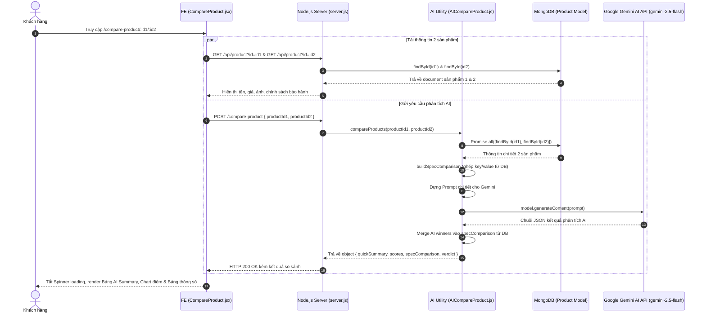

# TÀI LIỆU CONTEXT VÀ BỐI CẢNH NGHIỆP VỤ: CHỨC NĂNG SO SÁNH SẢN PHẨM (COMPARE PRODUCT)

Document này mô tả chi tiết bối cảnh, luồng dữ liệu, luồng nghiệp vụ, các hàm lõi backend/frontend, state và các trường hợp đặc biệt (edge cases) của tính năng So sánh sản phẩm (Compare Product) sử dụng Google Gemini AI trong hệ thống shop.

---

## 1. TỔNG QUAN CHỨC NĂNG

### 1.1 Chức năng chính
Tính năng So sánh sản phẩm (`CompareProduct`) cho phép người dùng chọn 2 sản phẩm bất kỳ trên hệ thống để đặt lên bàn cân so sánh chi tiết. Hệ thống tự động:
1. Trích xuất và lập bảng so sánh song song các thông số kỹ thuật thực tế từ MongoDB.
2. Tích hợp trí tuệ nhân tạo **Google Gemini AI (Model `gemini-2.5-flash`)** để phân tích ưu/nhược điểm từng máy, chấm điểm theo các tiêu chí (Hiệu năng, Camera, Pin, Màn hình, Giá trị), xác định bên chiến thắng (`winner`) cho từng tiêu chí kỹ thuật và đưa ra lời khuyên mua sắm cá nhân hóa cho khách hàng.

### 1.2 Các thành phần chính và mối liên hệ
1. **Frontend Component (`CompareProduct.jsx`)**:
   - Nhận 2 ID sản phẩm từ URL params (`/compare-product/:id1/:id2`).
   - Gọi API lấy chi tiết 2 sản phẩm (`requestGetProductById`) để hiển thị thông tin tổng quan (tên, giá, hình ảnh, chính sách bảo hành/dùng thử).
   - Gọi API phân tích AI (`requestCompareProduct`) và hiển thị kết quả bao gồm: Ưu/Nhược điểm, Thanh điểm đánh giá, Bảng thông số kỹ thuật highlight dòng thắng (`winner`), Lời khuyên mua hàng.
   - Quản lý hiệu ứng loading animation (VS Phone animation) trong lúc chờ AI phản hồi.

2. **Frontend Request Layer (`request.jsx`)**:
   - `requestGetProductById(id)`: Gọi `GET /api/product?id=...`
   - `requestCompareProduct(productId1, productId2)`: Gọi `POST /compare-product` với body `{ productId1, productId2 }`.

3. **Backend Endpoint (`server.js`)**:
   - Khai báo trực tiếp route `POST /compare-product` gọi tới helper `compareProducts(productId1, productId2)`.

4. **Backend AI Service (`AICompareProduct.js`)**:
   - Truy vấn dữ liệu 2 sản phẩm từ MongoDB (`models/products.model.js`).
   - Xây dựng cấu trúc so sánh thông số kỹ thuật chuẩn từ DB (`buildSpecComparison`).
   - Dựng prompt yêu cầu Google Gemini AI phân tích và trả về định dạng JSON thuần.
   - Trộn (`merge`) kết quả chấm điểm thắng/thua (`winner`) từ AI vào bảng thông số thực tế từ DB.

5. **Backend Model (`products.model.js`)**:
   - Chứa thông tin tên, giá, thương hiệu, hình ảnh và mảng `specifications` (`key`, `label`, `value`) của từng sản phẩm.

---

## 2. SƠ ĐỒ LUỒNG DỮ LIỆU TỔNG QUÁT



---

## 3. GIẢI THÍCH TỪNG LUỒNG NGHIỆP VỤ CHÍNH

### 3.1 Luồng Khởi tạo & Tải thông tin cơ bản của 2 Sản phẩm (Frontend)
- **Trigger**: Khách hàng truy cập đường dẫn `/compare-product/:id1/:id2`.
- **Hàm FE xử lý**: `useEffect` thứ nhất trong `CompareProduct.jsx`.
- **API gọi**: `GET /api/product?id=:id1` và `GET /api/product?id=:id2`.
- **Hàm BE xử lý**: `controllerProducts.getProductById`.
- **Logic xử lý**:
  1. Lấy `id1`, `id2` từ URL params thông qua `useParams()`.
  2. Đồng thời fetch thông tin chi tiết từng sản phẩm và lưu vào 2 state `product1`, `product2`.
  3. Gọi `compareRef.current?.scrollIntoView({ behavior: 'smooth' })` để tự động cuộn màn hình mượt xuống khu vực so sánh.

---

### 3.2 Luồng Phân tích AI & So sánh Thông số Kỹ thuật
- **Trigger**: Khi trang `CompareProduct.jsx` mount hoặc khi `id1`, `id2` thay đổi.
- **Hàm FE xử lý**: `useEffect` thứ hai trong `CompareProduct.jsx`.
- **API gọi**: `POST /compare-product` với payload `{ productId1: id1, productId2: id2 }`.
- **Hàm BE xử lý**: `compareProducts` trong `AICompareProduct.js`.
- **Logic xử lý chi tiết tại Backend**:
  1. Validate sự tồn tại của 2 sản phẩm trong DB bằng `Promise.all([modelProduct.findById(id1), modelProduct.findById(id2)])`. Nếu 1 trong 2 không tồn tại -> ném lỗi `Error("Không tìm thấy một hoặc cả hai sản phẩm")`.
  2. **Tạo bảng so sánh thông số chuẩn từ DB (`buildSpecComparison`)**:
     - Lấy mảng `specifications` của cả 2 sản phẩm.
     - Tạo 2 `Map` lưu trữ cặp `key -> { label, value }`.
     - Tổng hợp tất cả các `key` duy nhất xuất hiện ở ít nhất 1 sản phẩm (`Set([...map1.keys(), ...map2.keys()])`).
     - Bỏ qua các key như `"brand"`, `"manufacturer"` (vì đã hiển thị riêng ở đầu trang).
     - Nếu một sản phẩm thiếu thông số ở key tương ứng -> gán giá trị mặc định là `"—"`.
     - Khởi tạo giá trị `winner = 0` (chưa phân thắng bại).
  3. **Tạo Prompt cho Google Gemini AI (`buildSpecsForPrompt` & `specListForAI`)**:
     - Chuẩn bị danh sách thông số rút gọn dưới dạng văn bản.
     - Dựng cấu trúc Prompt ép Gemini AI đóng vai chuyên gia smartphone và trả về **chính xác cấu trúc JSON thuần** (không chứa markdown wrapper).
     - Định nghĩa cấu trúc JSON gồm: `quickSummary` (ưu/nhược điểm 2 máy), `scores` (thang điểm 1-10 cho Hiệu năng, Camera, Pin, Màn hình, Giá trị), `winners` (map từng `key` với giá trị `1`: SP1 tốt hơn, `2`: SP2 tốt hơn, `0`: tương đương), `verdict` (lời khuyên nên mua SP1/SP2 khi nào).
  4. **Tương tác API Gemini & Merge dữ liệu**:
     - Gọi `model.generateContent(prompt)` với mô hình `gemini-2.5-flash`.
     - Lấy chuỗi phản hồi `rawText`, làm sạch thẻ markdown codeblock (`replace(/```json/g, "").replace(/```/g, "")`) và `JSON.parse()`.
     - Lấy object `aiData.winners`, duyệt qua mảng `specComparison` ban đầu và gán `winner = winners[s.key] ?? 0`.
  5. Trả về kết quả tổng hợp cho Client: `{ quickSummary, scores, specComparison, verdict }`.

---

### 3.3 Luồng Render Kết quả So sánh trên Frontend
- **Trigger**: Khi API `requestCompareProduct` hoàn tất và trả dữ liệu về FE.
- **Xử lý UI trong `CompareProduct.jsx`**:
  1. Khi `isLoading === true`: Hiển thị khung Loading Animation với 2 biểu tượng điện thoại chạy đối đầu và chữ `"VS"` ở giữa.
  2. Khi `isLoading === false` và `compare` trả về object có `quickSummary`:
     - **Phần Ưu/Nhược điểm (`quick-summary`)**: Hiển thị danh sách dấu tích xanh `✅` cho Ưu điểm và dấu `❌` cho Nhược điểm của từng sản phẩm side-by-side.
     - **Phần Điểm Đánh Giá (`score-section`)**: Vẽ các thanh biểu đồ tỉ lệ (`score-bars`). Chiều rộng thanh bar được tính theo công thức: $\text{width} = \frac{\text{score}}{10} \times 100\%$.
     - **Phần Bảng thông số chi tiết (`spec-table`)**: Render từng dòng tiêu chí. Cột sản phẩm nào có `winner === 1` hoặc `winner === 2` sẽ được gán class `.winner` để highlight nổi bật (chữ màu xanh/nền sáng).
     - **Phần Lời khuyên mua hàng (`verdict-box`)**: Hiển thị 2 khung tư vấn *"Nên chọn [Tên SP] nếu..."* cho khách hàng dễ dàng đưa ra quyết định.
  3. **Case Fallback**: Nếu AI không trả về JSON mà trả về chuỗi text/HTML thuần -> Render qua `<div dangerouslySetInnerHTML={{ __html: compare }} />`.

---

## 4. GIẢI THÍCH CÁC HÀM "LÕI" VÀ HELPER QUAN TRỌNG (`AICompareProduct.js`)

### 4.1 `formatSpecLabel(key)`
- **Input**: `key` (string, ví dụ: `"ram_memory"`, `"screen_size"`)
- **Output**: Chuỗi nhãn đẹp dạng Title Case (ví dụ: `"Ram Memory"`, `"Screen Size"`).
- **Mục đích**: Chuyển đổi các key viết thường có dấu gạch dưới thành tên nhãn dễ đọc cho người dùng nếu DB thiếu trường `label`.

---

### 4.2 `toDisplayValue(value)`
- **Input**: `value` (bất kỳ kiểu dữ liệu nào: string, number, array, object, null).
- **Output**: Chuỗi hiển thị an toàn.
- **Cách hoạt động**:
  - Nếu `null`/`undefined` -> Trả về `""`.
  - Nếu là `Array` -> Nối các phần tử bằng dấu phẩy `, `.
  - Nếu là `Object` -> `JSON.stringify(value)`.
  - Nếu là kiểu nguyên thủy -> `String(value).trim()`.

---

### 4.3 `buildSpecComparison(product1, product2)`
- **Input**: `product1`, `product2` (Document sản phẩm từ DB).
- **Output**: Mảng các object thông số đã so khớp key: `[{ key, label, value1, value2, winner: 0 }]`.
- **Dùng ở đâu**: Trong hàm `compareProducts`.
- **Mục đích**: Đây là hàm cốt lõi giúp đảm bảo **dữ liệu thông số kỹ thuật luôn chính xác từ MongoDB** của shop, không phụ thuộc vào việc AI có nhớ chính xác cấu hình máy hay không. AI chỉ đóng vai trò trọng tài điền giá trị `winner` (`1`, `2` hoặc `0`).

---

### 4.4 `buildSpecsForPrompt(product)`
- **Input**: `product` (Document sản phẩm).
- **Output**: Chuỗi text liệt kê danh sách thông số dạng bullet point (`- Hãng: ... \n - Màn hình: ...`).
- **Mục đích**: Nén dữ liệu thông số kỹ thuật thành văn bản ngắn gọn để gửi cho Gemini AI đọc và đánh giá điểm số.

---

### 4.5 `compareProducts(productId1, productId2)`
- **Input**: `productId1`, `productId2` (ObjectId string).
- **Output**: An object chứa toàn bộ dữ liệu so sánh hoàn chỉnh.
- **Mục đích**: Hàm Controller chính cho tính năng so sánh AI, thực hiện truy vấn DB, gọi AI Gemini, parse JSON và merge kết quả.

---

## 5. GIẢI THÍCH CÁC STATE QUAN TRỌNG Ở FE (`CompareProduct.jsx`)

| State Name | Kiểu dữ liệu | Ý nghĩa & Vai trò | Phụ thuộc / Cập nhật khi nào |
| :--- | :--- | :--- | :--- |
| `id1`, `id2` | `String` | ID của 2 sản phẩm cần so sánh trích xuất từ URL. | Nhận từ `useParams()` của React Router (`/compare-product/:id1/:id2`). |
| `product1` | `Object` | Thông tin chi tiết sản phẩm 1 (tên, ảnh, giá, hãng...). | Cập nhật từ API `requestGetProductById(id1)`. |
| `product2` | `Object` | Thông tin chi tiết sản phẩm 2 (tên, ảnh, giá, hãng...). | Cập nhật từ API `requestGetProductById(id2)`. |
| `compare` | `Object / String` | Kết quả phân tích so sánh nhận từ Backend/AI. | Cập nhật từ API `requestCompareProduct(id1, id2)`. |
| `isLoading` | `Boolean` | Trạng thái hiển thị màn hình Loading Animation. | Set `true` khi bắt đầu gọi API AI so sánh, set `false` khi có kết quả hoặc lỗi (`finally`). |
| `compareRef` | `Ref Object` | Tham chiếu DOM tới khu vực bảng so sánh (`.compare-list`). | Dùng để tự động cuộn màn hình (`scrollIntoView`) khi trang mount. |

---

## 6. CÁC CASE ĐẶC BIỆT / EDGE CASES ĐÁNG CHÚ Ý

1. **Xử lý lệch Thông số Kỹ thuật giữa 2 Sản phẩm**:
   - Khi 2 sản phẩm thuộc 2 dòng/loại khác nhau có bộ thông số khác nhau (ví dụ: SP1 có chỉ số `"Chống nước"`, SP2 không có), hàm `buildSpecComparison` lấy tổng hợp tất cả các key (`Set`) và gán giá trị `"—"` cho bên bị thiếu, giúp bảng so sánh không bị lệch cột.

2. **Chế độ Fallback khi AI trả về sai định dạng JSON**:
   - Mặc dù Prompt đã yêu cầu Gemini chỉ trả về JSON thuần, đôi khi AI có thể ném ra văn bản thường hoặc lỗi. Hàm `compareProducts` có khối `try...catch` khi `JSON.parse(jsonStr)`. Nếu parse lỗi, nó ghi nhận `console.error` và **fallback trả về chuỗi text/HTML gốc** (`rawText`). Trên FE, `CompareProduct.jsx` kiểm tra `typeof compare === 'object'` để render UI hiện đại, nếu là string sẽ dùng `dangerouslySetInnerHTML` để tránh bị trắng trang.

3. **Cơ chế tách bạch Dữ liệu thật (DB) và Đánh giá (AI)**:
   - Dữ liệu `value1` và `value2` trên bảng so sánh được bảo chứng 100% từ MongoDB. AI chỉ cung cấp điểm số tổng quan và quyết định xem `value1` hay `value2` tốt hơn (`winner = 1 | 2 | 0`). Điều này loại bỏ hoàn toàn rủi ro AI "chế" ra thông số sai sự thật (AI hallucination).

4. **Loại trừ thuộc tính trùng lặp**:
   - Các key `"brand"` và `"manufacturer"` được chủ động lọc bỏ khỏi mảng `specComparison` vì thương hiệu sản phẩm đã được hiển thị trang trọng ở phần đầu thông tin sản phẩm trên UI.

---

## 7. GHI CHÚ / RỦI RO PHÁT HIỆN ĐƯỢC

> [!NOTE]
> Các ghi chú dưới đây ghi nhận thực tế từ codebase hiện tại để hỗ trợ dev mới nắm bắt, không thực hiện chỉnh sửa code.

1. **Endpoint `POST /compare-product` nằm trực tiếp trong `server.js`**:
   - **Hiện trạng**: Route `/compare-product` được khai báo trực tiếp ở file `server.js` (dòng 43) thay vì nằm trong thư mục `routes/` (như `routes/products.routes.js`).
   - **Rủi ro**: Không nhất quán về kiến trúc dự án, thiếu các middleware xử lý lỗi tập trung (`asyncHandler`) hoặc rate limiting để tránh việc người dùng spam request làm cạn kiệt Quota Gemini AI Key.

2. **Phụ thuộc vào Gemini API Key (`API_KEY_GEMINI`)**:
   - **Hiện trạng**: `AICompareProduct.js` sử dụng `process.env.API_KEY_GEMINI`.
   - **Rủi ro**: Nếu API Key hết hạn, vượt quá Rate Limit của Google, hoặc bị mất kết nối mạng quốc tế, API `/compare-product` sẽ ném Exception 500. Hiện chưa có cơ chế fallback điểm số mặc định nếu AI không khả dụng.

3. **Bảng điểm đính kèm trên UI cố định 5 tiêu chí**:
   - **Hiện trạng**: Prompt yêu cầu Gemini chấm điểm cho 5 danh mục cố định: `["Hiệu năng", "Camera", "Pin", "Màn hình", "Giá trị"]`.
   - **Rủi ro**: Nếu so sánh các thiết bị không phải điện thoại (ví dụ: Chuột, Bàn phím, Tai nghe, RAM, SSD), các tiêu chí như `"Camera"` hay `"Màn hình"` sẽ không phù hợp.
