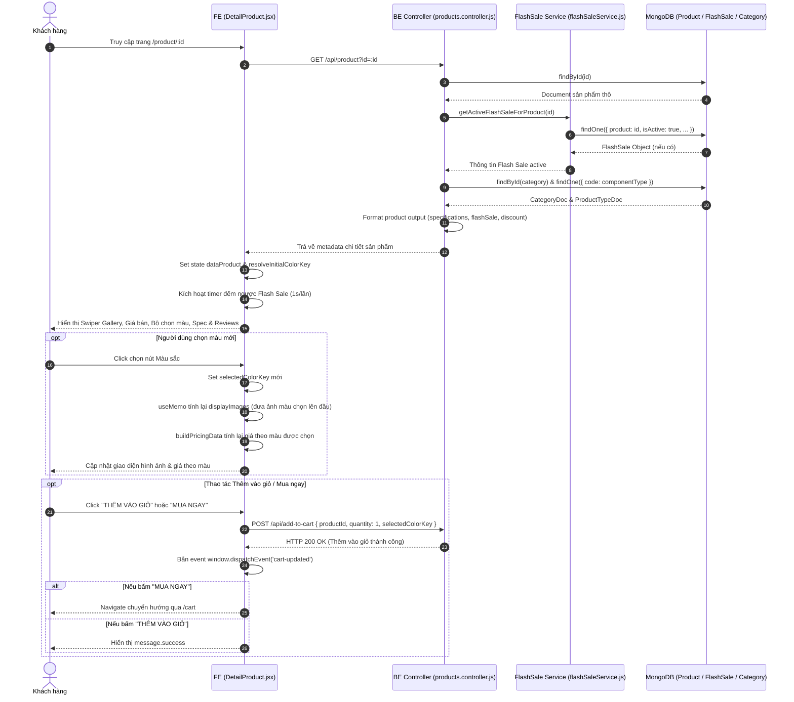

# TÀI LIỆU CONTEXT VÀ BỐI CẢNH NGHIỆP VỤ: CHỨC NĂNG XEM CHI TIẾT SẢN PHẨM (DETAIL PRODUCT)

Document này mô tả chi tiết bối cảnh, luồng dữ liệu, luồng nghiệp vụ, các hàm lõi backend/frontend, state và các trường hợp đặc biệt (edge cases) của tính năng Xem chi tiết sản phẩm (Detail Product) trong hệ thống shop.

---

## 1. TỔNG QUAN CHỨC NĂNG

### 1.1 Chức năng chính của Detail Product
Trang Chi tiết sản phẩm (`DetailProduct`) là nơi cung cấp thông tin toàn diện về một sản phẩm cụ thể cho khách hàng, bao gồm:
1. **Hình ảnh & Thư viện ảnh (Gallery)**: Slider Swiper cho phép xem ảnh sản phẩm góc rộng, tự động ưu tiên hiển thị hình ảnh tương ứng với tùy chọn màu sắc đang chọn.
2. **Giá bán & Khuyến mãi (Flash Sale / Discount)**: Hiển thị giá niêm yết, giá giảm, số tiền tiết kiệm, đồng hồ đếm ngược real-time khi có chương trình Flash Sale đang diễn ra.
3. **Biến thể màu sắc (Color Options)**: Cho phép khách hàng chọn các phiên bản màu sắc khác nhau, tự động cập nhật lại đơn giá và hình ảnh xem trước.
4. **Thông số kỹ thuật (Specifications)**: Hiển thị cấu hình chi tiết của sản phẩm dạng bảng đan xen màu sắc (striped list).
5. **Đánh giá & Phản hồi (Reviews & Admin Reply)**: Hiển thị điểm rating trung bình (sao Antd), tổng số lượt đánh giá, danh sách các nhận xét của khách hàng kèm hình ảnh thực tế và câu trả lời trực tiếp từ Quản trị viên (Admin Reply).
6. **Thao tác mua hàng**: Nút **"THÊM VÀO GIỎ"** và **"MUA NGAY"** (thêm vào giỏ và chuyển hướng ngay tới trang Giỏ hàng).

### 1.2 Các thành phần chính và mối liên hệ
1. **Frontend Component (`DetailProduct.jsx`)**:
   - Nhận ID sản phẩm từ URL params (`/product/:id`).
   - Gọi `requestGetProductById(id)` lấy dữ liệu chi tiết sản phẩm.
   - Quản lý state màu sắc đang chọn, tự động tính toán bảng giá (`buildPricingData`), lọc mảng ảnh `displayImages` và chạy đồng hồ đếm ngược Flash Sale.
   - Thao tác thêm sản phẩm vào giỏ thông qua `requestAddToCart`.

2. **Frontend Request Layer (`request.jsx`)**:
   - `requestGetProductById(id)`: Gọi `GET /api/product?id=...`.
   - `requestAddToCart(data)`: Gọi `POST /api/add-to-cart`.

3. **Backend Routes & Controller (`products.routes.js` & `products.controller.js`)**:
   - Endpoint `GET /api/product`: Gọi `controller.getProductById`.
   - `getProductById`: Query sản phẩm theo `_id`, gọi `getActiveFlashSaleForProduct(id)` để kiểm tra Flash Sale active, tra cứu `category` & `componentType`, format nhãn thông số kỹ thuật và trả về `metadata`.

4. **Backend Flash Sale Service (`flashSaleService.js`)**:
   - `getActiveFlashSaleForProduct(productId)`: Kiểm tra sự kiện Flash Sale trong DB thỏa mãn điều kiện thời gian (`startDate <= now <= endDate`), trạng thái active và chưa hết số lượng `soldQuantity < quantity`.

5. **Backend Models**:
   - `products.model.js`: Mongoose Schema chứa thông tin chi tiết sản phẩm.
   - `flashSale.model.js`: Schema chứa thông tin sự kiện Flash Sale.
   - `productType.model.js`: Schema loại sản phẩm chứa template thuộc tính (`attributesTemplate`).

---

## 2. SƠ ĐỒ LUỒNG DỮ LIỆU TỔNG QUÁT

---

## 3. GIẢI THÍCH TỪNG LUỒNG NGHIỆP VỤ CHÍNH

### 3.1 Luồng Tải & Hiển thị Thông tin Chi tiết Sản phẩm
- **Trigger**: User chuyển hướng truy cập vào URL `/product/:id`.
- **Hàm FE xử lý**: `useEffect` thứ nhất trong `DetailProduct.jsx`.
- **API gọi**: `GET /api/product?id=:id` (`requestGetProductById`).
- **Hàm BE xử lý**: `controllerProducts.getProductById` (trong `products.controller.js`).
- **Logic xử lý chi tiết**:
  1. Validate `id` từ query params. Tìm sản phẩm trong DB bằng `modelProduct.findById(id)`.
  2. Tra cứu Flash Sale active bằng `getActiveFlashSaleForProduct(data._id)`.
  3. Tra cứu `productType` theo `componentType` và `categoryDoc` theo `data.category`.
  4. Format dữ liệu sản phẩm qua `formatProductOutput`, đính kèm object `flashSale` (gồm `flashSalePrice`, `startDate`, `endDate`, `quantity`, `soldQuantity`) và trả về metadata.
  5. **Xử lý tại FE**:
     - Lưu metadata vào state `dataProduct`.
     - Gọi `resolveInitialColorKey` để tự động chọn màu sắc mặc định (`defaultColorKey` hoặc màu có `isDefault: true` hoặc màu đầu tiên trong mảng).
     - Cuộn màn hình mượt lên đầu trang (`ref.current?.scrollIntoView({ behavior: 'smooth' })`).

---

### 3.2 Luồng Đếm ngược Thời gian Flash Sale Real-time
- **Trigger**: Khi `dataProduct` có chứa thông tin `flashSale.endDate`.
- **Hàm FE xử lý**: `useEffect` thứ ba trong `DetailProduct.jsx`.
- **Logic xử lý**:
  1. Tính khoảng thời gian chênh lệch: `difference = new Date(endDate).getTime() - new Date().getTime()`.
  2. Nếu `difference <= 0`: Set state `flashSaleTimeLeft = 'Đã kết thúc'`.
  3. Ngược lại: Tính số giờ (`hrs`), phút (`mins`), giây (`secs`) còn lại và format dạng `HH:mm:ss` (pad bằng số 0 ở đầu).
  4. Thiết lập `setInterval` cập nhật mỗi `1000ms` (1 giây).
  5. **Cleanup**: Khi component unmount hoặc `dataProduct.flashSale` thay đổi, gọi `clearInterval(intervalId)` để giải phóng bộ nhớ.

---

### 3.3 Luồng Lựa chọn Phiên bản Màu sắc (Color Options Selection)
- **Trigger**: User click vào một button tùy chọn màu trong khối "Chọn màu sắc".
- **Hàm FE xử lý**: `setSelectedColorKey(option.key)` trong JSX render.
- **Logic xử lý & Tác động lan truyền (Side-effects)**:
  1. **Đổi giá sản phẩm**: Hàm `buildPricingData(dataProduct, selectedColorOption)` tính toán lại `originalPrice` dựa trên đơn giá của tùy chọn màu vừa chọn (`selectedColorOption.price`).
  2. **Đổi hình ảnh Gallery Swiper**: Hook `useMemo` tính toán lại `displayImages`. Nếu màu được chọn có trường `image`, hình ảnh màu đó sẽ được tự động **đưa lên vị trí đầu tiên của mảng ảnh** (`[selectedColorImage, ...remainingImages]`), giúp Swiper Carousel chuyển ngay sang ảnh màu đó.
  3. **Đổi thuộc tính active**: Button màu tương ứng nhận class `.colorOptionActive` kèm icon tích chọn `<FontAwesomeIcon icon={faCheck} />`.

---

### 3.4 Luồng Thêm vào Giỏ hàng (`handleAddToCart`)
- **Trigger**: User bấm nút **"THÊM VÀO GIỎ"**.
- **Hàm FE xử lý**: `handleAddToCart()`.
- **API gọi**: `POST /api/add-to-cart` (`requestAddToCart`).
- **Logic xử lý**:
  1. **Validate phía FE**: Kiểm tra xem sản phẩm có danh sách màu (`colorOptions`) hay không. Nếu có mà `selectedColorKey` rỗng -> Hiển thị `message.warning('Vui lòng chọn màu sắc trước khi thêm vào giỏ')` và dừng thực thi.
  2. Chuẩn bị payload: `{ productId: id, quantity: 1, selectedColorKey: selectedColorKey || undefined }`.
  3. Gọi API `requestAddToCart(data)`.
  4. Sau khi BE trả về thành công: Bắn event toàn cục `window.dispatchEvent(new Event('cart-updated'))` để Header cập nhật số đếm giỏ hàng. Hiển thị `message.success('Thêm vào giỏ hàng thành công')`.
  5. Nếu có lỗi từ BE (ví dụ hết kho): Hiển thị `message.error('Sản phẩm đã hết hàng')`.

---

### 3.5 Luồng Mua Ngay (`handleBuyNow`)
- **Trigger**: User bấm nút **"MUA NGAY"**.
- **Hàm FE xử lý**: `handleBuyNow()`.
- **Logic xử lý**:
  1. Tái sử dụng hàm `handleAddToCart()`.
  2. Nếu `handleAddToCart()` trả về `true` (thêm vào giỏ thành công) -> Thực hiện `navigate('/cart')` để chuyển hướng ngay lập tức người dùng sang trang Giỏ hàng tiến hành thanh toán.

---

### 3.6 Luồng Hiển thị Thông số Kỹ thuật (`specs`)
- **Hàm FE xử lý**: `buildSpecs(dataProduct)`.
- **Logic xử lý**:
  1. Gọi `normalizeSpecifications(product.specifications)` lọc các phần tử hợp lệ có `label` và `value` không rỗng.
  2. Nếu mảng `specifications` có dữ liệu -> Trả về mảng thông số chuẩn.
  3. **Fallback**: Nếu `specifications` rỗng, hệ thống tìm trong trường `product.attributes` (JSON string hoặc Object), gọi `normalizeAttributes` và parse từng cặp `key-value` chuyển nhãn qua `formatSpecLabel(key)` để làm thông số kỹ thuật fallback.
  4. Render danh sách thông số dạng bảng đan xen màu nền (sử dụng class `.striped` cho các dòng lẻ).

---

### 3.7 Luồng Hiển thị Đánh giá Khách hàng & Phản hồi Admin (Reviews)
- **Xử lý dữ liệu**:
  1. Lấy mảng `reviews = dataProduct.reviews || []`.
  2. Tính sao trung bình `averageRating`: Tổng điểm rating chia cho tổng số lượt review (lấy 1 chữ số thập phân). Render bằng component `Rate` Antd (cho phép hiển thị nửa sao `allowHalf`).
  3. Sắp xếp danh sách đánh giá theo ngày tạo mới nhất lên đầu: `[...reviews].sort((a, b) => new Date(b.createdAt) - new Date(a.createdAt))`.
  4. Mỗi dòng review hiển thị: Tên người đánh giá (`fullName`), ngày tạo (`toLocaleDateString`), số sao, nội dung bình luận (`comment`), danh sách ảnh đính kèm (nếu có).
  5. **Hiển thị Phản hồi Admin (`adminReply`)**: Nếu object review có chứa `adminReply.message` -> Render một khung riêng bên dưới comment với tên Admin, ngày phản hồi và nội dung câu trả lời.

---

## 4. GIẢI THÍCH CÁC HÀM "LÕI" VÀ HELPER QUAN TRỌNG (`DetailProduct.jsx`)

### 4.1 `normalizeAttributes(attributes)`
- **Input**: `attributes` (JSON String hoặc Object).
- **Output**: An object chứa các thuộc tính phẳng `{ [key]: value }`.
- **Mục đích**: Tránh crash ứng dụng khi trường `attributes` trong DB lưu dạng chuỗi JSON chưa parse hoặc null/undefined.

---

### 4.2 `formatSpecLabel(key)`
- **Input**: `key` (string, ví dụ: `"ram_capacity"`).
- **Output**: Chuỗi Title Case (ví dụ: `"Ram Capacity"`).
- **Mục đích**: Chuyển key dạng snake_case thành nhãn hiển thị đẹp nếu không có trường `label` sẵn.

---

### 4.3 `normalizeSpecifications(specifications)`
- **Input**: Mảng `specifications` thô từ DB.
- **Output**: Mảng các object đã làm sạch: `[{ key, label, value }]` (chỉ giữ lại phần tử có `label` và `value` hợp lệ).

---

### 4.4 `buildSpecs(product)`
- **Input**: Object `product`.
- **Output**: Mảng thông số kỹ thuật hoàn chỉnh để hiển thị trên UI.
- **Mục đích**: Tổng hợp thông số theo cơ chế ưu tiên: `specifications` trước, `attributes` sau.

---

### 4.5 `clampDiscountPercent(value)`
- **Input**: `value` (bất kỳ).
- **Output**: Số nguyên phần trăm từ `0` đến `100`.
- **Mục đích**: Đảm bảo tỉ lệ phần trăm giảm giá không bị âm hoặc vượt quá 100%.

---

### 4.6 `normalizeColorOptions(colorOptions)`
- **Input**: Mảng `colorOptions` từ DB.
- **Output**: Mảng các tùy chọn màu đã chuẩn hóa: `[{ key, name, image, price, isDefault }]`.
- **Mục đích**: Đảm bảo các thuộc tính `price >= 0`, `key` viết thường, loại bỏ các item lỗi.

---

### 4.7 `resolveInitialColorKey(product, colorOptions)`
- **Input**: `product` object và mảng `colorOptions` đã chuẩn hóa.
- **Output**: `selectedColorKey` mặc định khi tải trang.
- **Thứ tự ưu tiên**: `product.defaultColorKey` -> item có `isDefault === true` -> item màu đầu tiên trong mảng.

---

### 4.8 `buildPricingData(product, selectedColorOption)`
- **Input**: `product` object và `selectedColorOption` (màu đang chọn).
- **Output**: Object tính toán giá chi tiết: `{ originalPrice, discountPercent, hasDiscount, discountedPrice, savingAmount, isFlashSale }`.
- **Ưu tiên tính giá**:
  1. Nếu có `product.flashSale`: Lấy giá Flash Sale `flashSalePrice` làm `discountedPrice`.
  2. Nếu không có Flash Sale: Lấy `originalPrice` từ màu đang chọn (hoặc `product.price`), trừ đi `% discount` của sản phẩm.

---

### 4.9 `formatCurrency(value)`
- **Input**: Số tiền (number/string).
- **Output**: Chuỗi định dạng tiền tệ Việt Nam (ví dụ: `15.990.000`).

---

## 5. GIẢI THÍCH CÁC STATE QUAN TRỌNG Ở FE (`DetailProduct.jsx`)

| State Name | Kiểu dữ liệu | Ý nghĩa & Vai trò | Phụ thuộc / Cập nhật khi nào |
| :--- | :--- | :--- | :--- |
| `dataProduct` | `Object` | Chứa toàn bộ thông tin chi tiết sản phẩm nhận từ backend API `requestGetProductById`. | Cập nhật khi `useEffect` fetch dữ liệu theo `id` thành công. |
| `selectedColorKey` | `String` | Key của tùy chọn màu sắc đang được người dùng tích chọn. | Khởi tạo từ `resolveInitialColorKey()`. Cập nhật khi user click chọn nút màu mới. |
| `flashSaleTimeLeft` | `String` | Chuỗi đếm ngược thời gian Flash Sale (dạng `"HH:mm:ss"` hoặc `"Đã kết thúc"`). | Cập nhật mỗi `1000ms` bởi `setInterval` trong `useEffect`. |
| `displayImages` | `Array` *(useMemo)* | Mảng các URL hình ảnh hiển thị trong Swiper Gallery. | Tự động tính toán lại khi `dataProduct.images` hoặc `selectedColorOption.image` thay đổi (đưa ảnh màu chọn lên đầu). |
| `ref` | `Ref Object` | Tham chiếu DOM tới thẻ `<main>` chính của trang. | Dùng để cuộn trang mượt (`scrollIntoView`) lên đầu khi đổi sản phẩm `id`. |

---

## 6. CÁC CASE ĐẶC BIỆT / EDGE CASES ĐÁNG CHÚ Ý

1. **Ưu tiên giá Flash Sale tuyệt đối**:
   - Trong hàm `buildPricingData`, nếu sản phẩm đang thuộc chương trình Flash Sale active (`product.flashSale`), giá sale này sẽ ghi đè lên mức giảm giá `%` thông thường (`product.discount`), đồng thời hiển thị Banner Flash Sale màu đỏ nổi bật kèm đồng hồ đếm ngược real-time.

2. **Chuyển ảnh Swiper Gallery theo màu sắc linh hoạt**:
   - Thay vì khởi tạo lại Swiper làm giật lag giao diện, `DetailProduct.jsx` sử dụng `useMemo` tạo mảng `displayImages`. Nếu màu được chọn có ảnh riêng (`selectedColorOption.image`), ảnh đó được đặt vào phần tử đầu tiên (`index 0`) của mảng. Swiper sử dụng `key={gallery-${id}-${selectedColorKey || 'default'}}` để re-render nhẹ nhàng slider về vị trí ảnh đầu tiên.

3. **Chống quên chọn màu khi Thêm vào giỏ**:
   - Nếu sản phẩm có thiết lập `colorOptions` (có ít nhất 1 màu), nhưng vì lý do nào đó `selectedColorKey` bị rỗng, hàm `handleAddToCart` lập tức chặn request và cảnh báo người dùng bằng `message.warning`.

4. **Hiển thị Câu phản hồi từ Quản trị viên (Admin Reply)**:
   - Trong phần Đánh giá khách hàng, nếu admin đã phản hồi 1 đánh giá, object review sẽ chứa sub-document `adminReply`. UI tự động dựng một khung chat thụt lùi vào trong, hiển thị tên Admin (`adminName || 'Quản trị viên'`), ngày trả lời và nội dung phản hồi.

5. **Dọn dẹp Timer khi Unmount**:
   - `useEffect` đếm ngược Flash Sale có hàm cleanup `return () => clearInterval(intervalId)` giúp tránh rò rỉ bộ nhớ (memory leak) khi người dùng chuyển từ trang Detail sang trang khác.

---

## 7. GHI CHÚ / RỦI RO PHÁT HIỆN ĐƯỢC

> [!NOTE]
> Các ghi chú dưới đây ghi nhận thực tế từ codebase hiện tại để hỗ trợ dev mới nắm bắt, không thực hiện chỉnh sửa code.

1. **Thông tin ưu đãi & chính sách giao hàng mang tính chất tĩnh (Hardcoded)**:
   - Trong JSX của `DetailProduct.jsx` (từ dòng 373 đến 399), một số thông tin như *"Giao hàng ngày mở bán tại Việt Nam 27/06/2025"* hay số điện thoại *"0936 096 900"* được viết trực tiếp vào code giao diện thay vì lấy từ cấu hình hệ thống hay database.

2. **Hành vi nút "MUA NGAY" (`handleBuyNow`)**:
   - Nút Mua ngay gọi lại `handleAddToCart()` với số lượng cố định là `1`, sau đó thực hiện `navigate('/cart')`. Nếu sản phẩm đó đã có sẵn 3 chiếc trong giỏ từ trước, việc bấm Mua ngay sẽ làm số lượng trong giỏ tăng lên 4 thay vì đè số lượng thành 1.

3. **Không ghi nhận lượt xem sản phẩm (View Count)**:
   - API `GET /api/product?id=...` chỉ đọc dữ liệu từ DB mà không thực hiện tăng số lượt xem (`$inc: { views: 1 }`). Dự án hiện chưa có tính năng theo dõi sản phẩm xem nhiều/nổi bật dựa trên lượt view.
