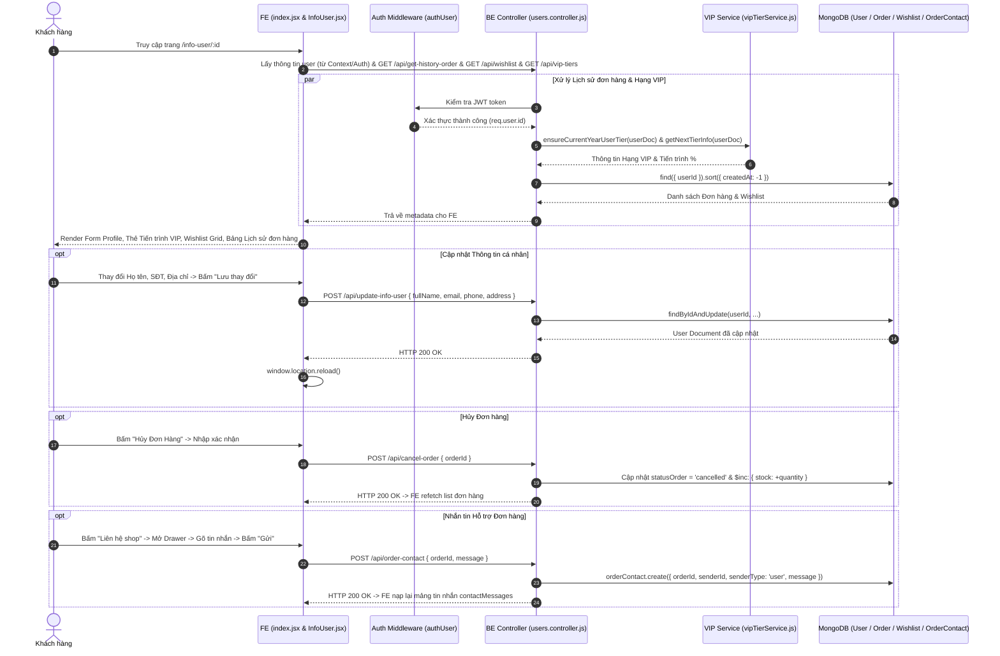

# TÀI LIỆU CONTEXT VÀ BỐI CẢNH NGHIỆP VỤ: CHỨC NĂNG THÔNG TIN CÁ NHÂN & QUẢN LÝ TÀI KHOẢN (INFO USER)

Document này mô tả chi tiết bối cảnh, luồng dữ liệu, luồng nghiệp vụ, các hàm lõi backend/frontend, state và các trường hợp đặc biệt (edge cases) của trung tâm Quản lý tài khoản người dùng (`InfoUser`) trong hệ thống shop.

---

## 1. TỔNG QUAN CHỨC NĂNG

### 1.1 Chức năng chính của InfoUser
Trang Thông tin cá nhân (`InfoUser`) đóng vai trò là trung tâm quản lý tài khoản dành cho khách hàng sau khi đăng nhập, tích hợp 6 nhóm chức năng lớn:
1. **Quản lý Hồ sơ cá nhân (Profile)**: Xem và cập nhật các thông tin cơ bản: Họ và tên, Email, Số điện thoại, Địa chỉ giao hàng mặc định.
2. **Tiến trình Hạng thành viên VIP (VIP Tier Progress)**: Hiển thị cấp độ hạng thành viên hiện tại (Thành viên, Đồng, Bạc, Vàng, Kim Cương), tỉ lệ % chiết khấu được hưởng, tổng chi tiêu tích lũy trong năm và thanh tiến trình % kèm số tiền còn thiếu để thăng hạng VIP tiếp theo.
3. **Danh sách sản phẩm yêu thích (Wishlist)**: Quản lý các sản phẩm người dùng đã thả tim lưu lại, cho phép xem nhanh và bỏ khỏi danh sách yêu thích.
4. **Lịch sử đơn hàng & Thao tác sau bán hàng (Order History)**: Theo dõi trạng thái toàn bộ đơn hàng (Chờ xác nhận, Đã xác nhận, Đang giao hàng, Đã giao hàng, Đã hủy).
   - *Đơn chờ/đã xác nhận*: Hỗ trợ **Hủy đơn hàng** kèm lý do.
   - *Đơn đã giao*: Hỗ trợ **Đánh giá sản phẩm** (chấm sao, viết comment, tải ảnh thực tế).
   - *Đơn đã hủy*: Hỗ trợ **Mua lại (Reorder)** - thêm toàn bộ sản phẩm trong đơn cũ vào giỏ hàng.
5. **Hỗ trợ & Liên hệ đơn hàng (Order Contact Messaging)**: Khung nhắn tin hai chiều theo dạng Drawer/Modal cho từng đơn hàng cụ thể giữa Khách hàng và Quản trị viên.
6. **Bảo mật tài khoản**: Đổi mật khẩu tài khoản và Đăng xuất an toàn.

### 1.2 Các thành phần chính và mối liên hệ
1. **Frontend Frame Component (`Pages/InfoUser/index.jsx`)**:
   - Khung giao diện chính bao gồm Header, Sidebar hiển thị Avatar người dùng (cho phép chọn ảnh xem trước qua Blob URL), Tên người dùng, Nút Đổi mật khẩu và Nút Đăng xuất (`requestLogout`).

2. **Frontend Main Component (`Pages/InfoUser/Components/InfoUser/InfoUser.jsx`)**:
   - Chứa toàn bộ giao diện và logic tương tác với các Sub-features: Form cập nhật thông tin, Khối tiến trình VIP, Thẻ Wishlist, Bảng Lịch sử đơn hàng, Modal Hủy đơn, Modal Đánh giá sản phẩm, Drawer Tin nhắn liên hệ đơn hàng.

3. **Frontend Sub-component (`ModalUpdatePassword.jsx`)**:
   - Form Modal Antd xử lý đổi mật khẩu tài khoản với validation khớp mật khẩu mới.

4. **Frontend Request Layer (`request.jsx`)**:
   - Giao tiếp API: `requestUpdateInfoUser`, `requestUpdatePassword`, `requestLogout`, `requestGetHistoryOrder`, `requestCancelOrder`, `requestReorder`, `requestGetWishlist`, `requestRemoveWishlist`, `requestReviewOrderProduct`, `requestGetOrderContactMessages`, `requestSendOrderContactMessage`, `requestDeleteOrderContactMessage`, `requestGetVipTiers`.

5. **Backend Controllers & Services**:
   - `users.controller.js`: Xử lý cập nhật profile, đổi mật khẩu, đăng xuất, lấy đơn hàng, hủy đơn, reorder, gửi/xóa tin nhắn liên hệ, viết đánh giá sản phẩm.
   - `vipTierService.js`: Service tự động tính toán hạng VIP theo chi tiêu năm (`ensureCurrentYearUserTier`), lấy thông tin tiến trình thăng hạng (`getNextTierInfo`) và % chiết khấu.

6. **Backend Models**:
   - `users.model.js`: Mongoose Schema lưu thông tin profile user (`fullName`, `email`, `phone`, `address`, `vipTier`, `yearlySpending`...).
   - `payments.model.js`: Schema lưu đơn hàng và trạng thái đơn hàng (`orderCode`, `status`, `items`, `typePayment`, `reviewedProductIds`...).
   - `wishlist.model.js`: Schema lưu danh sách ID sản phẩm yêu thích.
   - `orderContact.model.js`: Schema lưu lịch sử nhắn tin liên hệ hỗ trợ từng đơn hàng.

---

## 2. SƠ ĐỒ LUỒNG DỮ LIỆU TỔNG QUÁT

---

## 3. GIẢI THÍCH TỪNG LUỒNG NGHIỆP VỤ CHÍNH

### 3.1 Luồng Cập nhật Thông tin Cá nhân (Profile Update)
- **Trigger**: User chỉnh sửa Họ tên, Email, Số điện thoại hoặc Địa chỉ và bấm nút "Lưu thay đổi".
- **Hàm FE xử lý**: `handleUpdateInfoUser()` trong `InfoUser.jsx`.
- **API gọi**: `POST /api/update-info-user` (`requestUpdateInfoUser`).
- **Hàm BE xử lý**: `controllerUser.updateInfoUser`.
- **Logic xử lý**:
  1. FE gửi payload `{ fullName, email, phone, address }`.
  2. BE kiểm tra user tồn tại bằng `modelUser.findById(id)`.
  3. Tiến hành cập nhật các trường thông tin trong DB.
  4. Trả về phản hồi thành công -> FE hiển thị `message.success` và gọi `window.location.reload()` để đồng bộ lại toàn bộ dữ liệu trên giao diện web.

---

### 3.2 Luồng Hiển thị Tiến trình Hạng thành viên VIP (VIP Tier Progress)
- **Trigger**: Tự động kích hoạt khi mount trang `InfoUser.jsx`.
- **API gọi**: `GET /api/vip-tiers` (`requestGetVipTiers`).
- **Logic xử lý**:
  1. BE gọi `ensureCurrentYearUserTier(userDoc)` để tự động quét tổng chi tiêu trong năm hiện tại của user từ bảng đơn hàng `modelPayments` (chỉ tính đơn `status: 'delivered'`) và cập nhật `vipTier` vào `modelUser`.
  2. BE gọi `getNextTierInfo(currentTier, yearlySpending)` để tính toán mốc chi tiêu tiếp theo, phần trăm tiến trình `progressPercent` và số tiền còn thiếu `remainingAmount`.
  3. FE hiển thị Thẻ VIP với Icon Vương miện (`CrownOutlined`), Tag màu đại diện cho hạng (Đồng `#cd7f32`, Bạc `#c0c0c0`, Vàng `#ffd700`, Kim Cương `#b9f2ff`), thanh tiến trình `Progress` Antd và số tiền cần mua thêm để thăng hạng.

---

### 3.3 Luồng Quản lý Danh sách Sản phẩm Yêu thích (Wishlist)
- **Trigger**: Tự động kích hoạt khi mount trang `InfoUser.jsx`.
- **Hàm FE xử lý**: `loadWishlist()` & `handleRemoveWishlist(productId)`.
- **API gọi**: `GET /api/wishlist` (`requestGetWishlist`) và `DELETE /api/wishlist/remove` (`requestRemoveWishlist`).
- **Logic xử lý**:
  1. `loadWishlist`: Gọi API lấy mảng các ID sản phẩm trong wishlist của user (`res.metadata`). Với mỗi ID, gọi song song `requestGetProductById(id)` bằng `Promise.all` để trích xuất đầy đủ thông tin sản phẩm (tên, giá, hình ảnh). Lọc bỏ các sản phẩm không còn tồn tại (`filter(Boolean)`).
  2. `handleRemoveWishlist`: Khi user bấm biểu tượng Thùng rác trên thẻ wishlist -> Gọi API gỡ sản phẩm khỏi DB, hiển thị thông báo thành công, refetch lại danh sách wishlist và gọi `refreshWishlist()` để đồng bộ số lượng tim trên Header.

---

### 3.4 Luồng Xem Lịch sử Đơn hàng (Order History)
- **Trigger**: Tự động kích hoạt khi mount trang `InfoUser.jsx`.
- **Hàm FE xử lý**: `fetchOrders()`.
- **API gọi**: `GET /api/get-history-order` (`requestGetHistoryOrder`).
- **Hàm BE xử lý**: `controllerUser.getHistoryOrder`.
- **Logic xử lý**:
  1. BE tìm tất cả đơn hàng thuộc về user (`modelPayments.find({ userId }).sort({ createdAt: -1 })`).
  2. Trả về danh sách đơn hàng chứa mảng `products` (tên, ảnh, màu sắc chọn, số lượng, đơn giá), `totalPrice`, `address`, `statusOrder`, `createdAt`, `reviewedProductIds`.
  3. FE render dữ liệu dưới dạng Bảng (`Table` Antd) kèm Tag trạng thái đơn hàng (`renderStatus`) và Menu nút thao tác mở rộng (`renderActionButton`).

---

### 3.5 Luồng Hủy Đơn hàng (Cancel Order)
- **Trigger**: User bấm Menu thao tác "Hủy Đơn Hàng" tại dòng đơn hàng có trạng thái `pending` (Chờ xác nhận) hoặc `completed` (Đã xác nhận).
- **Hàm FE xử lý**: `handleOpenCancelModal(orderId)` -> `handleCancelOrder()`.
- **API gọi**: `POST /api/cancel-order` (`requestCancelOrder`).
- **Hàm BE xử lý**: `controllerUser.cancelOrder`.
- **Logic xử lý**:
  1. BE kiểm tra điều kiện đơn hàng: Chỉ cho phép hủy nếu trạng thái đơn là `pending` hoặc `completed`. Nếu đơn đã ở trạng thái `shipping` hoặc `delivered` -> Ném lỗi `BadRequestError("Đơn hàng đang giao hoặc đã hoàn thành, không thể hủy")`.
  2. Cập nhật `statusOrder = 'cancelled'`.
  3. **Hoàn trả tồn kho kho (`stock`)**: Duyệt mảng `products` trong đơn hàng, cộng hoàn trả số lượng lại cho sản phẩm gốc trong DB (`modelProduct.updateOne({ _id }, { $inc: { stock: quantity } })`).
  4. FE nhận phản hồi thành công, đóng Modal và refetch lại danh sách đơn hàng.

---

### 3.6 Luồng Mua Lại Đơn hàng (Reorder)
- **Trigger**: User bấm Menu thao tác "Mua Lại" tại dòng đơn hàng đã bị hủy (`cancelled`).
- **Hàm FE xử lý**: `handleReorder(orderId)`.
- **API gọi**: `POST /api/reorder` (`requestReorder`).
- **Hàm BE xử lý**: `controllerUser.reorder`.
- **Logic xử lý**:
  1. BE lấy thông tin đơn hàng cũ, kiểm tra tồn kho các sản phẩm trong đơn.
  2. Thêm tất cả sản phẩm từ đơn hàng cũ vào Giỏ hàng (`modelCart`) hiện tại của user.
  3. FE nhận phản hồi thành công, bắn event toàn cục `window.dispatchEvent(new Event('cart-updated'))`, hiển thị thông báo và thực hiện `navigate('/cart')`.

---

### 3.7 Luồng Viết Đánh giá Sản phẩm đã Mua (Product Review)
- **Trigger**: User bấm Menu thao tác "Đánh Giá" tại dòng đơn hàng đã giao thành công (`delivered`).
- **Hàm FE xử lý**: `handleOpenReviewModal(order)` -> `handleSubmitReview()`.
- **API gọi**: `POST /api/upload-image` (nếu có tải ảnh) và `POST /api/review-order-product` (`requestReviewOrderProduct`).
- **Hàm BE xử lý**: `controllerUser.reviewOrderProduct`.
- **Logic xử lý**:
  1. FE mở Modal cho chọn sản phẩm trong đơn hàng (nếu đơn có nhiều sản phẩm, ưu tiên mở sản phẩm chưa từng được đánh giá `reviewedProductIds`), cho chọn số sao Rating (1-5 sao), nhập nội dung comment và tải ảnh đính kèm (FormData).
  2. Nếu có chọn ảnh -> Gọi `requestUploadImage` tải ảnh lên Cloudinary lấy danh sách URL.
  3. Gọi API `requestReviewOrderProduct` gửi `{ orderId, productId, rating, comment, images }`.
  4. BE kiểm tra đơn hàng phải có `statusOrder === 'delivered'`, lưu đánh giá vào mảng `reviews` trong `modelProduct` và thêm `productId` vào mảng `reviewedProductIds` của `modelPayments`.
  5. FE nhận phản hồi thành công, đóng Modal và reload lại danh sách đơn hàng.

---

### 3.8 Luồng Nhắn tin Hỗ trợ Đơn hàng (Order Contact Messaging)
- **Trigger**: User bấm Menu thao tác "Liên hệ shop" tại bất kỳ đơn hàng nào.
- **Hàm FE xử lý**: `handleOpenContactModal(orderId)`, `handleSendContactMessage()`, `handleDeleteContactMessage(messageId)`.
- **API gọi**: `GET /api/order-contact`, `POST /api/order-contact`, `DELETE /api/order-contact-message`.
- **Logic xử lý**:
  1. Mở Drawer tin nhắn, fetch toàn bộ danh sách hội thoại liên hệ hỗ trợ của đơn hàng đó từ `modelOrderContact`.
  2. Khi User gõ nội dung và bấm "Gửi" -> Gửi request tạo tin nhắn mới với `senderType: 'user'`. BE lưu vào DB và FE nạp lại mảng tin nhắn.
  3. **Xóa tin nhắn**: User chỉ được phép xóa các tin nhắn do chính mình gửi (`canDeleteUserMessage`: `senderType === 'user'` và matching `senderId`). Khi bấm xóa -> Gọi API DELETE để loại bỏ tin nhắn khỏi DB.

---

### 3.9 Luồng Đổi Mật khẩu Tài khoản (Update Password)
- **Trigger**: User bấm mục "Đổi mật khẩu" ở Sidebar tài khoản.
- **Hàm FE xử lý**: `handleSubmit(values)` trong `ModalUpdatePassword.jsx`.
- **API gọi**: `POST /api/update-password` (`requestUpdatePassword`).
- **Hàm BE xử lý**: `controllerUser.updatePassword`.
- **Logic xử lý**:
  1. FE validate form: Mật khẩu hiện tại không được rỗng, Mật khẩu mới tối thiểu 6 ký tự và Mật khẩu xác nhận phải trùng khớp.
  2. BE kiểm tra mật khẩu hiện tại bằng `bcrypt.compare`. Nếu không khớp -> Ném lỗi `BadRequestError("Mật khẩu hiện tại không chính xác")`.
  3. Mã hóa mật khẩu mới bằng `bcrypt.hash` và lưu vào DB.
  4. FE nhận thông báo thành công, reset Form và đóng Modal.

---

### 3.10 Luồng Đăng xuất Tài khoản (Logout)
- **Trigger**: User bấm mục "Đăng xuất" ở Sidebar tài khoản.
- **Hàm FE xử lý**: `handleLogOut()` trong `index.jsx`.
- **API gọi**: `GET /api/logout` (`requestLogout`).
- **Logic xử lý**:
  1. Bật trạng thái `loading = true` để disable các tương tác.
  2. Gọi API `requestLogout` để BE xóa cookie/session đăng nhập.
  3. Gọi `clearAuth()` trong React Context để dọn dẹp state `dataUser` toàn cục.
  4. Thực hiện `navigate('/login')` chuyển hướng người dùng về trang Đăng nhập.

---

## 4. GIẢI THÍCH CÁC HÀM "LÕI" VÀ HELPER QUAN TRỌNG (`InfoUser.jsx`)

### 4.1 `ensureCurrentYearUserTier` & `getNextTierInfo` (Backend Service)
- **File**: `vipTierService.js`
- **Mục đích**: Tự động cập nhật hạng VIP người dùng dựa trên tổng giá trị các đơn hàng giao thành công trong năm hiện tại, và tính toán số liệu % tiến trình cùng số tiền còn thiếu để thăng hạng VIP kế tiếp.

---

### 4.2 `loadWishlist` (Frontend Helper)
- **File**: `InfoUser.jsx`
- **Mục đích**: Fetch danh sách mảng ID yêu thích từ API Wishlist, sau đó chạy `Promise.all` gọi song song API `requestGetProductById` cho từng ID để lấy đầy đủ chi tiết sản phẩm hiển thị trên thẻ Wishlist.

---

### 4.3 `renderStatus(status)` (Frontend Helper)
- **File**: `InfoUser.jsx`
- **Input**: `status` (string: `'pending'`, `'completed'`, `'shipping'`, `'delivered'`, `'cancelled'`).
- **Output**: Thẻ `` hiển thị tên trạng thái tiếng Việt với mã màu tương ứng (Tím: Chờ xác nhận, Cam: Đã xác nhận, Xanh dương: Đang giao hàng, Xanh lá: Đã giao hàng, Đỏ: Đã hủy).

---

### 4.4 `renderActionButton(record)` (Frontend Helper)
- **File**: `InfoUser.jsx`
- **Input**: `record` (Object dữ liệu 1 đơn hàng).
- **Output**: Component `Dropdown` Antd chứa danh sách các nút hành động phù hợp linh hoạt theo trạng thái đơn hàng (Liên hệ shop, Hủy đơn hàng, Mua lại, Đánh giá / Đã đánh giá).

---

## 5. GIẢI THÍCH CÁC STATE QUAN TRỌNG Ở FE

### 5.1 Trang Khung `Pages/InfoUser/index.jsx`

| State Name | Kiểu dữ liệu | Ý nghĩa & Vai trò | Phụ thuộc / Cập nhật khi nào |
| :--- | :--- | :--- | :--- |
| `isOpen` | `Boolean` | Trạng thái ẩn/hiện Modal Đổi mật khẩu. | Set `true` khi click "Đổi mật khẩu" ở Sidebar. Chuyền làm props cho `ModalUpdatePassword`. |
| `avatarPreview` | `String` | URL ảnh đại diện hiển thị khung Avatar (Blob URL hoặc ảnh mặc định). | Cập nhật khi user chọn file ảnh mới từ thẻ `<input type="file">`. |
| `loading` | `Boolean` | Trạng thái đang đăng xuất tài khoản. | Set `true` trong quá trình chờ API `requestLogout()`. |

### 5.2 Component Chính `InfoUser.jsx`

| State Name | Kiểu dữ liệu | Ý nghĩa & Vai trò | Phụ thuộc / Cập nhật khi nào |
| :--- | :--- | :--- | :--- |
| `fullName`, `email`, `phone`, `address` | `String` | Dữ liệu các ô input Form thông tin cá nhân. | Khởi tạo từ `dataUser` Context. Cập nhật khi user gõ phím. |
| `allVipTiers` | `Array` | Danh sách cấu hình tất cả bậc hạng VIP từ hệ thống. | Cập nhật từ API `requestGetVipTiers()` khi mount component. |
| `dataOrder` | `Array` | Danh sách lịch sử đơn hàng của người dùng. | Cập nhật từ API `fetchOrders()` (`requestGetHistoryOrder`). |
| `wishlistData` | `Array` | Danh sách thông tin chi tiết các sản phẩm trong Wishlist. | Cập nhật từ hàm `loadWishlist()`. |
| `mountedRef` | `Ref Object` | Đánh dấu trạng thái unmount của component. | Dùng để hủy gán state trong `loadWishlist()` nếu component unmount giữa chừng. |
| `cancelOrderId` & `isCancelModalOpen` | `String` / `Boolean` | ID đơn hàng cần hủy và trạng thái hiển thị Modal Hủy đơn. | Cập nhật khi bấm nút Hủy đơn trên dòng đơn hàng tương ứng. |
| `contactOrderId` & `contactMessages` | `String` / `Array` | ID đơn hàng đang nhắn tin hỗ trợ và mảng các tin nhắn hỗ trợ. | Cập nhật khi bấm nút "Liên hệ shop" hoặc khi gửi/xóa tin nhắn. |
| `reviewOrder` & `selectedProductId` | `Object` / `String` | Đơn hàng và ID sản phẩm được chọn để viết Đánh giá. | Cập nhật khi bấm nút "Đánh giá" trong bảng đơn hàng. |
| `rating`, `reviewComment`, `reviewFiles` | `Number` / `String` / `Array` | Số sao (1-5), nội dung bình luận và mảng file ảnh review. | Cập nhật khi user chọn sao, gõ bình luận hoặc upload ảnh trong Modal Review. |

---

## 6. CÁC CASE ĐẶC BIỆT / EDGE CASES ĐÁNG CHÚ Ý

1. **Quản lý Vòng đời Async với `mountedRef` trong Wishlist**:
   - Trong `InfoUser.jsx`, quá trình `loadWishlist()` phải thực hiện nhiều request async liên tiếp (`requestGetWishlist` -> `Promise.all(requestGetProductById)`). Hàm sử dụng `mountedRef.current` để kiểm tra component còn mount hay không trước khi gọi `setWishlistData`, tránh lỗi React warning *Can't perform a React state update on an unmounted component*.

2. **Tự động Khóa Nút Đánh giá (`allReviewed`)**:
   - Khi một đơn hàng có trạng thái `delivered` (Đã giao hàng), hệ thống so sánh mảng các sản phẩm trong đơn `record.products` với mảng `record.reviewedProductIds` (các sản phẩm đã được đánh giá). Nếu tất cả sản phẩm trong đơn đã được viết review (`allReviewed === true`), MenuItem "Đánh giá" sẽ bị `disabled` và đổi nhãn thành **"Đã Đánh Giá"**.

3. **Kiểm soát Quyền Xóa Tin nhắn Liên hệ Đơn hàng (`canDeleteUserMessage`)**:
   - Trong Drawer tin nhắn hỗ trợ đơn hàng, nút Xóa tin nhắn chỉ hiển thị đối với những tin nhắn thỏa mãn: `senderType === 'user'` VÀ `senderId` trùng khớp với `dataUser.id`. Khách hàng không thể xóa các tin nhắn do Quản trị viên (Admin) gửi.

4. **Giải phóng Bộ nhớ Blob URL Avatar (`URL.revokeObjectURL`)**:
   - Khi người dùng chọn file ảnh đại diện mới trên Sidebar, trình duyệt khởi tạo chuỗi `blob:http://...`. `index.jsx` có `useEffect` cleanup gọi `URL.revokeObjectURL(avatarPreview)` mỗi khi `avatarPreview` thay đổi để giải phóng bộ nhớ RAM của trình duyệt.

---

## 7. GHI CHÚ / RỦI RO PHÁT HIỆN ĐƯỢC

> [!NOTE]
> Các ghi chú dưới đây ghi nhận thực tế từ codebase hiện tại để hỗ trợ dev mới nắm bắt, không thực hiện chỉnh sửa code.

1. **Ảnh Đại diện (Avatar) chọn ở Sidebar chưa được Lưu lên Server**:
   - **Hiện trạng**: Trong `Pages/InfoUser/index.jsx`, khi người dùng chọn ảnh đại diện mới qua thẻ `<input type="file">`, hàm `handleAvatarChange` chỉ tạo Blob URL tạm thời để hiển thị (`setAvatarPreview(objectUrl)`). Không có API upload ảnh avatar hay lưu đường dẫn ảnh vào DB `modelUser`.
   - **Rủi ro**: Khi người dùng F5 tải lại trang hoặc đăng nhập trên thiết bị khác, ảnh đại diện sẽ quay trở lại hình ảnh mặc định (`User.png`).

2. **Sử dụng `window.location.reload()` sau khi Cập nhật Profile**:
   - **Hiện trạng**: Trong `handleUpdateInfoUser`, sau khi API `requestUpdateInfoUser` trả về thành công, hàm thực hiện `window.location.reload()` để tải lại toàn bộ trang web.
   - **Rủi ro**: Làm gián đoạn trải nghiệm người dùng (trắng màn hình tạm thời), không tận dụng được cơ chế cập nhật mượt mà (reactive) của React Context / State Management.

3. **Reorder Đơn hàng đã Hủy không giữ nguyên biến thể màu sắc**:
   - Trong hàm `reorder` tại BE controller, khi thêm lại sản phẩm từ đơn hàng cũ vào giỏ, nếu sản phẩm có biến thể màu `selectedColorKey`, cần đảm bảo BE trích xuất chính xác snapshot màu cũ để thêm đúng item màu đó vào giỏ.
