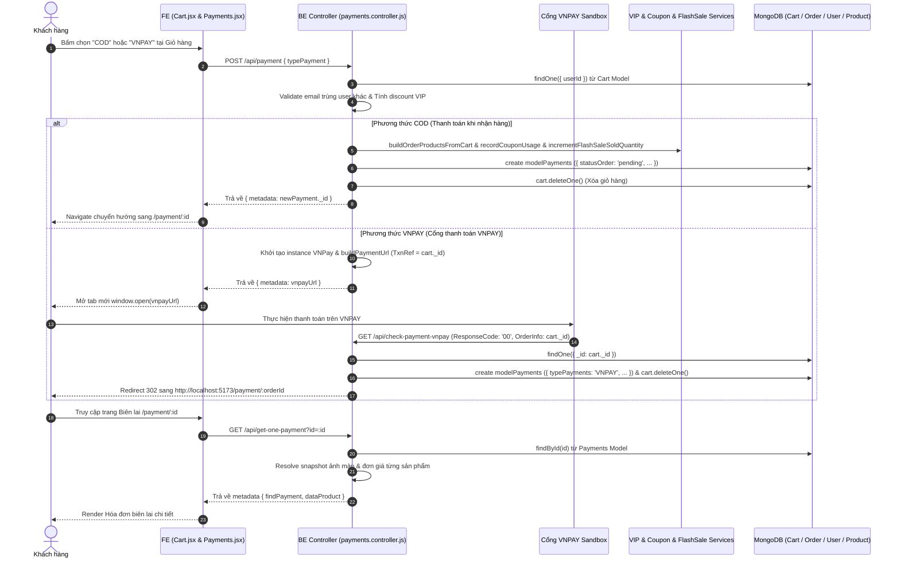

# TÀI LIỆU CONTEXT VÀ BỐI CẢNH NGHIỆP VỤ: CHỨC NĂNG THANH TOÁN VÀ XÁC NHẬN ĐƠN HÀNG (PAYMENTS)

Document này mô tả chi tiết bối cảnh, luồng dữ liệu, luồng nghiệp vụ, các hàm lõi backend/frontend, state và các trường hợp đặc biệt (edge cases) của hệ thống Thanh toán và Hóa đơn biên lai (`Payments`) trong ứng dụng shop.

---

## 1. TỔNG QUAN CHỨC NĂNG

### 1.1 Chức năng chính của Payments
Hệ thống Thanh toán (Payments) chịu trách nhiệm:
1. **Khởi tạo Đơn hàng & Xử lý Phương thức Thanh toán**: Hỗ trợ 2 hình thức thanh toán chính:
   - **COD (Thanh toán khi nhận hàng)**: Tạo đơn hàng với trạng thái `pending` (Chờ xác nhận), trừ/giữ kho, chốt ưu đãi VIP & Voucher, ghi nhận lượt dùng coupon và xóa giỏ hàng.
   - **VNPAY (Cổng thanh toán điện tử)**: Tạo URL thanh toán VNPAY Sandbox (Mã hóa chữ ký SHA512), chuyển hướng khách hàng sang cổng VNPAY, đón nhận callback IPN (`checkPaymentVnpay`) khi thanh toán thành công để hoàn tất đơn hàng và xóa giỏ.
2. **Hiển thị Biên lai / Hóa đơn Thanh toán (`Payments.jsx`)**: Trang xác nhận thành công hiển thị cho khách hàng chi tiết người nhận (Họ tên, SĐT, Email, Địa chỉ), phương thức thanh toán, bảng phân rã dòng tiền (Tạm tính tiền hàng thô, Giảm giá Hạng VIP %, Giảm giá Voucher, Thành tiền cuối cùng) và danh sách sản phẩm đã mua (ảnh biến thể màu sắc, đơn giá, số lượng).
3. **Cập nhật Trạng thái Đơn hàng & Tích lũy Doanh số VIP**: Quản lý vòng đời đơn hàng (Chờ xác nhận -> Đã xác nhận -> Đang giao -> Đã giao -> Đã hủy). Tự động tính tích lũy chi tiêu thăng hạng VIP cho người dùng khi đơn hàng chuyển sang trạng thái `delivered` (Đã giao hàng) và hoàn tác hạng nếu đơn bị đổi trạng thái/hủy.

### 1.2 Các thành phần chính và mối liên hệ
1. **Frontend Component (`Payments.jsx`)**:
   - Nhận ID đơn hàng từ URL params (`/payment/:id`).
   - Gọi API `requestGetOnePayment(id)` lấy dữ liệu chi tiết hóa đơn.
   - Phân rã dòng tiền (Tạm tính, Giảm giá VIP theo tên hạng VIP, Giảm giá Voucher theo mã code, Thành tiền) và render danh sách sản phẩm.

2. **Frontend Request Layer (`request.jsx`)**:
   - `requestPayment(typePayment)`: Gọi `POST /api/payment` để khởi tạo đơn COD hoặc lấy VNPAY URL.
   - `requestGetOnePayment(id)`: Gọi `GET /api/get-one-payment?id=...` để nạp thông tin hóa đơn.

3. **Backend Routes (`payments.routes.js`)**:
   - `POST /api/payment`: Endpoint khởi tạo đơn hàng COD / VNPAY.
   - `GET /api/check-payment-vnpay`: Callback URL xử lý kết quả từ cổng VNPAY.
   - `GET /api/get-one-payment`: Lấy thông tin hóa đơn 1 đơn hàng theo ID.
   - `POST /api/update-status-order`: Admin cập nhật trạng thái đơn hàng (kích hoạt tích lũy chi tiêu VIP).

4. **Backend Controller (`payments.controller.js`)**:
   - Chứa logic nghiệp vụ chính của luồng thanh toán: validate giỏ hàng & email trùng lặp, snapshot đơn giá & biến thể màu, tính ưu đãi VIP & Voucher, khởi tạo document `modelPayments`, tích hợp thư viện `vnpay`, xử lý callback VNPAY, hoàn trả/cập nhật tồn kho Flash Sale & coupon usage.

5. **Backend Services Phụ trợ**:
   - `vipTierService.js`: Tính chiết khấu VIP (`getDiscountRateByTier`), tích lũy doanh số nâng hạng (`updateCustomerTier`) và hoàn tác nâng hạng (`revertCustomerTier`).
   - `couponService.js`: Thẩm định coupon (`validateCouponForCart`) & lưu vết lượt dùng (`recordCouponUsage`).
   - `flashSaleService.js`: Tăng/Giảm số lượng đã bán của Flash Sale (`incrementFlashSaleSoldQuantity` / `decrementFlashSaleSoldQuantity`).

6. **Backend Models**:
   - `payments.model.js`: Mongoose Schema lưu trữ bảng đơn hàng `payments`.
   - `cart.model.js`: Schema giỏ hàng nguồn.
   - `users.model.js`, `products.model.js`, `coupon.model.js`, `flashSale.model.js`.

---

## 2. SƠ ĐỒ LUỒNG DỮ LIỆU TỔNG QUÁT

---

## 3. GIẢI THÍCH TỪNG LUỒNG NGHIỆP VỤ CHÍNH

### 3.1 Luồng Thanh toán COD (Thanh toán khi nhận hàng)
- **Trigger**: User gõ đủ thông tin nhận hàng ở Giỏ hàng và bấm nút "Thanh toán khi nhận hàng (COD)".
- **Hàm FE xử lý**: `handlePayments('COD')` trong `Cart.jsx`.
- **API gọi**: `POST /api/payment` với body `{ typePayment: 'COD' }`.
- **Hàm BE xử lý**: `PaymentsController.payment`.
- **Logic xử lý chi tiết**:
  1. Lấy `userId` từ JWT token (`req.user.id`). Tìm giỏ hàng `modelCart.findOne({ userId })`.
  2. Validate bắt buộc có `fullName`, `phone`, `address`, `email`.
  3. Validate email: Nếu email điền trùng với email tài khoản đăng ký khác (`modelUser.findOne({ email, _id: { $ne: userId } })`) -> Ném lỗi `BadRequestError("Email này đã được đăng ký. Vui lòng đăng nhập...")`.
  4. **Tính toán dòng tiền**:
     - Lấy hạng VIP của user -> Lấy `% vipDiscountRate` -> Tính `vipDiscountAmount = Math.floor(totalPrice * vipDiscountRate / 100)`.
     - Thẩm định lại mã coupon (nếu giỏ có gài coupon) qua `validateCouponForCart` với số tiền sau giảm VIP (`subtotalAfterVip`). Trích xuất `couponId`, `couponCode`, `discountAmount`, `totalPriceAfterDiscount`.
  5. Gọi `buildOrderProductsFromCart`: Duyệt qua các sản phẩm trong giỏ, snapshot màu sắc chọn, lấy giá Flash Sale active (nếu có) hoặc giá dòng sản phẩm để làm `unitPrice`.
  6. Tạo document `modelPayments` mới với `typePayments: "COD"`, `statusOrder: "pending"`.
  7. Gọi `incrementFlashSaleSoldQuantity` để cộng số lượng đã bán Flash Sale.
  8. Gọi `recordCouponUsage` để ghi nhận lịch sử dùng mã giảm giá vào DB.
  9. Xóa giỏ hàng: `await findCart.deleteOne()`.
- **Phản hồi FE**: Trả về ID đơn hàng mới -> FE thực hiện `navigate('/payment/' + newPayment._id)`.

---

### 3.2 Luồng Thanh toán qua VNPAY (Cổng thanh toán điện tử)
- **Trigger**: User bấm nút "Thanh toán qua VNPAY" tại Giỏ hàng.
- **Hàm FE xử lý**: `handlePayments('VNPAY')` trong `Cart.jsx`.
- **API gọi**: `POST /api/payment` với body `{ typePayment: 'VNPAY' }`.
- **Hàm BE xử lý**: `PaymentsController.payment` (nhánh `typePayment === "VNPAY"`).
- **Logic xử lý chi tiết**:
  1. Thực hiện các bước validate thông tin người nhận, email trùng và tính toán chiết khấu VIP & Voucher tương tự luồng COD.
  2. Khởi tạo đối tượng SDK `VNPay` với cấu hình TMN Code (`MPHY2159`), Secure Secret Key, Host Sandbox (`https://sandbox.vnpayment.vn`), thuật toán băm `SHA512`.
  3. Tạo URL thanh toán VNPAY qua `vnpay.buildPaymentUrl`:
     - `vnp_Amount`: Số tiền `totalPriceAfterDiscount`.
     - `vnp_TxnRef`: ID giỏ hàng (`findCart._id`).
     - `vnp_OrderInfo`: ID giỏ hàng (`findCart._id`).
     - `vnp_ReturnUrl`: `http://localhost:3000/api/check-payment-vnpay`.
     - `vnp_ExpireDate`: Thời gian hết hạn giao dịch (24 giờ kể từ thời điểm tạo).
- **Phản hồi FE**: BE trả về URL thanh toán VNPAY -> FE mở cửa sổ/tab mới `window.open(vnpayResponse.metadata, '_blank')`.

---

### 3.3 Luồng Callback Xử lý Kết quả Thanh toán VNPAY (`checkPaymentVnpay`)
- **Trigger**: Khách hàng hoàn tất thanh toán trên giao diện VNPAY và VNPAY redirect về ReturnUrl.
- **API gọi**: `GET /api/check-payment-vnpay?vnp_ResponseCode=00&vnp_OrderInfo=cartId...`.
- **Hàm BE xử lý**: `PaymentsController.checkPaymentVnpay`.
- **Logic xử lý chi tiết**:
  1. Kiểm tra mã phản hồi `vnp_ResponseCode === "00"` (Giao dịch thành công).
  2. Trích xuất ID giỏ hàng từ `vnp_OrderInfo`, tìm `modelCart.findOne({ _id: idCart })`.
  3. Tính toán lại chiết khấu VIP và thẩm định lại coupon `validateCouponForCart`.
  4. Tạo document `modelPayments` mới với `typePayments: "VNPAY"`.
  5. Gọi `incrementFlashSaleSoldQuantity` tăng lượt bán Flash Sale và `recordCouponUsage` ghi nhận lịch sử mã giảm giá.
  6. Xóa giỏ hàng `findCart.deleteOne()`.
  7. **Redirect**: Trả về lệnh chuyển hướng HTTP 302 sang trang FE: `res.redirect('http://localhost:5173/payment/' + newPayment._id)`.

---

### 3.4 Luồng Hiển thị Hóa đơn Biên lai Thanh toán (`Payments.jsx`)
- **Trigger**: Người dùng được chuyển hướng vào URL `/payment/:id`.
- **Hàm FE xử lý**: `useEffect` trong `Payments.jsx`.
- **API gọi**: `GET /api/get-one-payment?id=:id` (`requestGetOnePayment`).
- **Hàm BE xử lý**: `PaymentsController.getOnePayment`.
- **Logic xử lý**:
  1. BE tìm đơn hàng theo `id` (`modelPayments.findById(id)`).
  2. Duyệt mảng `products` trong đơn hàng, dùng `resolveOrderItemSnapshot` để trích xuất ảnh màu chọn, tên màu, đơn giá snapshot. Nếu sản phẩm đã bị xóa khỏi DB, trả về object fallback *"Sản phẩm không tồn tại"*.
  3. BE trả về object `{ findPayment, dataProduct }`.
  4. **Hiển thị tại FE (`Payments.jsx`)**:
     - Hiển thị GIF thành công, lời cảm ơn và thông tin người nhận (Tên, Địa chỉ, SĐT, Email, Phương thức thanh toán).
     - Phân rã các khoản tiền: `rawTotal` (Tổng tiền hàng thô), `vipDiscountAmount` (Giảm giá hạng VIP kèm % rate và tên tiếng Việt hạng VIP), `discountAmount` (Giảm giá Voucher kèm mã code), và `totalPriceAfterDiscount` (Thành tiền).
     - Render danh sách các sản phẩm đã đặt (ảnh preview màu, tên sản phẩm, nhãn màu sắc, đơn giá, số lượng `x...`).

---

### 3.5 Luồng Cập nhật Trạng thái Đơn hàng & Tích lũy Doanh số VIP (Admin)
- **Trigger**: Admin thay đổi trạng thái đơn hàng trên trang Quản lý đơn hàng Admin (`OrderManagement`).
- **API gọi**: `POST /api/update-status-order` (Bảo vệ bởi `authAdmin`).
- **Hàm BE xử lý**: `PaymentsController.updateStatusOrder`.
- **Logic xử lý**:
  1. Validate trạng thái hợp lệ trong `SUPPORTED_ORDER_STATUSES` (`pending`, `completed`, `shipping`, `delivered`, `cancelled`).
  2. Lưu trạng thái mới vào `findPayment.statusOrder`.
  3. **Tích lũy Doanh số thăng hạng VIP (`updateCustomerTier`)**:
     - Nếu trạng thái chuyển thành `"delivered"` (Đã giao hàng) và trước đó chưa từng tính (`!tierCounted`): BE gọi `updateCustomerTier(userId, orderId)`. Hàm này tính tổng chi tiêu trong năm hiện tại của user, cập nhật lại `yearlySpending` và tự động thăng hạng VIP (`dong`, `bac`, `vang`, `kimcuong`) trong `modelUser`, đồng thời đánh dấu `tierCounted = true` trên đơn hàng.
  4. **Hoàn tác Hạng VIP (`revertCustomerTier`)**:
     - Nếu đơn hàng chuyển từ `"delivered"` sang trạng thái khác (hoặc bị hủy) mà đã lỡ tính điểm (`tierCounted === true`): BE gọi `revertCustomerTier` để trừ lại số tiền đơn hàng khỏi `yearlySpending` và tính lại hạng VIP chuẩn cho user.
  5. **Giảm số lượng Flash Sale khi Hủy đơn (`decrementFlashSaleSoldQuantity`)**:
     - Nếu chuyển trạng thái sang `"cancelled"`, BE gọi `decrementFlashSaleSoldQuantity` để giảm số lượng đã bán của chương trình Flash Sale tương ứng.

---

## 4. GIẢI THÍCH CÁC HÀM "LÕI" VÀ HELPER QUAN TRỌNG (`payments.controller.js`)

### 4.1 `buildOrderProductsFromCart(cartProducts)`
- **Input**: Mảng sản phẩm từ giỏ hàng (`cart.product`).
- **Output**: Mảng sản phẩm định dạng chuẩn cho đơn hàng `modelPayments.products`.
- **Dùng ở luồng nào**: Luồng `payment` (COD) và `checkPaymentVnpay`.
- **Mục đích**: Query thông tin sản phẩm tươi từ DB, kiểm tra Flash Sale active, tính toán `finalUnitPrice` chính xác tại thời điểm chốt đơn để lưu cố định snapshot vào đơn hàng.

---

### 4.2 `resolveOrderItemSnapshot({ orderItem, product })`
- **Input**: Object `orderItem` từ đơn hàng và `product` document từ DB.
- **Output**: An object chứa `{ selectedColorKey, selectedColorName, selectedColorHex, selectedColorImage, unitPrice }`.
- **Dùng ở luồng nào**: `buildOrderProductsFromCart`, `getHistoryOrder`, `getOnePayment`.
- **Mục đích**: Xử lý fallback toàn diện cho hình ảnh và giá sản phẩm trong hóa đơn/lịch sử đơn hàng. Nếu thông tin snapshot màu sắc cũ bị thiếu hoặc sản phẩm trong DB bị sửa/xóa, hàm vẫn khôi phục được ảnh màu sắc và giá bán gốc chuẩn để hiển thị cho người dùng.

---

### 4.3 `updateCustomerTier` & `revertCustomerTier` (VIP Services)
- **File**: `vipTierService.js`
- **Mục đích**: `updateCustomerTier` cộng dồn tổng tiền các đơn `delivered` trong năm hiện tại để tự động nâng hạng VIP người dùng. `revertCustomerTier` hoàn tác lại điểm và hạng nếu đơn hàng bị thay đổi trạng thái khỏi `delivered`.

---

## 5. GIẢI THÍCH CÁC STATE QUAN TRỌNG Ở FE (`Payments.jsx`)

| State Name | Kiểu dữ liệu | Ý nghĩa & Vai trò | Phụ thuộc / Cập nhật khi nào |
| :--- | :--- | :--- | :--- |
| `id` | `String` | ID đơn hàng nhận từ đường dẫn URL params (`/payment/:id`). | Nhận từ `useParams()`. |
| `dataPayment` | `Object` | Chứa toàn bộ dữ liệu đơn hàng và sản phẩm nhận từ API `requestGetOnePayment(id)`. | Cập nhật khi `useEffect` fetch dữ liệu thành công. Gồm 2 phần chính: `dataPayment.findPayment` và `dataPayment.dataProduct`. |
| `totalPriceAfterDiscount` | `Number` | Số tiền thành tiền cuối cùng của đơn hàng. | Tính toán từ `dataPayment?.findPayment?.totalPriceAfterDiscount ?? dataPayment?.findPayment?.totalPrice`. |

---

## 6. CÁC CASE ĐẶC BIỆT / EDGE CASES ĐÁNG CHÚ Ý

1. **Bảo vệ Hóa đơn khi Sản phẩm bị Xóa khỏi Database**:
   - Khi hiển thị hóa đơn thanh toán (`getOnePayment`), nếu sản phẩm trong đơn đã bị admin xóa hoàn toàn khỏi DB (`modelProduct.findById` trả về `null`), hàm `resolveOrderItemSnapshot` tự động trả về tên hiển thị fallback *"Sản phẩm không tồn tại"* kèm theo ảnh snapshot màu đã chọn trước đó, giúp giao diện biên lai không bị crash hay trống ảnh.

2. **Chống Tích lũy Doanh số VIP Trùng lặp (`tierCounted`)**:
   - Để tránh việc một đơn hàng được cộng điểm thăng hạng VIP nhiều lần (do admin toggle chuyển đổi trạng thái liên tục), Schema `payments.model.js` lưu cờ `tierCounted: { type: Boolean, default: false }`. Chi tiêu năm chỉ được cộng khi `tierCounted === false` và chuyển thành `delivered`.

3. **Ghi nhận & Hoàn trả Lượt sử dụng Coupon (`rollbackCouponUsageByOrder`)**:
   - Khi đơn hàng được tạo, `recordCouponUsage` lưu vết lượt dùng và tăng `usedCount` của coupon. Nếu đơn hàng bị hủy hoặc xóa, hàm `rollbackCouponUsageByOrder` tự động giảm `usedCount` của mã giảm giá và xóa bản ghi trong `modelCouponUsage`.

4. **Trừ & Hoàn trả Kho Flash Sale (`incrementFlashSaleSoldQuantity` / `decrementFlashSaleSoldQuantity`)**:
   - Sản phẩm tham gia chương trình Flash Sale được theo dõi số lượng đã bán `soldQuantity`. Khi thanh toán thành công (COD hoặc VNPAY), BE tự động `incrementFlashSaleSoldQuantity`. Khi đơn hàng bị hủy (`cancelled`), BE tự động `decrementFlashSaleSoldQuantity` để trả lại suất Flash Sale cho khách hàng khác.

---

## 7. GHI CHÚ / RỦI RO PHÁT HIỆN ĐƯỢC

> [!NOTE]
> Các ghi chú dưới đây ghi nhận thực tế từ codebase hiện tại để hỗ trợ dev mới nắm bắt, không thực hiện chỉnh sửa code.

1. **Hardcode Cấu hình Cổng Thanh toán VNPAY**:
   - **Hiện trạng**: Trong `payments.controller.js` (dòng 405-407), thông số TMN Code (`"MPHY2159"`) và Hash Secret Key (`"KWDGTEXOHPVZSUZFHUVDZRXHSRPHSMTM"`) được viết trực tiếp vào source code.
   - **Rủi ro**: Lộ thông tin bảo mật và khó khăn khi chuyển đổi môi trường từ Sandbox sang Production.

2. **Hardcode URL Chuyển hướng Frontend sau khi VNPAY Callback**:
   - **Hiện trạng**: Trong `checkPaymentVnpay` (dòng 507), sau khi VNPAY gọi callback thành công, server chuyển hướng bằng URL cứng: `res.redirect("http://localhost:5173/payment/" + newPayment._id)`.
   - **Rủi ro**: Nếu ứng dụng deploy lên tên miền khác (ví dụ: `https://macshop.com`), người dùng sẽ bị lỗi chuyển hướng về `localhost:5173`.

3. **Kiểu dữ liệu Số điện thoại trong Schema `payments.model.js`**:
   - **Hiện trạng**: Trường `phone` trong `payments.model.js` được định nghĩa là `type: Number`.
   - **Rủi ro**: Số điện thoại Việt Nam bắt đầu bằng số `0` (ví dụ `0936096900`), khi lưu dạng `Number` vào MongoDB sẽ bị tự động mất số `0` ở đầu (trở thành `936096900`). Vì vậy trên FE `Payments.jsx` (dòng 57) phải dùng mẹo ghép chuỗi `0` + `phone` (`
0{dataPayment?.findPayment?.phone}
`).
