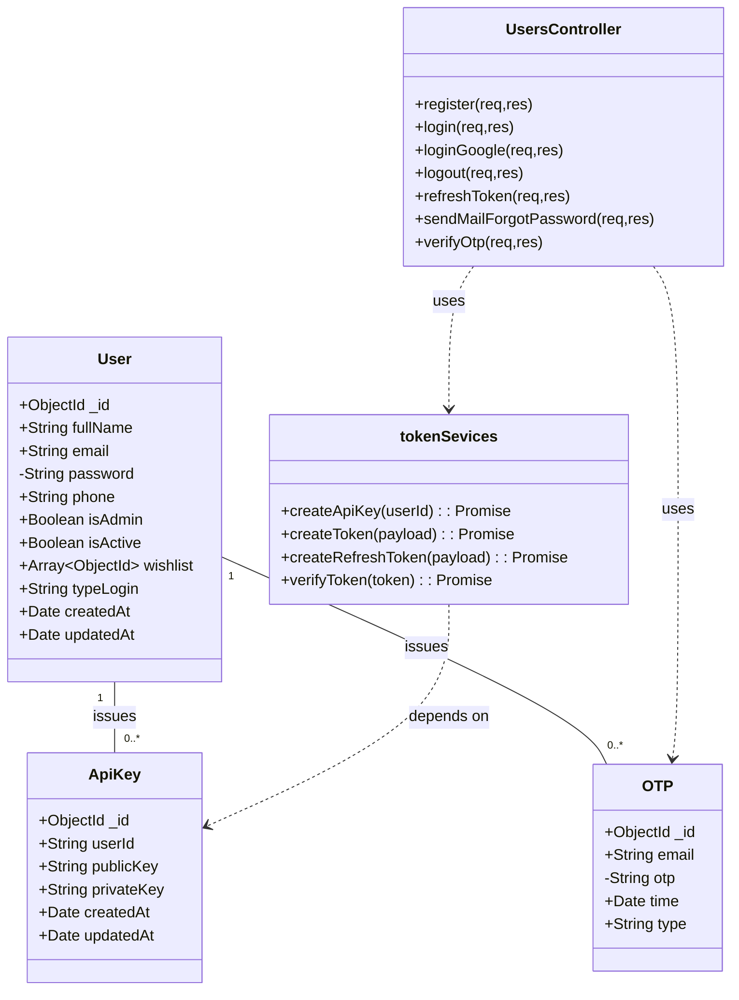
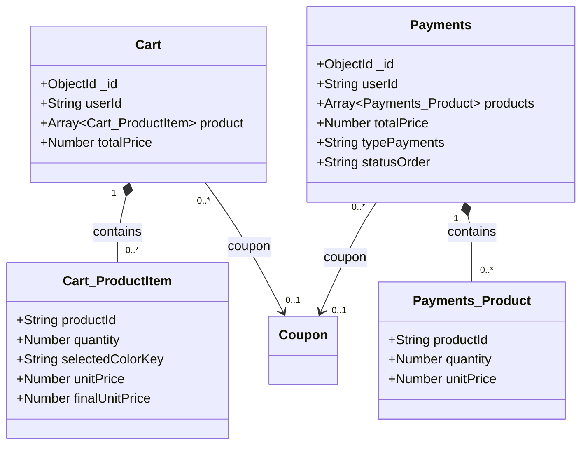
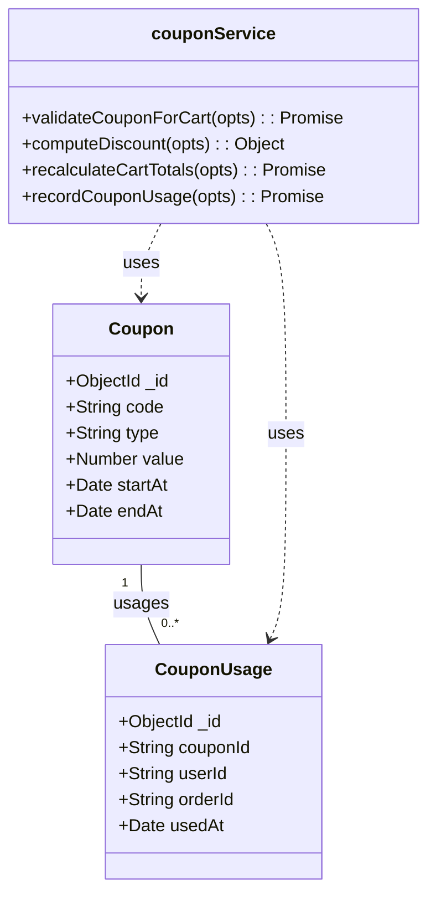
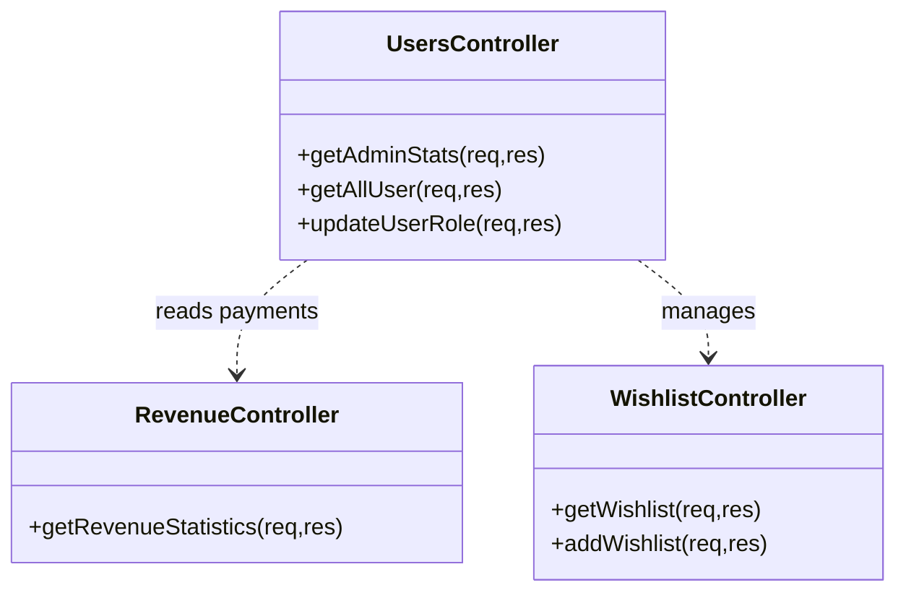
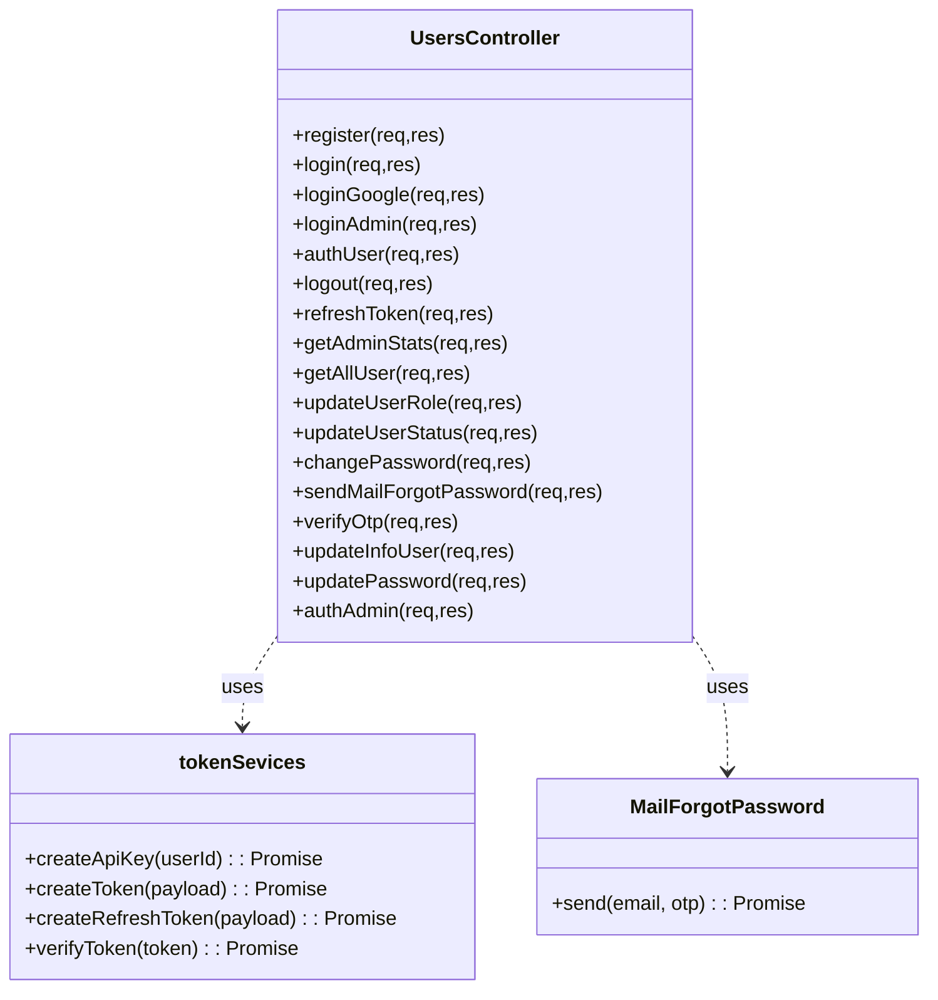
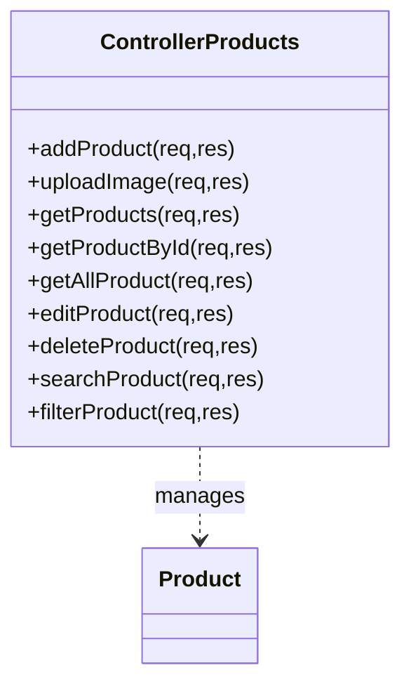
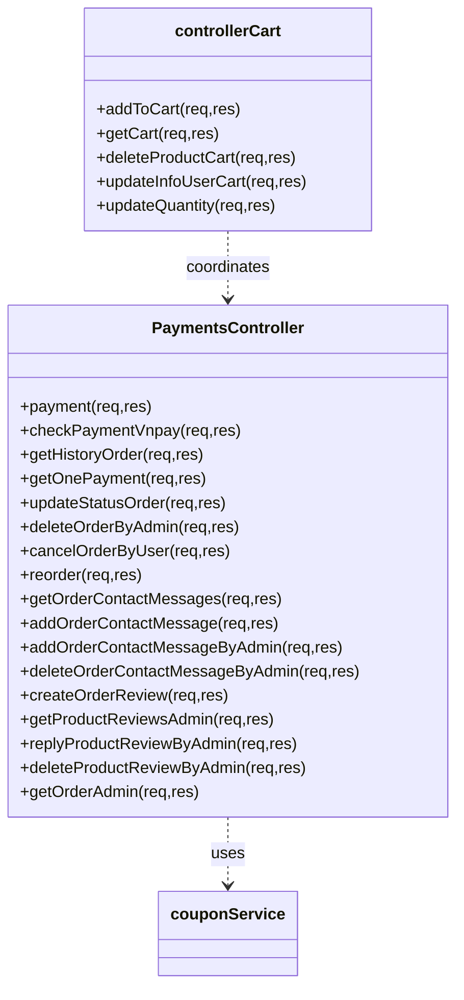
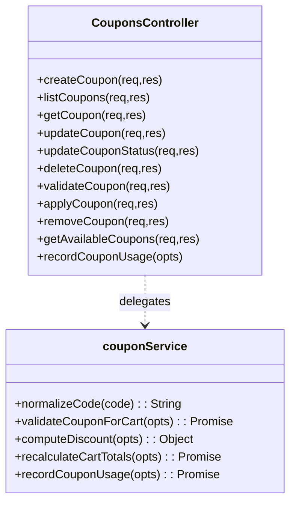
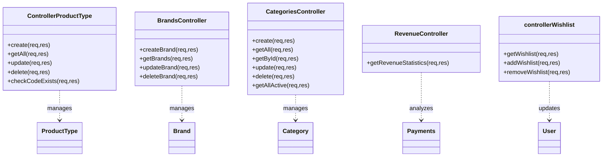

# Class & Data Design — mac-shop (server/src/models)

Updated: 2026-05-22

Mục tiêu: xác thực, chuẩn hóa và bổ sung mô tả các entity (Mongoose models), controllers, services và relationships để dùng cho báo cáo đồ án và để sinh UML (Mermaid-ready).

Ghi chú ngắn:
- Tài liệu này dựa trên mã nguồn thực tế trong `server/src/` (mac-shop). Tôi đã so sánh schema, controllers và services, phát hiện bất đồng (ghi rõ bên dưới) và chuẩn hoá notation UML theo yêu cầu: visibility (+ public / - private / # protected) và kiểu dữ liệu tiêu chuẩn (`String`, `Number`, `Boolean`, `Date`, `ObjectId`, `Array<T>`, `Object`, `Promise<T>`).

---

**System Overview**
- Ứng dụng: e-commerce (mac-shop) – backend Express + Mongoose. Dữ liệu chính: Users, Products (với ProductType template), Cart, Payments, Coupons, Brands, Categories, OTP, API Keys.

**Design Principles used**
- Embedded subdocuments (arrays nội bộ) => composition (lưu snapshot, lifecycle phụ thuộc tài liệu cha).
- Ref ObjectId => association (quan hệ DB thực sự).
- Nếu model lưu key/string để liên kết (ví dụ `brand` là tên) => logical link (không ràng buộc DB).
- Service dùng model => dependency; Controller dùng Service => dependency.

---

**Domain Models**

User
├── Fields
│  - + ObjectId _id
│  - + String fullName (required)
│  - + String email (required)
│  - - String password (required)  // private: cảm nhạy
│  - + String phone (required)
│  - + Boolean isAdmin (default: false)
│  - + Boolean isActive (default: true)
│  - + Array<ObjectId> wishlist (ref: product) (default: [])
│  - + String typeLogin (enum: email | google)
│  - + Date createdAt
│  - + Date updatedAt
└── Notes
  - Code hiện tại: schema dùng `require: true` (không chuẩn - nên `required: true`).
  - `email` không được đánh index/unique trong code (khuyến nghị: thêm unique index để tránh trùng địa chỉ).
  - `password` nên được lưu với `select: false` để tránh leak.

ApiKey
├── Fields
│  - + ObjectId _id
│  - + String userId (ref: user)  // lưu String trong mã nguồn
│  - + String publicKey
│  - + String privateKey
│  - + Date createdAt
│  - + Date updatedAt
└── Notes
  - `userId` được lưu dưới `String` (không phải `ObjectId`) — code tạo và tìm kiếm bằng `userId.toString()`.

Brand
├── Fields
│  - + ObjectId _id
│  - + String name (required)
│  - + String slug (required, unique, index)
│  - + String description (default: "")
│  - + String logo (default: "")
│  - + Boolean isActive (default: true)
│  - + Date createdAt
│  - + Date updatedAt
└── Notes
  - `slug` là `unique` + `index` trong code.

ProductType
├── Fields
│  - + ObjectId _id
│  - + String code (required, unique, index, regex /^[a-z0-9-_]+$/)
│  - + String name (required)
│  - + Array<ProductType_Attribute> attributesTemplate (default: [])
│  - + Date createdAt
│  - + Date updatedAt
└── Notes
  - `attributesTemplate` là mảng subdoc (composition). Subdoc schema có validation (key regex, inputType enum, v.v.).

ProductType_Attribute (embedded)
├── Fields
│  - + String key (required, lowercase, matches /^[a-z0-9_]+$/)
│  - + String label (required)
│  - + String inputType (enum: text | number | select, default: text)
│  - + Boolean required (default: false)
│  - + String placeholder (default: "")
│  - + Array<String> options (default: [])
│  - + Number order (default: 0)
└── Notes
  - `_id: false` (không tạo _id cho mỗi subdoc trong code)

Product
├── Fields
│  - + ObjectId _id
│  - + String name (required)
│  - + String brand (required) // stored as name, logical link to Brand
│  - + ObjectId category (ref: category, default: null)
│  - + Number price (required, min: 0)
│  - + Number discount (default: 0, min:0, max:100)
│  - + Number costPrice (default: 0, min:0)
│  - + Number priceDiscount (legacy, default: 0)
│  - + Array<String> images (required, default: [])
│  - + Number stock (required, min:0)
│  - + String componentType (default: "")
│  - + Object attributes (Mixed, default: {})
│  - + Array<Product_ColorOption> colorOptions (embedded, default: [])
│  - + Array<Product_Review> reviews (embedded, default: [])
│  - + Date createdAt
│  - + Date updatedAt
└── Notes
  - `brand` là tên (`String`) chứ không phải ref; đây là logical link.
  - `reviews` và `colorOptions` là embedded (composition) — snapshot lifecycle phụ thuộc product.
  - `reviews[].userId` và `reviews[].orderId` được lưu dưới `String` có `ref` (không phải ObjectId). Khuyến nghị: nhất quán dùng ObjectId cho referential fields.

Product_ColorOption (embedded)
├── Fields
│  - + String key (required)
│  - + String name (required)
│  - + String image (default: "")
│  - + Number price (required, min: 0)
│  - + Boolean isDefault (default: false)
└── Notes
  - `_id: false` trong schema (code đặt _id: false)

Product_Review (embedded)
├── Fields
│  - + String userId (required, ref: user)
│  - + String orderId (required, ref: payments)
│  - + Number rating (required, min:1, max:5)
│  - + String comment (default: "")
│  - + Array<String> images (default: [])
│  - + String fullName (default: "")
│  - + Object adminReply { adminId: String, adminName: String, message: String, repliedAt: Date }
│  - + Date createdAt (default: Date.now)
└── Notes
  - embedded review là composition; khi product bị xoá, reviews bị xoá theo.

Category
├── Fields
│  - + ObjectId _id
│  - + String name (required)
│  - + String slug (required, unique, index)
│  - + String description (default: "")
│  - + String image (default: "")
│  - + Boolean isActive (default: true)
│  - + Date createdAt
│  - + Date updatedAt
└── Notes
  - `slug` có unique + index.

Cart
├── Fields
│  - + ObjectId _id
│  - + String userId (required, ref: user)
│  - + Array<Cart_ProductItem> product
│  - + Number totalPrice (required)
│  - + Number totalPriceAfterDiscount (default: 0)
│  - + Number discountAmount (default: 0)
│  - + String couponId (default: null, ref: coupon)
│  - + String couponCode (default: "")
│  - + String fullName (required)
│  - + String phone (required)
│  - + String address (required)
│  - + Date createdAt
│  - + Date updatedAt
└── Notes
  - Business logic dùng `findOne({ userId })` → giả sử 1 cart hoạt động cho 1 user; DB không enforce unique nhưng nên tạo index unique nếu muốn ràng buộc.

Cart_ProductItem (embedded)
├── Fields
│  - + String productId (required, ref: product)
│  - + Number quantity (required)
│  - + String selectedColorKey (default: "")
│  - + String selectedColorName (default: "")
│  - + String selectedColorHex (default: "")
│  - + String selectedColorImage (default: "")
│  - + Number unitPrice (default: 0, min:0)
│  - + Number finalUnitPrice (default: 0, min:0)
└── Notes
  - embedded: snapshot giá, màu, dùng để tính toán và không cập nhật trực tiếp khi product thay đổi.

Coupon
├── Fields
│  - + ObjectId _id
│  - + String code (required, index, uppercase)
│  - + String type (required, enum: PERCENT | FIXED)
│  - + Number value (required)
│  - + Number minOrderValue (default: 0)
│  - + Number maxDiscount (default: 0)
│  - + Number totalUsageLimit (default: 0)
│  - + Number perUserUsageLimit (default: 0)
│  - + Number usedCount (default: 0)
│  - + Date startAt (required)
│  - + Date endAt (required)
│  - + String status (enum: ACTIVE | INACTIVE, default: ACTIVE)
│  - + Date createdAt
│  - + Date updatedAt
└── Notes
  - `code` không đặt unique trong code nhưng có index; có auto-deactivate logic trong controller/service.

CouponUsage
├── Fields
│  - + ObjectId _id
│  - + String couponId (required, ref: coupon)
│  - + String userId (required, ref: user)
│  - + String orderId (default: null, ref: payments)
│  - + Date usedAt (default: Date.now)
│  - + Number discountAmount (default: 0)
│  - + Date createdAt
│  - + Date updatedAt
└── Notes
  - Composite index: `{ couponId:1, userId:1 }` (code đã khai báo index)

OTP
├── Fields
│  - + ObjectId _id
│  - + String email (required)
│  - - String otp (required, hashed) // private
│  - + Date time (TTL index expires: 300s)
│  - + String type (required)
│  - + Date createdAt
│  - + Date updatedAt
└── Notes
  - TTL index dùng `index: { expires: 300 }` trong schema.

Payments
├── Fields
│  - + ObjectId _id
│  - + String userId (required, ref: user)
│  - + Array<Payments_Product> products (required)
│  - + String fullName (required)
│  - + Number phone (required)
│  - + String address (required)
│  - + String typePayments (enum: COD | MOMO | VNPAY, default: COD)
│  - + String statusOrder (enum: pending | completed | shipping | delivered | cancelled, default: pending)
│  - + Number totalPrice (required)
│  - + Number totalPriceBeforeDiscount (default: 0)
│  - + Number discountAmount (default: 0)
│  - + String couponId (default: null, ref: coupon)
│  - + String couponCode (default: "")
│  - + Array<Payments_ProductReview> productReviews (default: [])
│  - + Array<Payments_ContactMessage> contactMessages (default: [])
│  - + Date createdAt
│  - + Date updatedAt
└── Notes
  - `products` là embedded array (composition) chứa snapshot thông tin dòng hàng tại thời điểm thanh toán.

Payments_Product (embedded)
├── Fields
│  - + String productId (required, ref: product)
│  - + Number quantity (required)
│  - + String selectedColorKey
│  - + String selectedColorName
│  - + String selectedColorHex
│  - + String selectedColorImage
│  - + Number unitPrice
└── Notes
  - Snapshot của sản phẩm tại thời điểm tạo order.

Payments_ProductReview (embedded)
├── Fields
│  - + String productId (required, ref: product)
│  - + Number rating (1..5)
│  - + String comment
│  - + Array<String> images
│  - + Date createdAt

Payments_ContactMessage (embedded)
├── Fields
│  - + String senderType (enum: user | admin)
│  - + String senderId (ref: user)
│  - + String senderName
│  - + String message
│  - + Date createdAt

---

**Controllers (tóm tắt)**
- `UsersController` — đăng ký, đăng nhập (email/google/admin), authUser, logout, refreshToken, quản lý người dùng (role/status), quên mật khẩu (OTP), changePassword, getAdminStats.
- `ProductsController` — CRUD product, uploadImage (Cloudinary), tìm kiếm, filter, xuất dữ liệu formatProductOutput.
- `ProductTypeController` — CRUD product type, validate templates.
- `BrandsController` — CRUD brands (slug unique), propagate brand name changes to products.
- `CategoriesController` — CRUD categories, attach product counts.
- `CartController` — addToCart, getCart, deleteProductCart, updateInfoUserCart, updateQuantity. (business logic: snapshot, stock update, recalculate coupon)
- `CouponsController` — CRUD coupon, validate/apply/remove coupon, getAvailableCoupons, record usage.
- `PaymentsController` — payment flow (COD/VNPAY), build order from cart, record coupon usage, order history, admin operations, reviews/contact messages.
- `RevenueController` — report & statistics aggregations.
- `WishlistController` — get/add/remove wishlist (user.wishlist array).

---

**Services / Utilities**
- `couponService` — validateCouponForCart, computeDiscount, recalculateCartTotals, recordCouponUsage (depends on modelCoupon, modelCouponUsage)
- `tokenSevices` — createApiKey (RSA keypair), createToken/createRefreshToken (RS256), verifyToken (depends on ApiKey model)
- `MailForgotPassword` — nodemailer OAuth2 wrapper to send OTP
- `cloudinary` — uploadToCloudinary, uploadMultipleToCloudinary

---

**Relationships (chuẩn hoá, phân loại, multiplicity)**
- `User` 1 -- 0..* `ApiKey` (Dependency/association by userId string) — operational: system tạo nhiều key, logout xóa 1 key. (DB: many)
- `User` 1 -- 0..1 `Cart` (Association by userId string) — Business: 1 cart hoạt động mỗi user; DB không enforce unique nhưng nên tạo index unique nếu muốn ràng buộc.
- `User` 1 -- 0..* `Payments` (Association)
- `User` 1 -- 0..* `CouponUsage` (Association)
- `User` 1 -- 0..* `OTP` (Association by email value)
- `Product` 1 *-- 0..* `Product_ColorOption` (Composition — embedded)
- `Product` 1 *-- 0..* `Product_Review` (Composition — embedded)
- `Product` 0..* --> 0..1 `Category` (Association by ObjectId)
- `Product` 0..* -..-> 0..1 `Brand` (Logical link by name string)
- `ProductType` 1 -..-> 0..* `Product` (Logical link: product.componentType == productType.code)
- `Cart` 1 *-- 0..* `Cart_ProductItem` (Composition — embedded snapshot)
- `Payments` 1 *-- 0..* `Payments_Product` (Composition — snapshot)
- `Payments` 0..* --> 0..1 `Coupon` (Association by couponId)
- `Cart` 0..* --> 0..1 `Coupon` (Association)
- `Coupon` 1 -- 0..* `CouponUsage` (Association)

Classification legend:
- `*--` composition (embedded subdocuments)
- `-->` association (ObjectId ref)
- `-..->` logical link / code-match (string fields)
- `..>` dependency (module uses model/service)

---

**Validation / Index / Constraints summary (phát hiện trong code)**
- `users.model.js`: nhiều trường dùng `require: true` (cần sửa thành `required: true`).
- `users.email`: không có unique/index (khuyến nghị thêm `unique: true, index: true`).
- `users.password`: không đặt `select: false` (khuyến nghị). Mã hiện đã hash mật khẩu nhưng vẫn query toàn bộ document (nên giới hạn select khi trả về danh sách người dùng).
- `brand.slug`, `category.slug`, `productType.code`: có `unique` + `index` trong code.
- `coupon.code`: index + uppercase (không unique) — code kiểm tra trùng khi tạo coupon; nên cân nhắc `unique` nếu muốn phòng trùng.
- `couponUsage`: composite index `{ couponId:1, userId:1 }` đã khai báo.
- `otp.time`: TTL index `expires: 300` đã khai báo.
- Nhiều ref fields ở code được lưu dưới `String` (userId, productId, orderId) — nên thống nhất dùng `ObjectId` hoặc giải thích rõ lý do lưu String (hiện code thường convert toString khi so sánh).

---

**UML Design Notes**
- Vì sao dùng composition cho embedded subdocuments: các subdoc (colorOptions, reviews, cart.product, payments.products) là snapshot dữ liệu (ngữ nghĩa: lưu trạng thái tại thời điểm), lifecycle phụ thuộc tài liệu cha (xóa cha -> xóa subdoc). Sử dụng composition giúp performance (một lookup) và giữ snapshot ổn định.
- Vì sao dùng association/ref ObjectId: quan hệ thực giữa entities độc lập (ví dụ `product.category`, `cart.product[].productId` cần lookup product/category) — association cho phép truy vấn, populate và maintain referential integrity.
- Aggregate root design: nhóm theo Aggregate Root sau:
  - Product Aggregate: Product (root) bao gồm colorOptions (embedded), reviews (embedded). ProductType là external reference (logical link) — Product Aggregate chịu trách nhiệm cho invariants liên quan tới thuộc tính sản phẩm.
  - Cart Aggregate: Cart (root) bao gồm Cart_ProductItem (embedded) + coupon snapshot; Cart lifecycle là session-level → xóa cart khi checkout.
  - Payments Aggregate: Payments (root) bao gồm Payments_Product và contactMessages (embedded). Payment chịu ràng buộc giao dịch (transaction boundary).
- Transaction boundary: các thao tác thay đổi stock và cart → tạo Payments → record coupon usage cần transactional behavior; hiện code cập nhật `product.stock` và `cart.deleteOne()` riêng rẽ. Khuyến nghị: sử dụng transaction (Mongo session) khi có nhiều bước cập nhật đa collection để tránh inconsistency.
- Business domain grouping: tách rõ `Catalog` (Products, ProductType, Brand, Category), `Ordering` (Cart, Payments), `Promotion` (Coupon, CouponUsage), `Auth` (User, ApiKey, OTP), `Admin` (controllers báo cáo, quản lý users)

---

**Suggested Package Diagram**
- Models: `models/*` (user, product, productType, category, brand, cart, payments, coupon, couponUsage, otp, apiKey)
- Controllers: `controllers/*` (users.controller, products.controller, cart.controller, payments.controller, coupons.controller, productType.controller, brands.controller, categories.controller, revenue.controller, wishlist.controller)
- Services: `services/*` (tokenSevices, couponService, MailForgotPassword)
- Utilities: `utils/*` (cloudinary, Chatbot, AICompareProduct)
- Middleware/Core: `auth/checkAuth.js`, `core/*` (error.response, success.response)

---

**Suggested Class Diagram Optimization / Recommendations**
- R1 — Consistency of ID types: chọn `ObjectId` cho các ref (userId, productId, orderId) hoặc giải thích rõ và tiêu chuẩn hóa cách convert toString trong toàn bộ code.
- R2 — Fix schema option typos: đổi `require: true` -> `required: true` để Mongoose áp validation đúng.
- R3 — Security: `password` field nên `select: false`; thêm rate-limits/lockout cho OTP và login.
- R4 — Indexes: thêm unique index cho `users.email` nếu dự kiến email là khóa duy nhất.
- R5 — Transactional safety: wrap stock updates + cart delete + payment create + coupon usage record trong MongoDB transaction session.
- R6 — Reduce coupling: Product stores `brand` as String; cân nhắc ref `brandId` để giảm lỗi typography và dễ maintain khi đổi tên brand.
- R7 — Remove duplicate ApiKeys or make logic explicit: hiện createApiKey tạo bản ghi mới mỗi lần — cân nhắc update/replace thay vì insert nhiều.

---

**Mermaid Class Diagram Ready**
Gồm các diagram tách theo domain để dễ đọc: Authentication, Product Management, Cart & Payment, Coupon System, Admin Management.

---

Authentication Diagram


Product Management Diagram
```mermaid
classDiagram
class ProductType {
  +ObjectId _id
  +String code
  +String name
  +Array~ProductType_Attribute~ attributesTemplate
}

class ProductType_Attribute {
  +String key
  +String label
  +String inputType
  +Boolean required
  +Array~String~ options
}

class Brand {
  +ObjectId _id
  +String name
  +String slug
}

class Category {
  +ObjectId _id
  +String name
  +String slug
}

class Product {
  +ObjectId _id
  +String name
  +String brand
  +ObjectId category
  +Number price
  +Number discount
  +Array~String~ images
  +Array~Product_ColorOption~ colorOptions
  +Array~Product_Review~ reviews
}

class Product_ColorOption {
  +String key
  +String name
  +String image
  +Number price
}

class Product_Review {
  +String userId
  +String orderId
  +Number rating
  +String comment
}

ProductType "1" -..-> "0..*" Product : componentType==code
Product "1" *-- "0..*" Product_ColorOption : contains
Product "1" *-- "0..*" Product_Review : contains
Product "0..*" --> "0..1" Category : category
Product "0..*" -..-> "0..1" Brand : brandName

```

Cart & Payment Diagram


Coupon System Diagram


Admin & Reporting Diagram


---

Notes on diagram splitting
- I đã tách sơ đồ theo domain (Authentication, Product Management, Cart & Payment, Coupon System, Admin). Nếu bạn muốn tôi tạo thêm một sơ đồ master (toàn bộ) để render 1 file Mermaid duy nhất, tôi có thể thêm — nhưng nó sẽ rất lớn và rất khó đọc; khuyến nghị dùng sơ đồ tách.

---

File generated: `server/src/models/Class.UML.md`

## Controller & Service Methods (extracted from source)

Below are controller and service classes with their concrete methods extracted directly from the codebase. Use these blocks to update class diagrams that include behavior (methods).

Authentication Controllers & Services


Product Management Controllers


Cart & Payment Controllers


Coupon Controllers & Services


Admin & Catalog Controllers


--- End of extracted methods section

## Controller & Service Methods (extracted from source)

Below are controller and service classes with their concrete methods extracted directly from the codebase. Use these blocks to update class diagrams that include behavior (methods).

Authentication Controllers & Services


Product Management Controllers


Cart & Payment Controllers


Coupon Controllers & Services


Admin & Catalog Controllers


--- End of extracted methods section
